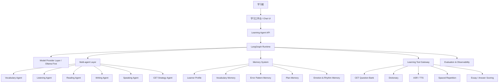

# 00. 项目总览

## 1. 项目定位

本项目是一个面向英语学习者的长期陪伴型 Agent 系统，优先支持英语四级、六级备考，同时可扩展到考研英语、职场英语、技术阅读、口语提升和写作训练。

系统的核心不是“问答”，而是“学习闭环”：

```text
诊断 -> 计划 -> 训练 -> 反馈 -> 复习 -> 复盘 -> 记忆更新 -> 下一次训练
```

技术底座：

- LangGraph：状态化工作流编排。
- Local LLM Provider：默认通过 Ollama 调用本地开源大模型，优先满足低成本、隐私友好和离线可控。
- Long-term Memory：跨会话学习画像、错词错因、复习计划。
- Multi-agent：按学习技能拆分专家 Agent。
- Learning Tools / MCP：题库、词典、ASR、TTS、作文评分、复习调度。
- Evaluation：学习效果评估 + Agent 行为评估。

## 2. 一句话架构

> 以 LangGraph 为学习流程编排核心，由 Learning Supervisor 调度词汇、听力、阅读、写作、口语、考试策略等专家 Agent，通过长期 Memory 追踪学习者能力变化，并借助学习工具链完成练习、纠错、复习和评估。

## 3. 系统上下文



## 4. 核心模块

### 4.1 Learning Workspace

用户入口，不做营销页，首屏直接是学习工作台：

- 今日课程。
- 复习队列。
- 四六级倒计时。
- 最近高频错误。
- 本周学习趋势。
- 开始今日课程。

### 4.2 Learning Agent API

后端接入层，负责：

- 用户、目标、会话、run 管理。
- 同步和流式响应。
- 任务提交、作文提交、口语音频提交。
- 学习记录查询。
- 复习队列查询。

### 4.3 LangGraph Runtime

负责把一次学习 session 编排成状态机：

```text
load_profile
-> detect_intent
-> select_learning_goal
-> route_skill_agent
-> run_learning_task
-> generate_feedback
-> update_memory
-> schedule_review
-> summarize_session
```

### 4.4 Model Provider Layer

模型提供方抽象层负责把 Agent 与具体 LLM 运行时解耦。

默认策略：

- 优先使用本地 Ollama 部署的开源大模型。
- 对分类、路由、摘要、错因提取等轻量任务使用本地小模型。
- 对 Supervisor、写作反馈、复杂讲解等任务优先使用本地能力较强模型。
- 云端 LLM 只作为可配置 fallback，不作为默认依赖。
- 所有模型调用必须记录 provider、model、latency、token/字符量、失败原因和 fallback 路径。

详见 [09-model-provider-and-ollama.md](./09-model-provider-and-ollama.md)。

### 4.5 Memory System

负责长期陪伴的核心能力：

- 记住用户目标、基础、兴趣和时间预算。
- 记住错词、错题、错因和复习间隔。
- 记住写作和口语高频错误。
- 记住用户情绪和执行节奏。
- 用 Memory Curator 做去重、合并、降噪和遗忘。

### 4.6 Multi-agent Layer

按学习技能拆专家 Agent：

- Learning Supervisor Agent：总调度。
- Vocabulary Coach Agent：词汇和复习。
- Listening Coach Agent：精听、泛听、听力题。
- Reading Coach Agent：阅读题、精读、泛读。
- Writing Coach Agent：作文、翻译、二次修改。
- Speaking Coach Agent：口语陪练、场景问答。
- CET Strategy Agent：四六级题型策略和冲刺计划。
- Motivation & Rhythm Agent：节奏调整、低压力陪伴。

### 4.7 Learning Tool Gateway

工具统一入口：

- 题库。
- 词典，预留有道词典 MCP provider。
- 作文评分。
- ASR/TTS。
- 间隔复习。
- 材料推荐。
- 进度分析。

### 4.8 Evaluation & Observability

评估两件事：

- 学习者有没有进步。
- Agent 的教学行为是否正确。

关键指标：

- 词汇掌握率。
- 复习完成率。
- 阅读正确率和耗时。
- 听力转写准确率。
- 写作评分趋势。
- 口语错误频次。
- 用户连续学习天数。
- Agent 反馈采纳率。

## 5. MVP 总体边界

第一阶段聚焦：

- 四六级目标设置。
- 7 天学习计划。
- 词汇 Memory + 间隔复习。
- 阅读训练 + 错因记录。
- 写作批改 + 二次修改。
- 每日课程状态机。
- 周复盘报告。

暂不优先：

- 完整口语发音评分。
- 大规模听力素材版权库。
- 社区排行榜。
- 复杂游戏化。
- 多平台插件生态。

## 6. 架构取舍

### 为什么不先做大而全题库系统

题库可以提高短期应试效率，但本项目的壁垒在“个性化学习闭环”。先证明 Memory 和反馈能持续改善学习，再扩充题库更稳。

### 为什么需要 LangGraph

英语学习不是单次问答，而是长周期、多步骤、有状态的过程。LangGraph 能让每次课程可恢复、可观测、可回放，也方便后续插入人工确认、异步评分和复习调度。

### 为什么需要多 Agent

听力、阅读、写作、口语的教学方法不同。拆成专家 Agent 可以让提示词、工具、评分标准和 Memory 写入规则更清晰。

### 为什么 Memory 是核心

学习陪伴的本质是“下次见面还记得你”。如果系统不能记住用户昨天错了什么、今天该复习什么、最近为什么学不动，它就只是一个换皮聊天机器人。
