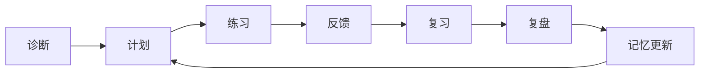

# 01. 领域与产品方案

## 1. 领域目标

英语学习陪伴 Agent 的核心目标不是回答英语问题，而是让用户：

- 更清楚自己的水平和弱项。
- 每天知道该练什么。
- 在低压力下持续主动输出。
- 得到具体、可执行的反馈。
- 通过复习机制减少遗忘。
- 在四六级考试中取得可见分数提升。

## 2. 目标用户

### 主用户

准备英语四级或六级的大学生。

典型特点：

- 时间有限，每天可投入 15-60 分钟。
- 目标明确，但执行不稳定。
- 常见问题是背了忘、听不懂、阅读慢、作文模板化。
- 容易在学习中焦虑、拖延或过度自责。

### 扩展用户

- 考研英语备考者。
- 需要英文技术阅读的程序员。
- 需要职场英语写作和口语的人。
- 希望长期提升英语输入输出能力的人。

## 3. 领域原则

来自 `docs/docs/englishtips/` 的核心原则：

- 先明确为什么学、用在哪儿。
- 被动输入不够，必须主动输出。
- 计划要适合当前水平，不能靠透支换努力感。
- 词汇要结合语境、发音、搭配和复习。
- 听力要区分精听和泛听，避免材料超纲。
- 阅读要区分精读和泛读，避免全文翻译依赖。
- 写作要先自己写，再反馈，再修改。
- AI 是教练，不是代学工具。

## 4. 学习闭环

### 4.1 诊断

系统初次使用时做轻量诊断：

- 词汇：高频词、熟词僻义、搭配。
- 阅读：主旨、细节、推断、耗时。
- 听力：主旨、细节、转写。
- 写作：基础作文或短段落。
- 自评：目标、时间、最弱项、兴趣、压力状态。

### 4.2 计划

计划不是一次生成 12 周详细表格后不再变化，而是滚动计划：

- 长期目标：考试日期和目标分。
- 阶段目标：本周重点。
- 每日任务：今天能完成的小任务。
- 动态调整：根据完成情况和正确率调整。

### 4.3 练习

练习必须包含主动输出：

- 词汇：造句、填空、搭配选择。
- 听力：转写、复述、题目作答。
- 阅读：总结、定位、题目解释。
- 写作：自己先写，再修改。
- 口语：回答、复述、场景模拟。

### 4.4 反馈

反馈规则：

- 每次只抓 1-3 个关键问题。
- 优先高频、可迁移、影响分数的问题。
- 明确指出为什么错、怎么改、下次怎么练。
- 避免一次性罗列所有语法问题。

### 4.5 复习

复习对象：

- 错词。
- 错题。
- 错误模式。
- 作文表达。
- 听力错听片段。
- 口语卡壳问题。

### 4.6 复盘

复盘输出：

- 今天完成了什么。
- 今天最关键的一个收获。
- 今天最值得修正的一个问题。
- 下次复习什么。
- 下次课程重点。

## 5. 四六级备考路径

### 5.1 阶段划分

| 阶段 | 时间 | 核心目标 |
|---|---|---|
| Diagnostic | 1-2 天 | 测水平、建画像、定计划 |
| Foundation | 1-3 周 | 高频词、基础听力、阅读题型、写作结构 |
| Intensive | 4-8 周 | 分题型专项突破 |
| Simulation | 考前 2-3 周 | 真题套卷、时间控制、错题复盘 |

### 5.2 技能优先级

不同用户的优先级不同：

- 词汇弱：词汇 + 阅读材料降级 + 高频词复习。
- 听力弱：精听 + 转写 + 题型定位。
- 阅读慢：限时定位 + 段落结构。
- 写作弱：结构模板 + 句子升级 + 二次修改。
- 执行差：减少任务量 + 强复盘 + 正反馈。

## 6. 产品页面

### 6.1 学习工作台

首屏内容：

- 今日课程。
- 今日复习。
- 本周进度。
- 高频错误。
- 四六级倒计时。
- 开始按钮。

### 6.2 课程页

结构：

- 左侧材料或题目。
- 右侧 Agent 引导。
- 底部输入区。
- 可展开反馈和笔记。

### 6.3 词汇页

能力：

- 今日新词。
- 今日复习。
- 错词本。
- 易混词。
- 词汇掌握趋势。

### 6.4 写作页

能力：

- 作文题目。
- 草稿编辑器。
- Agent 反馈。
- 用户二次修改。
- 升级版对照。
- 错误模式沉淀。

### 6.5 周报页

内容：

- 本周学习时间。
- 完成率。
- 词汇掌握变化。
- 阅读/听力/写作趋势。
- 高频错误 Top 5。
- 下周计划。

## 7. 反需求

明确不做或不优先做：

- 不做纯聊天英语陪聊。
- 不让 AI 直接替用户写作文。
- 不把所有材料都翻译成中文。
- 不用任务堆叠制造努力感。
- 不用排行榜压迫低基础用户。
- 不把技术复杂度暴露给学习者。
