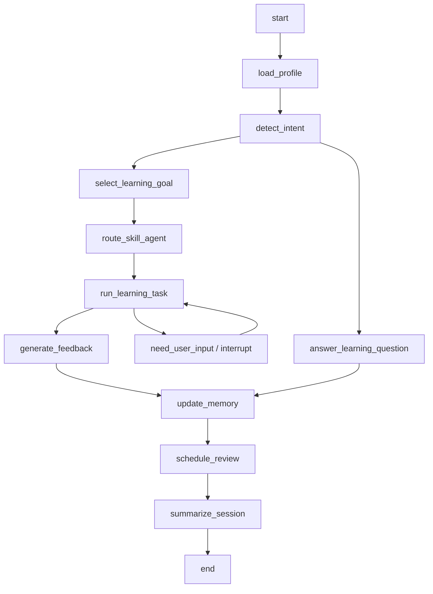

# 02. LangGraph Runtime 技术方案

## 1. 模块目标

LangGraph Runtime 负责把学习过程编排为可恢复、可观测、可扩展的状态机。

它解决的问题：

- 一节课不是一次 LLM 调用，而是多步骤流程。
- LLM 默认来自本地 Ollama，需要在节点层统一路由、校验和降级。
- 用户可能中断，需要从上次状态继续。
- 不同学习技能需要不同节点和 Agent。
- 每节课都要统一写入 Memory 和复习计划。
- 后续要能回放学习路径，解释系统为什么给出某个建议。

## 2. 核心状态

建议定义 `LearningState`：

```python
class LearningState(TypedDict):
    user_id: str
    thread_id: str
    session_id: str
    target_exam: str | None
    exam_date: str | None
    current_level: str | None
    daily_time_budget: int
    active_skill: str | None
    today_goal: str | None
    messages: list
    input_materials: list
    learner_answer: dict | None
    agent_feedback: dict | None
    memory_candidates: list
    review_items: list
    next_tasks: list
    emotion_signal: dict | None
    model_policy: dict | None
```

## 3. 顶层 Graph



## 4. 节点设计

### 4.1 `load_profile`

职责：

- 加载用户画像。
- 加载今日计划。
- 加载复习队列。
- 加载最近错误模式。

输入：

- `user_id`
- `thread_id`

输出：

- `current_level`
- `target_exam`
- `review_items`
- `recent_error_patterns`

### 4.2 `detect_intent`

判断用户意图：

- 开始今日课程。
- 复习单词。
- 提交作文。
- 做阅读/听力题。
- 问英语知识。
- 调整计划。
- 情绪/拖延求助。

输出：

```json
{
  "intent": "start_daily_lesson",
  "confidence": 0.92,
  "requires_skill": "reading"
}
```

模型策略：

- 默认使用 Ollama utility model。
- 输出必须为短 JSON。
- 解析失败时最多重试一次，不应进入长篇解释。

### 4.3 `select_learning_goal`

根据以下信息选择今日小目标：

- 长期目标。
- 今日时间预算。
- 复习到期项。
- 最近弱项。
- 用户状态。

示例输出：

```json
{
  "today_goal": "练习六级阅读中的转折定位题",
  "estimated_minutes": 20,
  "success_criteria": "完成 1 篇短阅读并解释 2 道错题"
}
```

### 4.4 `route_skill_agent`

路由到技能 Agent：

- vocabulary
- listening
- reading
- writing
- speaking
- exam_strategy
- motivation

路由规则：

- 到期复习优先。
- 考前真题优先。
- 连续失败则降级难度。
- 用户主动请求优先，但需要 Supervisor 控制任务量。

### 4.5 `run_learning_task`

调用具体技能 Agent 或 subgraph。

常见子流程：

- 词汇复习：取词 -> 出题 -> 作答 -> 判分。
- 阅读训练：取文章 -> 出题 -> 作答 -> 错因分析。
- 写作批改：接收草稿 -> 诊断 -> 要求二改 -> 对照反馈。
- 听力训练：取音频 -> 转写 -> 对照 -> 错听分析。

### 4.6 `generate_feedback`

统一反馈格式：

```json
{
  "summary": "你这次主要问题是定位转折后的关键信息。",
  "key_issues": [
    {
      "type": "reading_logic",
      "evidence": "题目问原因，但你选了结果。",
      "fix": "看到 however / yet / but 后优先标记观点变化。"
    }
  ],
  "drill": {
    "type": "transition_signal_practice",
    "minutes": 5
  }
}
```

模型策略：

- 默认使用 Ollama chat model。
- 写作、口语、学习记录等敏感内容标记为 `local_only`。
- 如果启用云端 fallback，也必须先检查 session 是否允许外发。

### 4.7 `update_memory`

把本次 session 的有效信息转成 Memory candidates：

- 新错词。
- 错题错因。
- 写作错误模式。
- 口语卡点。
- 完成情况。
- 情绪信号。

该节点不直接盲写所有内容，需要做过滤：

- 有证据。
- 可复用。
- 对后续计划有价值。
- 不包含敏感信息或无用闲聊。

### 4.8 `schedule_review`

调用复习调度工具，为以下对象生成复习：

- vocabulary item。
- wrong question。
- writing error pattern。
- listening mishearing pattern。

### 4.9 `summarize_session`

输出给用户的结尾：

- 今天完成了什么。
- 一个关键收获。
- 一个待修正问题。
- 到期复习。
- 下次重点。

## 5. Checkpoint 策略

### 5.1 为什么需要 checkpoint

典型中断场景：

- 用户写作文写到一半离开。
- 口语音频上传后 ASR 异步处理。
- 题库或评分工具调用失败。
- 用户需要先完成题目，Agent 等待输入。

### 5.2 checkpoint 粒度

建议在这些节点后保存：

- `load_profile`
- `select_learning_goal`
- `run_learning_task` 出题后
- 用户提交答案后
- `generate_feedback`
- `update_memory`
- `summarize_session`

### 5.3 恢复策略

- 如果用户中断在答题前：恢复题目和材料。
- 如果中断在评分前：重新调用评分工具，但保证幂等。
- 如果中断在 Memory 写入前：检查 session event 是否已写，避免重复。

## 6. Streaming 事件

面向前端输出事件：

```text
session.started
profile.loaded
goal.selected
task.created
agent.thinking
tool.called
answer.required
feedback.generated
memory.updated
review.scheduled
session.completed
```

## 7. 错误处理

| 错误 | 处理 |
|---|---|
| 本地 Ollama 不可达 | 返回可读错误并提示检查本地模型服务；若配置允许，可进入 fallback |
| LLM 超时 | 优先重试一次本地模型；必要时切 utility model 或异步处理 |
| 结构化输出解析失败 | JSON repair 后重试一次，仍失败则返回保守默认值 |
| 工具失败 | 返回可继续的学习任务，不中断整节课 |
| 题库无合适题 | 由 Agent 生成临时练习并标记来源 |
| Memory 写入失败 | 写入 outbox，异步补偿 |
| 用户答案为空 | 引导用户给最小回答，不直接跳过 |

## 8. 子图设计

后续可将复杂技能拆为 subgraph：

- `VocabularyReviewGraph`
- `ReadingLessonGraph`
- `WritingFeedbackGraph`
- `ListeningDictationGraph`
- `SpeakingPracticeGraph`

这样顶层 Graph 保持稳定，各技能独立迭代。

## 9. 模型调用约束

LangGraph 节点不得直接调用具体模型 SDK。所有模型调用必须经过 Model Provider Layer。

每次模型调用必须携带：

- `task_type`
- `preferred_provider`
- `preferred_model`
- `local_only`
- `response_schema`
- `trace_id`

默认：

```text
preferred_provider = ollama
local_only = true for writing, speaking, learner profile, memory extraction
```

详见 [09-model-provider-and-ollama.md](./09-model-provider-and-ollama.md)。
