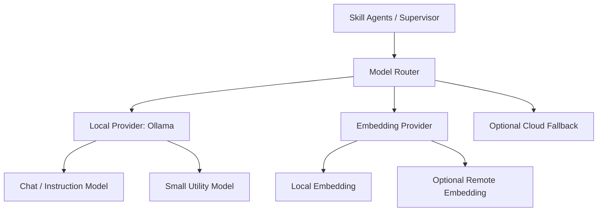

# 09. Model Provider 与 Ollama 本地模型方案

## 1. 模块目标

Agent 系统不可避免需要 LLM API。本项目的默认策略是：

> 优先使用本地部署的 LLM，当前默认以 Ollama 作为本地开源大模型运行时；云端模型仅作为可选 fallback 或高难任务增强，不作为系统默认依赖。

这样设计服务于英语学习场景的真实需求：

- 降低长期陪伴产品的推理成本。
- 减少用户学习记录、作文、口语转写等敏感数据外发。
- 支持离线或弱联网学习环境。
- 方便开发阶段快速切换和评估不同开源模型。
- 为后续私有化部署、学校/机构本地部署预留空间。

## 2. 模型提供方分层



## 3. 默认 Provider

### 3.1 Ollama

默认本地运行时：

```text
provider: ollama
base_url: http://localhost:11434
default_chat_model: configurable
default_utility_model: configurable
default_embedding_model: configurable
```

具体模型不在架构文档中写死，避免实现时被单一模型绑定。建议通过配置管理：

```yaml
model_provider:
  default_provider: ollama
  ollama:
    base_url: http://localhost:11434
    chat_model: qwen3:latest
    utility_model: qwen3:latest
    embedding_model: nomic-embed-text:latest
  fallback:
    enabled: false
    provider: openai_compatible
```

说明：

- `chat_model` 用于教学对话、写作反馈、阅读讲解。
- `utility_model` 用于意图识别、路由、摘要、Memory candidate 提取。
- `embedding_model` 用于材料、错题、表达和长期记忆检索。
- 如果本地机器资源有限，可以先用同一个模型覆盖 chat 和 utility，后续再拆。

## 4. Model Router

Model Router 为每个任务选择模型。

| 任务 | 默认模型策略 | 备注 |
|---|---|---|
| intent detection | Ollama utility model | 低成本、低延迟 |
| skill routing | Ollama utility model | 输出结构化 JSON |
| daily lesson dialog | Ollama chat model | 需要稳定教学语气 |
| writing feedback | Ollama chat model | 需要较强语言能力 |
| memory extraction | Ollama utility model | 必须严格 schema |
| weekly report | Ollama chat model | 可异步生成 |
| eval judge | 本地优先，可配置 fallback | 高质量评估可选云模型 |

## 5. 调用抽象

后端不要在 Agent 节点中直接调用 Ollama SDK，而应通过统一接口：

```python
class ModelClient(Protocol):
    async def chat(self, request: ChatRequest) -> ChatResponse:
        ...

    async def embed(self, request: EmbedRequest) -> EmbedResponse:
        ...
```

### 5.1 ChatRequest

```json
{
  "task_type": "writing_feedback",
  "messages": [],
  "response_schema": {},
  "temperature": 0.3,
  "max_tokens": 1200,
  "preferred_provider": "ollama",
  "preferred_model": "qwen3:latest"
}
```

### 5.2 ChatResponse

```json
{
  "provider": "ollama",
  "model": "qwen3:latest",
  "content": "...",
  "structured": {},
  "latency_ms": 1830,
  "usage": {
    "input_tokens": null,
    "output_tokens": null
  },
  "finish_reason": "stop"
}
```

注意：部分本地模型 API 的 token usage 不完整，系统应允许 usage 为空，但仍记录 prompt 字符数、响应字符数和耗时。

## 6. 结构化输出策略

本地开源模型在 JSON 稳定性上可能弱于部分云模型，因此需要额外约束：

- 优先使用 Pydantic schema 校验输出。
- 失败时进行一次 JSON repair。
- repair 后仍失败则重试一次，并降低输出复杂度。
- 关键节点不要依赖长篇自然语言解析。
- Memory 写入必须通过 schema 校验后才能入库。

建议所有 utility 任务输出都使用短 JSON：

```json
{
  "intent": "start_daily_lesson",
  "skill": "reading",
  "confidence": 0.86
}
```

## 7. Fallback 策略

默认关闭云端 fallback。只有在配置显式开启时才允许。

可 fallback 的场景：

- 本地 Ollama 不可用。
- 本地模型连续结构化输出失败。
- 用户明确允许使用云端增强。
- 离线评估需要高质量 judge。

不可 fallback 的场景：

- 用户作文原文、口语音频转写等敏感内容，除非用户明确授权。
- 机构私有化部署环境。
- 标记为 local_only 的 session。

Fallback 事件必须写入 trace：

```json
{
  "event": "model_fallback",
  "from": "ollama:qwen3:latest",
  "to": "openai_compatible:configured-model",
  "reason": "schema_validation_failed",
  "user_authorized": true
}
```

## 8. Ollama 健康检查

系统启动和运行中应检查：

- Ollama 服务是否可达。
- 默认 chat model 是否已 pull。
- 默认 embedding model 是否可用。
- 模型响应延迟是否超过阈值。

建议健康检查接口：

```text
GET /internal/model/health
```

返回：

```json
{
  "default_provider": "ollama",
  "ollama_reachable": true,
  "chat_model": {
    "name": "qwen3:latest",
    "available": true
  },
  "embedding_model": {
    "name": "nomic-embed-text:latest",
    "available": true
  }
}
```

## 9. 性能与成本

本地模型没有按 token 计费，但仍要记录成本代理指标：

- latency_ms。
- prompt_chars。
- completion_chars。
- retry_count。
- fallback_count。
- model_queue_time。
- GPU/CPU 内存占用，若可采集。

这些指标用于判断：

- 是否需要拆 utility model。
- 是否需要引入缓存。
- 是否需要对写作反馈改为异步。
- 是否需要限制上下文长度。

## 10. Agent 使用约束

所有 Agent 必须遵守：

- 不直接依赖某个具体云模型能力。
- prompt 不能假设模型一定具备联网能力。
- 需要外部事实时必须调用工具或题库。
- 对本地模型输出保持校验和容错。
- 写作、口语、学习记录默认 local_only。

## 11. MVP 建议

MVP 阶段：

- 先实现 Ollama chat。
- 再实现 Ollama embedding。
- 云端 fallback 配置保留但默认关闭。
- Eval judge 可以先用同一个本地 chat model，后续再对比更强模型。
- 对写作反馈、Memory extraction、skill routing 三类任务建立本地模型回归测试。
