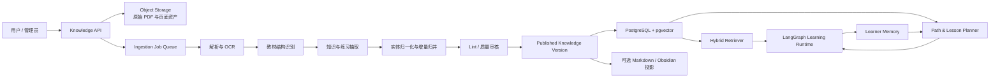

# 10. 教材知识库与学习路径技术方案

## 1. 模块目标

知识库模块负责把用户持续上传的教材和学习材料，编译成可追溯、可维护、可用于教学编排的结构化知识，而不是只在问答时临时切片检索。

目标闭环：

```text
上传教材 -> 解析教材结构 -> 抽取并归并知识 -> 质量审核 -> 发布知识版本
        -> 生成学习路径 -> 编排每日课程 -> 完成练习 -> 更新 learner memory
        -> 根据掌握度调整后续路径与复习 -> 新教材继续增量扩充
```

当前阶段仅处理人教版七年级英语上册、下册 PDF。数据模型保留未来扩展能力，但本期不导入、不抽取、不评估其他年级教材。

七年级教材重点抽取：

- 教材、章节、单元、课时和页面顺序。
- 语法、词汇、词组、搭配、佳句、固定句式。
- 单元主题、沟通功能、听说读写目标和学习策略。
- 教材原有讲解、例句、活动和练习。
- 知识点之间的先修、同义、对比、包含和复现关系。

模块最终服务两类场景：

1. **教材探索**：用户按教材顺序浏览单元、知识和练习，也能沿知识链接横向探索。
2. **个性化学习**：系统结合七年级教材顺序、知识依赖、用户目标和 learner memory，推荐每日课程与动态学习路径。

### 1.1 当前范围

| 范围 | 本期处理 |
|---|---|
| 七年级上册 | 是，作为首个 golden textbook 和主验收教材 |
| 七年级下册 | 是，在上册流水线稳定后接入 |
| 七年级用户持续上传的新教材/补充材料 | 是，进入同一审核与发布流程 |
| 小学教材 | 否 |
| 八、九年级教材 | 否 |
| 高中教材 | 否 |

“可扩展”只表示架构不锁死年级，并不意味着本期批量处理仓库中的其他教材。

## 2. 设计原则

### 2.1 编译知识，不只保存切片

传统 RAG 保存文档切片，查询时重新拼接答案。这里借鉴 Karpathy 的 LLM Wiki：原始资料不可变，中间知识层由系统持续维护，新增七年级材料会更新已有知识页、增加来源证据并建立跨材料链接。

向量检索仍然有用，但它是召回手段，不是知识库本身。课程编排必须读取经过校验的结构化知识，而不能直接依赖向量相似度生成教学事实。

### 2.2 教材顺序和知识依赖同时保留

教材目录表达作者设计的教学顺序；知识图谱表达七年级上、下册和补充材料之间的概念关系。两者不可互相替代：

- `NEXT_IN_BOOK` 保证用户可以顺着课本学习。
- `PREREQUISITE_OF` 保证跨材料推荐不会跳过先修知识。
- learner memory 决定何时复习、加练、跳过或回退。

### 2.3 知识事实与学习记忆分离

- Knowledge Base 回答“教材里有什么、知识之间如何关联”。
- Learner Memory 回答“这个用户学过什么、掌握得怎样、下一次何时复习”。

同一个知识点可以被所有用户共享，但每个用户的掌握状态独立存储。禁止把用户表现写回公共知识事实。

### 2.4 所有教学内容可溯源

每个知识点、例句和练习都要能回到：

```text
source_id + source_version + page_number + region/bounding_box + extraction_run_id
```

LLM 补充的解释或生成练习必须标为 `generated`，不能伪装成教材原文。

### 2.5 草稿与发布分离

上传成功不等于知识立即可用于推荐。抽取结果先进入 `draft`，通过自动校验和必要的人工审核后生成不可变的发布版本。每日课程只使用 `published` 版本。

## 3. 从 LLM Wiki 继承与改造的设计

参考实现提出 Raw Sources、Wiki、Schema 三层，以及 Ingest、Query、Lint 三类操作。本项目采用其“知识持续累积”思想，并做如下领域化改造：

| LLM Wiki 概念 | BinnAgent 落地 | 改造原因 |
|---|---|---|
| Raw sources | 对象存储中的原始教材与校验和 | 原文件不可变，可重放抽取 |
| Markdown wiki | PostgreSQL 规范数据 + 可选 Markdown 投影 | 课程调度需要稳定 ID、状态和事务 |
| Schema 文档 | 版本化 extraction schema、prompt 和校验规则 | 抽取结果必须可复现、可迁移 |
| index.md | 结构化目录索引 + 全文/向量索引 | 教材规模增长后仍可高效检索 |
| log.md | append-only ingestion events 和审计日志 | 支持任务恢复、错误定位和版本追踪 |
| Ingest | 多阶段、可恢复、幂等的导入流水线 | PDF/OCR/LLM 都可能部分失败 |
| Query | 结构化过滤 + 全文 + 向量混合检索 | 精确顺序、概念召回和语义召回并存 |
| Lint | 知识库健康检查与发布门禁 | 防止重复、孤儿、冲突和无来源知识进入课程 |

`englishwiki/wiki/` 可以继续作为 Obsidian 可读的知识投影和运营检查界面，但不作为生产运行时唯一数据库。Markdown 文件由导出器生成，不由在线请求直接修改。

## 4. 系统边界与总体架构



### 4.1 组件职责

| 组件 | 职责 |
|---|---|
| Source Registry | 上传、去重、版本、授权范围、文件状态 |
| Document Processor | PDF 页面渲染、文本层提取、OCR、版面块识别 |
| Curriculum Parser | 识别目录、单元、课时、栏目、页码和顺序 |
| Knowledge Extractor | 抽取知识点、例句、句式、练习与教学目标 |
| Knowledge Curator | 归一化、跨来源合并、冲突标记、关系建立 |
| Knowledge Linter | 完整性、溯源、重复、关系和教学安全校验 |
| Knowledge Store | 版本化保存结构、知识、证据、关系和 embedding |
| Hybrid Retriever | 元数据过滤、全文检索、向量召回和重排 |
| Path Planner | 生成教材路径和个性化路径 |
| Lesson Planner | 在时间预算内组合新学、练习与复习 |
| Memory Adapter | 把学习事件更新到用户掌握度和复习计划 |

## 5. 知识模型

### 5.1 三层核心模型

#### A. 教材结构树（Curriculum Tree）

保持原书顺序和层级：

```text
Textbook -> Volume -> Unit -> Section -> Lesson Block -> Page Region
```

`Lesson Block` 是最小可教学顺序单元，例如 Reading、Grammar Focus、Listening、Workbook Exercise。它包含 `ordinal`、预计学习时长和页面证据。

#### B. 可复用知识图（Knowledge Graph）

知识类型：

| 类型 | 示例 |
|---|---|
| `grammar` | 定语从句、一般现在时、被动语态 |
| `vocabulary` | challenge、recommend、suitable |
| `phrase` | sign up for、be responsible for |
| `collocation` | face a challenge、highly recommended |
| `sentence_pattern` | It is + adj. + to do... |
| `good_sentence` | 可迁移到表达训练的优质原句 |
| `function` | 提建议、澄清、表达同意或反对 |
| `strategy` | 略读、预测、根据上下文猜词 |
| `topic` | 校园生活、旅行、自然灾害 |

常用关系：

```text
PREREQUISITE_OF   先修
PART_OF           包含
INTRODUCED_IN     首次出现
PRACTICED_IN      被练习
REINFORCED_IN     再次强化
NEXT_IN_BOOK      教材下一项
RELATED_TO        相关
CONTRASTS_WITH    易混或对比
SYNONYM_OF        同义
VARIANT_OF        词形或句式变体
EXEMPLIFIED_BY    由例句说明
ASSESSED_BY       由练习检测
```

#### C. 学习资产（Learning Assets）

保存可直接用于课程的内容：

- 原教材讲解与例句。
- 原教材练习及答案（如来源包含）。
- LLM 生成的分级解释、变式题、提示和反馈 rubric。
- 音频、图片、页面裁剪等多模态资产引用。

所有资产都有 `origin = source | generated | teacher_authored`。教材资产与生成资产分开授权和展示。

### 5.2 知识点最小结构

```json
{
  "id": "kp_01J...",
  "canonical_key": "grammar.relative-clause.defining",
  "type": "grammar",
  "title": "限制性定语从句",
  "language": "zh-CN",
  "level": "senior-high-1",
  "summary": "使用关系词限定先行词范围。",
  "content": {},
  "aliases": ["defining relative clause"],
  "difficulty": 0.56,
  "status": "published",
  "version": 3,
  "source_count": 4
}
```

不同类型的 `content` 使用独立 JSON Schema。例如 vocabulary 包含词性、音标、义项、搭配和例句；grammar 包含形式、意义、使用条件、常见错误和对比例句；sentence pattern 包含槽位、约束和可替换示例。

### 5.3 来源证据

证据不是知识点里的一个模糊 `source_ref`，而是多对多实体：

```text
Knowledge Point <- Knowledge Evidence -> Source Segment
```

`knowledge_evidence` 至少记录：

- `knowledge_point_id`
- `source_segment_id`
- `claim_path`：支持知识对象中的哪个字段
- `evidence_type`：definition/example/exercise/inferred
- `quote`：短摘录，受版权展示策略限制
- `confidence`
- `extraction_run_id`

一个知识点可以被七年级上、下册或用户后续上传的七年级材料共同支持；新材料不会覆盖旧来源，而是增加证据、补充差异或创建冲突记录。

## 6. PDF 导入流水线

### 6.1 状态机

```text
uploaded -> fingerprinted -> parsed -> structured -> extracted
         -> normalized -> validated -> review_required -> published
                                      \-> rejected
任意处理中状态 -> failed -> retrying
```

### 6.2 阶段设计

#### 1. 上传与登记

- 流式上传到对象存储，不把大文件放入数据库。
- 校验 MIME、扩展名、大小、页数、恶意文件和加密状态。
- 计算 SHA-256；同一租户内相同文件直接复用已有 source。
- 保存书名、出版社、学段、年级、册次、版本、版权与可见范围。
- 同一教材新版创建 `source_version`，不原地覆盖。

#### 2. 页面解析

每页生成统一 `PageArtifact`：

- 原始文本层及字符坐标。
- 页面图片。
- OCR 文本及置信度，仅对无文本层或低质量区域启用。
- 版面块：标题、正文、表格、图片、页眉页脚、题目和答案区。
- PDF 页码与印刷页码映射。

解析器先使用确定性工具；视觉模型只处理复杂版面和图片语义，降低成本与幻觉。

#### 3. 教材结构识别

- 先识别目录和全书 page map。
- 再按 Unit/Section 边界分组，不用固定 token 长度切割教材。
- 保留七年级教材栏目，如 Topics、Functions、Structures、Target Language、Vocabulary、Recycling，以及具体页面中的听说读写活动。
- 为每个节点计算 `parent_id`、`ordinal`、起止页和学习目标。

目录识别结果与实际页标题必须互相校验，页码偏移不能靠 LLM 猜测后直接发布。

#### 4. 知识与练习抽取

以一个 `Lesson Block` 为原子任务，使用版本化 schema 输出严格 JSON：

- 显式知识：教材直接给出的语法、词表、句式。
- 隐式知识：从课文和活动识别的可迁移知识，标为 `inferred`。
- 练习：题干、选项、答案、解析、技能、难度和所测知识点。
- 例句：原文、译文、所在页、可教学标签。

每个对象必须附页面证据；无法定位来源的抽取进入待审或丢弃。

#### 5. 归一化与增量归并

采用“候选召回 + 规则比较 + LLM 判定”的三级流程：

1. 按类型、lemma、canonical key 和 aliases 精确召回。
2. 用全文与 embedding 召回相似知识点。
3. 判断 `same / related / contrasting / new`，输出解释和置信度。

自动合并仅允许高置信、同类型且 schema 兼容的对象。低置信候选进入 review queue。合并时保留字段级 provenance，不做不可逆文本覆盖。

#### 6. 校验与发布

发布门禁至少包括：

- 结构节点连续，Unit/Section ordinal 不重复。
- 所有知识和练习均有来源证据。
- `NEXT_IN_BOOK` 不形成环。
- `PREREQUISITE_OF` 不形成环，或明确标记为待处理冲突。
- 练习答案格式合法，选择题答案在选项范围内。
- 同一 canonical key 没有未处理的重复发布对象。
- 低 OCR 置信度、低抽取置信度和冲突项已审核。

发布生成不可变 `knowledge_release`。失败任务可以从最后成功阶段恢复，不重复创建实体。

### 6.3 幂等与可恢复性

任务幂等键：

```text
source_version_id + stage + processor_version + schema_version
```

每阶段只写自己的 staging 表或 artifact，完成后原子提交状态。修改 prompt、模型或 schema 时生成新的 extraction run，允许比较结果后再切换发布版本。

## 7. 检索设计

### 7.1 查询路径

不同用途采用不同检索策略：

| 用途 | 首选检索 |
|---|---|
| 按教材继续学习 | curriculum node + ordinal |
| 找某单元语法/词汇 | 结构过滤 + 类型过滤 |
| 回答知识问题 | 全文/BM25 + vector + rerank |
| 找先修知识 | graph traversal |
| 生成复习题 | knowledge ID + learner mastery + asset type |
| 查原文依据 | evidence -> source segment |

混合检索候选应先用 `tenant_id`、`release_id`、`source visibility`、`knowledge type` 和 `level` 过滤，再做全文/向量排序，避免跨权限或跨学段污染。

### 7.2 Prompt Context 组装

运行时只传递完成当前教学任务所需的：

- 目标知识点规范内容。
- 必要先修知识的短摘要。
- 当前教材位置和前后关系。
- 2-4 个有来源的例句或练习。
- 用户相关的 mastery、错误模式和到期复习项。

不把整本 PDF、整张知识图或全部 learner memory 塞入 prompt。

## 8. 学习路径设计

### 8.1 两种基础路径

#### 教材路径

严格沿 `NEXT_IN_BOOK` 推进，适合“从头学完这本书”。允许用户查看和跳转，但系统记录跳过状态。

#### 能力路径

以目标知识集合为终点，根据 `PREREQUISITE_OF` 展开有向无环图，再结合用户已掌握项生成拓扑序。适合补弱项或在七年级上、下册及补充材料之间学习。

用户实际路径是两者的加权组合：

```text
candidate_score =
    0.35 * book_sequence
  + 0.25 * prerequisite_readiness
  + 0.20 * weakness_priority
  + 0.10 * due_review_priority
  + 0.05 * goal_relevance
  + 0.05 * interest_fit
  - overload_penalty
```

权重是首版默认值，应通过学习完成率和掌握提升评估后调整，不让 LLM自由决定。

### 8.2 路径节点状态

每个用户对路径节点有独立状态：

```text
locked -> available -> in_progress -> completed
                           |              |
                           v              v
                        paused         review_due
                                           |
                                           v
                                        mastered
```

`completed` 表示完成一次课程，不等于 `mastered`。掌握状态由多次、跨形式证据决定。

### 8.3 掌握度

建议以 `learner_knowledge_states` 统一承载语法、词汇、词组和句式，而不是只给词汇建表：

```text
learner_id
knowledge_point_id
status                  unseen/learning/reviewing/mastered
mastery_score           0..1
confidence              对 mastery 估计的置信度
exposure_count
correct_count
last_seen_at
next_review_at
source_path_node_id
evidence_summary jsonb
updated_at
```

单次答对只能增加证据，不能直接判定掌握。mastery 更新至少考虑正确性、作答时间、提示次数、题型迁移、遗忘间隔和最近错误。

## 9. 每日课程编排

### 9.1 输入

- 用户目标、水平、每日时间预算和偏好。
- 当前 active learning path 与教材位置。
- 到期复习队列。
- 最近错误模式和知识掌握状态。
- 已发布知识版本及可见教材范围。

### 9.2 课程模板

默认 25 分钟课程可以组合为：

```text
3 min  热身与到期复习
8 min  当前教材新知识
8 min  教材练习或变式练习
4 min  输出任务：造句、复述、对话或短写作
2 min  反馈、memory 更新和下一步预告
```

时间不足时优先保留到期复习和一个可闭环的小目标；时间充足时扩展练习深度，不一次塞入过多新知识。

### 9.3 选课约束

- 新知识的先修掌握度达到阈值。
- 每日新知识数量有上限。
- 到期复习具有保底时间配额。
- 连续失败时回退到先修或更简单资产。
- 已掌握内容只做低频抽查，不重复完整讲授。
- 教材顺序可以被个性化策略暂时打断，但必须记录原因并可回到原位置。

### 9.4 LangGraph 接入

在现有 daily lesson graph 中新增：

```text
load_profile
  -> load_active_path
  -> retrieve_due_reviews
  -> select_lesson_candidates
  -> compose_daily_lesson
  -> run_learning_task
  -> generate_feedback
  -> update_learner_knowledge_state
  -> update_memory
  -> schedule_review
  -> advance_or_replan_path
  -> summarize_session
```

`select_learning_goal` 不再凭 prompt 临时产生目标，而是消费 Path Planner 给出的候选和可解释分数。所有推荐保存 `recommendation_reason`，便于用户理解“为什么今天学这个”。

## 10. 与 Memory System 的边界和事件协议

### 10.1 写入事件

课程运行时产生 append-only `learning_events`：

```json
{
  "event_type": "knowledge_practiced",
  "learner_id": "...",
  "session_id": "...",
  "knowledge_point_id": "...",
  "learning_asset_id": "...",
  "result": {
    "correct": false,
    "response_time_ms": 18400,
    "hint_count": 1,
    "error_type": "relative_pronoun_confusion"
  },
  "occurred_at": "2026-06-18T12:00:00Z"
}
```

Memory Curator 消费事件并更新：

- `learner_knowledge_states`
- `vocabulary_items`（兼容现有词汇产品页）
- `error_patterns`
- `review_schedules`
- `plan_memory`

### 10.2 读取协议

Path Planner 只读取结构化状态，不读取未经验证的聊天推断。读取结果应包含：

- mastery score 与置信度。
- 最近证据及其时间。
- 到期复习时间。
- 相关错误模式。
- 用户明确偏好。

### 10.3 一致性

课程完成事件、attempt 和 learner knowledge state 使用同一数据库事务，事件消费者必须幂等。公共知识版本升级时，旧学习记录仍引用原 knowledge ID；合并知识点时使用 alias/redirect，不级联丢失历史。

## 11. 数据模型

### 11.1 来源与导入

```text
knowledge_sources
  id, tenant_id, title, source_type, publisher, level, metadata,
  visibility, status, created_by, created_at

knowledge_source_versions
  id, source_id, version_label, object_key, sha256, mime_type,
  file_size, page_count, parser_version, created_at

ingestion_jobs
  id, source_version_id, status, current_stage, progress,
  schema_version, processor_version, error_summary, created_at, updated_at

ingestion_runs
  id, job_id, stage, attempt, model_provider, model_name, prompt_version,
  input_artifact_ref, output_artifact_ref, status, metrics, started_at, completed_at

source_pages
  id, source_version_id, pdf_page_number, printed_page_number,
  image_ref, text_ref, ocr_confidence, layout_metadata

source_segments
  id, page_id, segment_type, ordinal, text, bbox, language,
  checksum, embedding
```

### 11.2 教材与知识

```text
curriculum_nodes
  id, source_version_id, parent_id, node_type, title, ordinal,
  start_page, end_page, learning_objectives, estimated_minutes, metadata

knowledge_points
  id, canonical_key, type, title, language, level, summary,
  content, aliases, difficulty, status, current_version, created_at, updated_at

knowledge_point_versions
  id, knowledge_point_id, version, content, change_reason,
  extraction_run_id, review_status, created_at

knowledge_evidence
  id, knowledge_point_version_id, source_segment_id, claim_path,
  evidence_type, quote, confidence

knowledge_relations
  id, from_knowledge_id, relation_type, to_knowledge_id,
  source, confidence, status

curriculum_knowledge_map
  curriculum_node_id, knowledge_point_id, role,
  first_introduced, ordinal, expected_depth

learning_assets
  id, curriculum_node_id, asset_type, origin, content,
  answer, explanation, difficulty, rights_metadata, status

asset_knowledge_map
  learning_asset_id, knowledge_point_id, assessment_weight

knowledge_releases
  id, tenant_id, release_number, status, manifest,
  published_by, published_at
```

### 11.3 路径与学习状态

```text
learning_paths
  id, learner_id, title, path_type, source_release_id,
  goal, status, strategy_version, created_at, updated_at

learning_path_nodes
  id, path_id, curriculum_node_id, knowledge_point_id,
  ordinal, status, recommendation_reason, unlocked_at, completed_at

daily_lessons
  id, learner_id, path_id, lesson_date, time_budget_minutes,
  goal, status, planner_version, explanation, created_at

daily_lesson_items
  id, daily_lesson_id, item_type, knowledge_point_id,
  learning_asset_id, ordinal, estimated_minutes, purpose, status

learner_knowledge_states
  learner_id, knowledge_point_id, status, mastery_score, confidence,
  exposure_count, correct_count, last_seen_at, next_review_at,
  evidence_summary, updated_at

learning_events
  id, learner_id, session_id, event_type, knowledge_point_id,
  learning_asset_id, payload, occurred_at
```

### 11.4 关键索引与约束

```text
UNIQUE (tenant_id, sha256)                         -- 上传去重
UNIQUE (source_version_id, parent_id, ordinal)     -- 教材顺序
UNIQUE (canonical_key, language)                   -- 规范知识键
UNIQUE (learner_id, knowledge_point_id)            -- 用户掌握状态
INDEX  (source_version_id, pdf_page_number)
INDEX  (knowledge_point_id, next_review_at)
INDEX  (learner_id, next_review_at)
INDEX  GIN(content jsonb)
INDEX  GIN(search_document)                        -- PostgreSQL FTS
INDEX  HNSW(embedding vector_cosine_ops)            -- pgvector
```

## 12. API 与管理功能

### 12.1 用户 API

```text
POST   /api/knowledge/sources/uploads              创建上传会话
POST   /api/knowledge/sources/{id}/ingest          发起导入
GET    /api/knowledge/sources                       教材列表
GET    /api/knowledge/sources/{id}                  教材与处理状态
GET    /api/knowledge/sources/{id}/curriculum       教材目录树
GET    /api/knowledge/points/{id}                   知识详情与来源
GET    /api/knowledge/search                        混合检索
POST   /api/learners/{id}/learning-paths            创建路径
GET    /api/learners/{id}/learning-paths/{path_id}  路径进度
GET    /api/learners/{id}/daily-lessons/today       今日课程
POST   /api/learners/{id}/daily-lessons/{id}/items/{item_id}/attempts
```

上传和导入是异步操作。状态通过轮询或 SSE 返回 `stage`、`progress`、警告和可重试错误。

### 12.2 管理台

首期管理功能：

- 教材列表：文件、版本、状态、页数、上传者和可见范围。
- 导入详情：阶段进度、耗时、失败原因、重试与取消。
- 目录校对：左侧 PDF 页面，右侧结构树，支持修正页码和层级。
- 抽取审核：按类型查看知识、练习、证据和置信度。
- 归并审核：并排比较已有知识与新候选，选择合并、关联或新建。
- 冲突处理：保留不同教材表述，选择适用范围，不静默覆盖。
- 发布管理：查看 lint 报告、创建 release、回滚到上一 release。
- 知识浏览：按教材、类型、级别和来源查看关系与使用情况。
- 学习路径预览：用模拟 learner profile 检查每日课程结果和推荐理由。

权限建议：

| 角色 | 权限 |
|---|---|
| learner | 上传私有教材、查看自己的教材和路径 |
| curator | 审核结构、知识、归并与冲突 |
| admin | 管理全局来源、权限、发布和回滚 |

## 13. Knowledge Lint 与质量指标

### 13.1 Lint 项

- 无证据或证据页不存在。
- 教材结构缺页、重叠、顺序冲突。
- 无入边/无课程映射的孤儿知识。
- 重复 canonical key 或高度相似未归并项。
- 循环先修关系。
- 来源之间定义、答案或难度冲突。
- vocabulary 无 lemma/词性，grammar 无形式或示例。
- 练习无答案、答案越界、题目与所测知识不一致。
- Markdown 投影的断链和索引遗漏。

### 13.2 核心指标

| 指标 | 含义 | MVP 目标 |
|---|---|---|
| structure coverage | 正确识别的单元/栏目占比 | >= 95% |
| evidence coverage | 有有效页码证据的发布知识占比 | 100% |
| extraction precision | 抽样审核正确率 | >= 90% |
| duplicate rate | 发布后重复知识比例 | < 3% |
| exercise validity | 答案与格式校验通过率 | >= 98% |
| lesson traceability | 课程项可回溯知识和来源占比 | 100% |
| path completion | 用户按周完成计划的比例 | 产品基线后持续提升 |
| mastery lift | 一段时间后同知识测评提升 | 核心学习效果指标 |

必须建立一小套人工标注 golden textbook pages，对目录识别、知识抽取、归并和练习映射做回归测试。不能只用“LLM 看起来合理”作为验收。

## 14. 安全、隐私与版权

- 原始教材默认私有；租户和用户访问在查询层强制过滤。
- 文件上传进行类型、大小、恶意内容和路径穿越检查。
- 对象存储使用不可猜测 key 和短期签名 URL。
- 教材原文仅在授权范围内展示；搜索结果优先返回短摘录和页码。
- 生成内容明确标注，不冒充出版社内容或官方答案。
- 删除来源时先检查知识、路径和学习历史引用；公共知识可撤销来源证据，用户学习事件不被静默篡改。
- 外部模型默认不能接收私有教材全文；遵循 Ollama-first 和 `local_only` 策略。
- 管理操作、发布、合并和回滚全部进入审计日志。

## 15. MVP 范围与实施顺序

### Phase 1：单本教材可用

- 上传一本 PDF，保存原文件与状态。
- 解析目录、Unit/Section、页面文本和图片。
- 抽取 grammar、vocabulary、phrase、sentence pattern 和 exercise。
- 提供证据页码、草稿审核和一次发布。
- 按教材顺序生成路径与每日课程。
- 练习结果写入 `learner_knowledge_states`、现有 vocabulary memory 和 review schedule。

验收：以人教版七年级上册为样本，用户可从 Starter Unit 1 开始，看到按书序组织的知识与练习；完成课程后路径推进，错误知识进入复习。随后使用七年级下册验证增量导入不会破坏上册知识与学习记录。

### Phase 2：七年级多材料增量知识

- 七年级下册及用户新增的七年级材料与已有知识归并。
- 字段级多来源 evidence、冲突审核和 release 回滚。
- 全文 + pgvector 混合检索。
- 能力路径和七年级材料间的先修图。
- Markdown/Obsidian 投影与自动 lint。

### Phase 3：个性化与规模化

- mastery 模型校准和更成熟的复习算法。
- 课程 A/B 与推荐权重调优。
- 多模态听力、图片、口语素材。
- 批量导入、优先级队列、成本配额和运营指标。

## 16. 明确不在 MVP 做的事情

- 不先引入独立图数据库；PostgreSQL 关系表足以支持首期图遍历。
- 不把每个 PDF chunk 都当作知识点。
- 不自动发布低置信抽取或冲突归并。
- 不在上传请求内同步完成整本教材处理。
- 不用向量相似度代替教材顺序和先修约束。
- 不因新教材更新而覆盖或删除历史学习记录。
- 不处理小学、八九年级和高中教材。
- 不一次性把仓库内教材全部导入生产知识库；先用七年级上册建立 golden set 和质量基线，再处理七年级下册。

## 17. 关键决策记录

1. **PostgreSQL 是运行时事实源，Markdown 是可选投影。** 兼顾课程事务与人类可读维护。
2. **知识 ID 跨七年级材料稳定，证据和版本持续增加。** 支持后续上传新材料而不破坏 learner memory。
3. **教材结构、知识图和学习资产分层。** 分别解决顺序、复用和实际教学。
4. **路径规划是约束评分器，LLM 负责解释与内容生成。** 保持推荐可控、可测、可复现。
5. **发布 release 隔离在线课程与导入过程。** 新教材处理失败不会污染正在学习的用户。

## 18. 参考

- [Karpathy: LLM Wiki](https://gist.github.com/karpathy/442a6bf555914893e9891c11519de94f) - Raw/Wiki/Schema、Ingest/Query/Lint 与累积式知识维护模式。
- [03-memory-system.md](./03-memory-system.md) - learner memory、错误模式和复习调度。
- [02-langgraph-runtime.md](./02-langgraph-runtime.md) - 每日课程状态机和节点编排。
- [06-data-model.md](./06-data-model.md) - PostgreSQL、pgvector 和现有业务模型。
- [09-model-provider-and-ollama.md](./09-model-provider-and-ollama.md) - 本地模型优先与外发边界。
