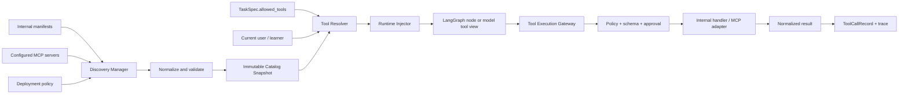

# 15. Dynamic Tool Registry、Discovery 与 Runtime Injection

> 状态：Phase 1 基础设施和首批 can-do 学习 wrapper 已实现；LangGraph 全量迁移与通用 MCP discovery 待完成
> 审计日期：2026-07-14
> 范围：内部 Python tools、MCP tools、LangGraph runtime、TaskSpec、权限与审计

## 1. 结论

BinnAgent 已从静态 Tool Registry 骨架升级为应用级 Tool Catalog 第一阶段，并完成首批五个 can-do 学习业务 wrapper；LangGraph 全量迁移和通用 MCP discovery 尚未完成。

2026-07-12 已落地：

- 应用 lifespan 初始化的 `ToolCatalogManager`；
- 内部 manifest discovery、原子 refresh、catalog revision、generation 与 spec hash；
- 工具启用/停用、健康状态和刷新失败计数；
- 默认拒绝的 Task allowlist resolver；
- 带 catalog revision、input/output schema、timeout、结构化错误和审计 metadata 的执行 gateway；
- Dev Console Catalog、生命周期监控、重新发现、启停和权限解析诊断；
- registry、resolver、gateway 和 debug API 回归测试。

2026-07-14 新增：

- `find_can_do_for_item`、`find_can_do_for_query`、`analyze_learner_response`、`get_learner_knowledge_state`、`record_learning_evidence` 五个真实 binding；
- learner/db 可信执行上下文，与模型可见 payload 分离；
- can-do primary/alternatives、atomic KC、文本证据、置信度和 `whether`/`wh-word` 术语冲突保留；
- `(learner_id, event_id)` 数据库级幂等、原始证据/匹配器版本审计、撤销后状态重放；
- 状态写入复用 `MasteryEngine`，LLM 参数不能直接覆盖 IRT/DKT/FSRS 状态。

原有静态能力包括：

- `src/tools/registry.py` 提供进程内 `register/get/list_tools/execute`；
- `ToolSpec` 描述名称、输入输出 schema、风险、超时、重试和审批标志；
- `/api/tools` 可在 Dev Console 中列出默认工具；
- `ToolRegistry.execute()` 可记录 `ToolCallRecord`；
- `TaskSpec` 和 ExploreCapability 可声明 `allowed_tools`。

当前仍未形成的闭环：

- 兼容层 `build_default_tool_registry()` 仍是静态实现；应用执行入口已切到 catalog，旧八个 core binding 仍是占位 handler，五个 can-do learning binding 已是真实实现；
- 没有 entry point、模块 manifest、数据库配置或 MCP server 的自动发现；
- 已有启动时 catalog、显式刷新、状态计数与 revision；尚无外部 provider 探活、跨进程 revision 和持久化版本快照；
- gateway 已能强制调用方传入的 `allowed_tools`，但现有 LangGraph/业务调用尚未全部迁入 gateway；
- can-do 工具已可信注入 learner 和数据库会话；current user、episode、approval 等完整 `ToolContext` 仍待扩展；
- 没有把筛选后的工具注入 LangGraph 节点或模型 tool calling；
- 业务节点通常直接 import service，未经过统一执行网关；
- schema 与 timeout 已执行；retry、approval、scope 和 risk policy 仍待落实；
- `/api/tools/catalog` 已提供运行态视图，旧 `/api/tools` 保留兼容。

因此，当前实现应准确标记为“应用级动态 Catalog 与执行治理基础设施”，仍不能表述为完整动态 Tool/MCP 平台。

## 2. 当前链路审计

| 能力 | 当前证据 | 判断 |
|---|---|---|
| 注册 | `ToolRegistry.register()` | 有进程内手工注册；无生命周期和来源治理 |
| 发现 | `build_default_tool_registry()` 固定八个名称 | 只有静态枚举；无 provider/MCP discovery |
| 列表 API | `GET /api/tools` | 可观察静态 spec；不反映健康、版本和权限 |
| 执行 | `ToolRegistry.execute()` | 可调 handler 并记录 hash/latency；无 schema/policy enforcement |
| Task allowlist | `TaskSpec.allowed_tools` | 有声明；未在统一边界强制执行 |
| Runtime 注入 | 未发现 resolver/injector | learner/db/episode 等可信上下文未隔离注入 |
| LangGraph 注入 | 未发现 `ToolNode`、`bind_tools` 或等价机制 | 图为固定节点，业务代码直接调用 service |
| MCP | 飞书为专项 adapter，架构文档有目标 | 没有通用 MCP catalog 与 adapter |
| 审计 | `ToolCallRecord`、episode trace | 有基础；缺 spec/version/provider/policy decision |

## 3. 设计目标与非目标

### 3.1 目标

1. 内部工具和 MCP 工具使用同一份规范化 `ToolDescriptor`。
2. 工具可以在启动时发现，在显式刷新后更新；一次 episode 内保持工具集合稳定。
3. `TaskSpec.allowed_tools`、learner ownership、部署策略和风险策略共同决定可用工具。
4. 模型只看到允许调用的公开参数；可信上下文只能由 runtime 注入。
5. 所有调用统一经过 schema、授权、超时、审批、审计和输出归一化。
6. 工具失败可分类、可重试、可回放，但副作用不被盲目重放。

### 3.2 非目标

- 第一阶段不允许用户上传任意 Python 代码并在主进程执行。
- 不把 prompt registry 与 tool registry 合并；二者共享治理原则，但生命周期不同。
- 不让 LLM 自行决定 learner、tenant、episode、数据库 session 或审批结果。
- 不为“动态”而做请求级热扫描；生产刷新必须显式、可审计、可回滚。

## 4. 总体架构



系统分为两个平面：

- **控制面**：发现、规范化、注册、健康检查、启停、刷新、生成 immutable catalog snapshot。
- **数据面**：按请求解析允许工具、注入可信上下文、执行策略、调用 adapter、记录审计。

控制面变化不能悄悄改变运行中的 episode。episode 创建时保存 `catalog_revision` 和选中工具的 `name/version/spec_hash/provider_ref`，恢复时优先复用该快照；快照不可用时明确失败或执行受控迁移。

## 5. 核心模型

### 5.1 ToolDescriptor

建议用不可变模型替代当前只覆盖展示字段的 `ToolSpec`：

```python
class ToolDescriptor(BaseModel):
    name: str
    version: str
    description: str
    input_schema: dict[str, Any]
    output_schema: dict[str, Any]
    source: Literal["internal", "mcp"]
    provider_ref: str
    risk_level: Literal["read", "write", "external_side_effect", "privileged"]
    required_scopes: set[str] = set()
    injected_fields: set[str] = set()
    timeout_ms: int = 30_000
    retry_policy: RetryPolicy = RetryPolicy()
    idempotency: Literal["safe", "keyed", "unsafe"] = "unsafe"
    requires_approval: bool = False
    enabled: bool = True
    metadata: dict[str, Any] = {}
```

关键约束：

- 工具唯一键为 `(name, version)`；同名同版本不同 `spec_hash` 必须拒绝注册。
- 对模型暴露的 schema 必须移除 `injected_fields`。
- `description` 和 MCP schema 都属于不可信供应链输入，注册前要做长度、格式、危险文本和 allowlist 检查。
- `provider_ref` 只引用 adapter/config，不包含 secret。

### 5.2 ToolBinding 与 ToolContext

`ToolDescriptor` 是可序列化元数据；`ToolBinding` 才持有不可序列化 handler：

```python
class ToolBinding:
    descriptor: ToolDescriptor
    adapter: ToolAdapter

class ToolContext:
    current_user: CurrentUser
    learner: Learner
    db: AsyncSession
    episode_id: UUID
    task_spec: TaskSpec
    trace_id: str | None
    approval: ApprovalGrant | None
```

公开 payload 与可信 context 必须分离。handler 接口建议为：

```python
async def invoke(payload: dict[str, Any], context: ToolContext) -> dict[str, Any]: ...
```

严禁从模型参数接受 `learner_id` 后直接查询私有资源。若业务 schema 需要展示 learner 标识，也必须校验其与 `context.learner.id` 一致。

### 5.3 CatalogSnapshot

```text
revision
created_at
bindings[(name, version)]
spec_hashes
source_health
configuration_hash
```

Registry 对外发布 snapshot，刷新过程先在 staging catalog 完成发现、校验和探活，全部通过后再原子替换；读取路径不持有刷新锁。

## 6. 动态注册

### 6.1 内部工具

第一阶段采用显式 manifest，不使用全仓库 import 扫描：

```python
INTERNAL_TOOL_PROVIDERS = [
    RagToolProvider(),
    ExerciseToolProvider(),
    MemoryToolProvider(),
]
```

每个 provider 返回 `list[ToolBinding]`。这样可测试、可审阅，也避免 import side effect。未来若拆成独立 Python package，可增加受 allowlist 控制的 `importlib.metadata.entry_points(group="binnagent.tools")`，但第三方代码必须在隔离 worker/container 运行。

### 6.2 MCP 工具

MCP server 来源只允许配置文件或数据库中的管理员配置。Discovery Manager 对每个启用 server：

1. 建立带连接/读取超时的 session；
2. 调用 `tools/list`；
3. 将 server tool name 规范化为稳定名称，例如 `mcp.feishu.message_list`；
4. 校验 JSON Schema、描述、工具数和响应大小上限；
5. 应用 server/tool allowlist 与本地 risk override；
6. 生成 `McpToolAdapter` 和 catalog candidate；
7. 记录 server revision、发现时间、健康状态和失败原因。

远端描述发生变化不应直接覆盖当前版本。若 server 没有可靠版本，使用本地配置版本加 `spec_hash`；hash 改变时进入 `pending_review`，经管理员确认后发布新 revision。

### 6.3 生命周期

- FastAPI lifespan 启动：构建初始 catalog；关键工具失败可阻止启动，非关键 MCP 降级为 unavailable。
- 管理员刷新：`POST /api/debug/tools/refresh`，只允许 debug/admin 权限。
- 定时探活：只更新 health，不直接发布 schema 变化。
- shutdown：关闭 MCP sessions 和 adapter resources。
- 多 worker 部署：revision 存数据库/Redis，进程订阅失效通知；不能依赖单进程内存一致性。

## 7. 发现与解析

“发现”分成两层，不能混用：

1. **系统发现**：哪些工具已安装、配置并健康。
2. **请求解析**：当前 learner、task 和 episode 实际可以使用哪些工具。

`ToolResolver.resolve(context)` 采用交集而非并集：

```text
effective_tools = catalog_enabled
                ∩ deployment_allowlist
                ∩ task_spec.allowed_tools
                ∩ user/learner scopes
                ∩ episode snapshot
                ∩ risk/approval policy
```

默认 deny。`allowed_tools=[]` 表示无工具，不表示全部工具。支持精确名称优先；若以后支持 namespace wildcard，必须在 TaskSpec schema 中显式区分并做展开上限。

解析结果包含允许或拒绝原因，供 Dev Console 查看，但普通 learner API 不暴露内部权限细节。

## 8. Runtime Injection

注入分为两类：

- **能力注入**：把解析后的 tool definitions 提供给确定性 LangGraph node 或模型。
- **上下文注入**：执行时由 runtime 提供 `ToolContext`，绝不暴露给模型修改。

### 8.1 LangGraph

当前 Daily Lesson 是确定性固定图，第一阶段不必强行改成自由 ReAct。建议新增 `ToolRuntime` 依赖：

```python
runtime = ToolRuntime(snapshot, resolver, gateway)
result = await runtime.execute(
    "exercise.grade",
    payload,
    context=context,
)
```

将 `grade_attempt`、`update_mastery`、`update_memory`、`schedule_review` 等副作用节点逐步改为 wrapper tool。节点仍决定何时调用，gateway 统一治理如何调用。

如果后续开放模型 tool calling：

1. resolver 只生成当前任务允许的公开 schema；
2. 模型返回 tool call；
3. 自定义 tool-call node 校验 name、call count、payload size 和 schema；
4. gateway 注入 context 并执行；
5. 结果作为结构化 tool message 回到模型；
6. 设置每轮/每 episode 调用预算，防止循环和费用失控。

不要直接使用绕过 BinnAgent gateway 的裸 `ToolNode`。

### 8.2 FastAPI 依赖注入

新增应用级 singleton `ToolCatalogManager`，通过 `app.state` 或无副作用 dependency 获取；请求级 `ToolContext` 由现有 `get_current_user`、`require_learner_access`、`get_db_session` 和 episode ownership 共同构造。不得在 singleton binding 中捕获请求级 `AsyncSession`。

## 9. 统一执行网关

`ToolExecutionGateway.execute()` 的固定顺序：

1. 从 episode snapshot 定位精确 tool version；
2. 检查工具 enabled/health 与 `TaskSpec.allowed_tools`；
3. 校验 current user、learner ownership 和 required scopes；
4. 对公开 payload 做 input schema validation，拒绝未知字段；
5. 检查 risk、approval、调用预算和 payload 大小；
6. 生成或校验 idempotency key；
7. 在 timeout/circuit breaker 下调用 adapter；
8. 仅对 `idempotency=safe/keyed` 且命中 retry policy 的错误重试；
9. 校验 output schema，做大小限制和敏感字段清理；
10. 写 `ToolCallRecord` 与 trace，返回 typed result。

错误码应结构化为：`not_found`、`not_allowed`、`invalid_input`、`approval_required`、`timeout`、`provider_unavailable`、`invalid_output`、`execution_failed`、`budget_exceeded`。普通响应不返回堆栈或 secret。

对 Memory、Mastery 等关键表的写操作继续遵守现有业务 validator，registry 不能成为绕过 schema-first/ownership 的后门。LLM 型 tool 内部若需要模型调用，仍必须经 `PromptExecutor`。

## 10. 持久化与可观测性

扩展 `ToolCallRecord` 或增加关联快照字段：

```text
tool_name, tool_version, spec_hash, catalog_revision
provider_type, provider_ref
episode_id, learner_id, task_spec_hash
policy_decision, approval_id
attempt_count, status, error_code
input_hash, output_hash, latency_ms
trace_id, started_at, finished_at
```

本地不重复保存敏感 raw payload/output；需要调试正文时使用受控 Langfuse/object storage reference，并执行脱敏和保留期策略。

Dev Console 建议分三视图：

- Catalog：版本、来源、健康、risk、spec hash、最近发现时间；
- Resolution：给定 learner/task/episode 后的 allowed/denied 及原因；
- Calls：版本化调用、policy decision、重试、错误分类和 trace。

## 11. API 设计

保留 `GET /api/tools`，但明确为 debug catalog API，并返回运行态视图：

```text
GET  /api/tools?status=available&source=mcp
GET  /api/debug/tools/{name}/versions
POST /api/debug/tools/refresh
POST /api/debug/tools/{name}/{version}/enable
POST /api/debug/tools/{name}/{version}/disable
POST /api/debug/tools/resolve   # 仅模拟 policy，不执行工具
```

启停和刷新必须有管理员权限、CSRF/来源保护和审计。生产中不提供任意工具通用 execute HTTP endpoint；业务调用只能从受控 workflow 进入。

## 12. 迁移计划

### Phase 0：修正表述与建立回归基线

- 将当前状态标为“静态骨架”；
- 增加测试证明 `allowed_tools` 当前未强制，作为待修复边界；
- 为真实调用链建立 simulation baseline，不修改既有 baseline 掩盖回归。

### Phase 1：内部工具闭环

- 引入 `ToolDescriptor/Binding/CatalogSnapshot/Resolver/Gateway/Context`；
- 把默认占位 handler 替换为真实 wrapper；
- 在 FastAPI lifespan 构建应用级 catalog；
- 强制 input/output schema、allowlist、timeout 和 ToolCallRecord 版本字段；
- 先迁移 `exercise.grade`、`memory.write`、`mastery.update`、`review.schedule`、`verification.verify_episode`。

### Phase 2：LangGraph 注入

- Daily Lesson 节点通过 `ToolRuntime` 调用；
- episode 固化 catalog revision；
- checkpoint/resume 校验 snapshot 与幂等键；
- 更新 daily lesson、memory、mastery、PromptExecutor 相关 simulation scenarios。

### Phase 3：通用 MCP discovery

- 增加 server config、session manager、`tools/list` discovery 和 `McpToolAdapter`；
- 完成 allowlist、schema drift review、health/circuit breaker；
- 先接只读工具，再接有审批和幂等保障的写工具。

### Phase 4：受控模型 tool calling

- 仅对明确场景开启；
- 增加 tool selection eval、注入攻击 fixture、循环/预算限制；
- 模型选错工具或参数非法时采用可观测 fallback，不自动扩大权限。

## 13. 测试与验收

最低测试矩阵：

| 类别 | 必测场景 |
|---|---|
| Registry | 重名同版本冲突、原子刷新、失败不污染 active snapshot |
| Discovery | MCP 超时、坏 schema、schema drift、部分 server 不可用 |
| Resolver | allowlist 交集、空列表 deny、scope/risk/health 拒绝 |
| Injection | 模型 schema 不含 learner/db/episode 等 injected fields |
| Execution | input/output validation、timeout、错误分类、输出大小限制 |
| Security | 跨 learner、伪造 learner_id、tool poisoning、SSRF/secret 泄漏 |
| Side effect | keyed idempotency、resume 不重复写、unsafe tool 不自动 retry |
| Observability | 版本、revision、policy decision、hash、latency、trace 完整 |
| Simulation | Daily Lesson 与 Knowledge Exercise 的真实工具序列和失败路径 |

完整验收标准：

1. 新内部 provider 或受信 MCP server 可在不修改 graph 拓扑的情况下进入 catalog。
2. 未在 `TaskSpec.allowed_tools` 中的工具即使模型请求也返回 `not_allowed`，handler 零调用。
3. 模型无法覆盖 learner、db、episode、approval 等可信上下文。
4. episode resume 使用同一 catalog revision，写工具不会重复产生业务副作用。
5. MCP schema 漂移不会静默进入生产 active catalog。
6. 每次工具调用都能从 episode trace 追溯到精确版本、policy decision 和 provider。
7. registry/gateway 迁移后的相关 pytest、ruff 和 learner simulation 全部通过，且不擅自更新 baseline。

## 14. 推荐的实现顺序

优先完成 Phase 1 和 Phase 2，而不是先开放自由模型 tool calling。BinnAgent 的核心学习闭环包含 Memory、Mastery 和复习计划等 learner-facing 写操作，先建立确定性工具执行边界，才能安全地扩展 MCP 与模型自主选工具。
