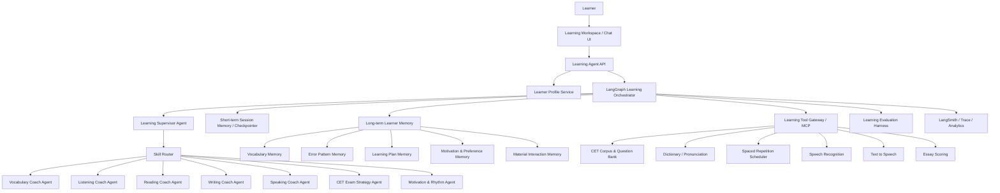
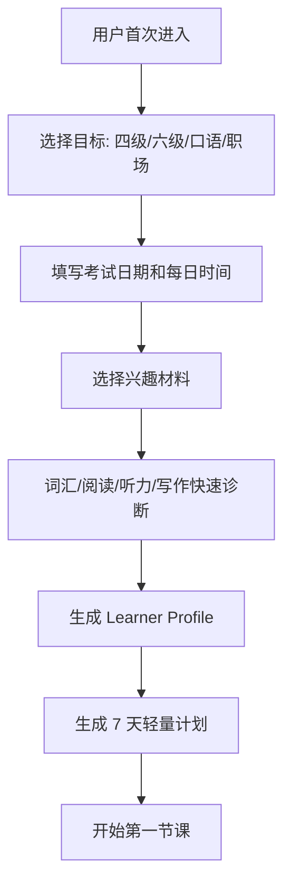
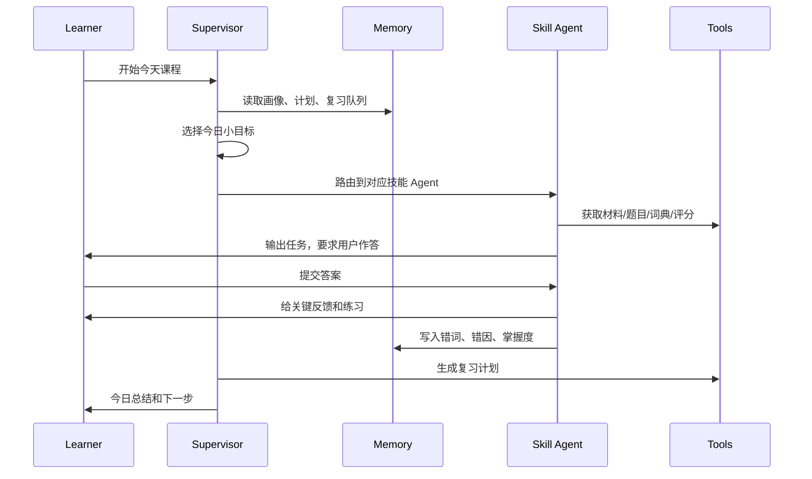

# 英语学习陪伴 Agent 系统技术方案

> 文档日期：2026-06-11  
> 基础方案：`docs/langgraph-memory-multi-agent-architecture.md`  
> 领域参考资料：`docs/docs/englishtips/`  
> 核心原则：坚定技术为需求服务。LangGraph、Memory、多智能体、MCP、评估体系都必须服务于“让学习者持续学、有效练、看见进步”。

## 1. 项目定位

将通用 Agent 系统落地为一个面向大学生与英语学习者的英语学习陪伴系统，重点支持英语四六级备考，同时保留向考研英语、职场英语、口语提升、阅读写作进阶扩展的能力。

系统不是单纯的“刷题工具”或“AI 聊天机器人”，而是一个长期陪伴型英语教练：

- 能诊断学习者当前水平、目标、时间、兴趣和情绪状态。
- 能制定可执行的学习计划，而不是给一堆泛泛建议。
- 能围绕词汇、听力、阅读、写作、口语形成训练闭环。
- 能记住学习者的错词、错因、常见表达问题和学习节奏。
- 能根据四六级考试目标做阶段性提分，也能保护学习者长期兴趣。
- 能把 AI 的能力落在“引导、出题、纠错、复盘、复习”上，而不是替用户完成学习。

一句话项目描述：

> 基于 LangGraph 构建英语学习陪伴 Agent，围绕四六级备考与长期英语能力提升，设计学习诊断、个性化计划、多智能体教学、长期记忆、间隔复习、听说读写训练、错因分析和评测闭环，实现一个能长期陪伴、动态调整、可量化提分的 AI 英语私教系统。

## 2. 从参考资料提炼出的产品原则

`englishtips` 资料不是普通知识库，而是本项目的产品价值观来源。

### 2.1 认知篇：先处理目标、节奏和情绪

参考：`1-understanding.md`

关键启发：

- 学英语不是只有考试，也可以是连接更大世界。
- 被动输入远远不够，必须推动用户主动输出。
- 不要靠透支睡眠和内疚驱动学习。
- 学习计划要适合当前水平，不要盲目对标别人。
- 学习应该尽量与兴趣绑定，让过程更可持续。

系统落地：

- Onboarding 阶段先问清楚用户目标：四级、六级、考研、职场、口语、技术阅读等。
- 计划生成必须考虑每日可用时间、考试日期、基础水平、压力状态。
- 每日任务不追求“多”，而追求“能完成、能复盘、能持续”。
- Agent 反馈语气应鼓励、具体、温和，避免制造焦虑。

### 2.2 单词篇：词汇是地基，但不能只背键值对

参考：`2-vocabulary.md`

关键启发：

- 词汇量有从量变到质变的特征。
- 1000、7000 词汇量是重要阶段节点。
- 背单词需要结合语境、发音、搭配、造句。
- 艾宾浩斯记忆曲线适合设计复习周期。
- 云单词本的价值是集中管理生词并随时复习。
- AI 适合生成例句、短文、近义词对比、小测和复盘。

系统落地：

- 建立 Learner Vocabulary Memory，记录用户的生词、熟词、错词、发音问题、搭配问题。
- 使用 spaced repetition scheduler，根据遗忘曲线生成复习任务。
- 每个词条不是简单释义，而是对象：释义、音标、例句、搭配、错因、来源、复习状态。
- 对总是记不住的词，Agent 自动生成个性化语境、填空题、改错题和口头造句。

### 2.3 听力篇：材料选择、精听泛听、字幕依赖

参考：`3-listening.md`

关键启发：

- 听力材料分散、超纲、不感兴趣、过度依赖字幕，都会降低效率。
- 精听要听懂意思、听清单词，可配合拼写、复述、跟读。
- 泛听用于语感和兴趣培养。
- 高阶听力要从逐词理解转向句子整体理解，关注连读、弱读、断句。

系统落地：

- Listening Agent 根据用户水平和兴趣推荐少量稳定材料，避免订阅过多。
- 每段听力训练拆成：预习生词、无字幕听、逐句精听、转写、错听分析、跟读复述。
- 对四六级听力，加入题型策略：短篇新闻、长对话、篇章理解。
- 对泛听，允许兴趣驱动，如音乐、美剧、技术视频，但不把所有娱乐都变成压力任务。

### 2.4 阅读篇：精读与泛读并存

参考：`4-reading.md`

关键启发：

- 短小精悍文章适合精读，重在结构、表达和观点。
- 小说和兴趣材料适合泛读，重在享受和持续接触。
- 阅读技术文档时，生词过多要先处理关键词，否则后续理解会崩。
- Medium、Quora、Reddit、Hacker News、Stack Overflow 等适合兴趣和职业结合。

系统落地：

- Reading Agent 区分 CET 阅读训练、精读赏析、兴趣泛读、技术阅读。
- 对四六级阅读，训练主旨题、细节题、推断题、词义题、匹配题。
- 对泛读材料，Agent 不要求逐词翻译，而是引导总结、复述和表达吸收。
- 当材料生词密度过高，系统自动降级材料或先生成词汇预习。

### 2.5 口语篇：发音、朗读、场景问题和勇敢开口

参考：`5-speaking.md`

关键启发：

- 口语基础是发音，音标和大声朗读很重要。
- 大声说和小声说效果不同。
- 很多人开口卡住，是因为中文思维先行，再翻译成英文。
- 应准备常见问题并反复练到能自然变体。

系统落地：

- Speaking Agent 设计每日短口语任务：自我介绍、观点表达、复述听力、描述图表、四六级口语模拟。
- 反馈只抓 1-3 个关键问题，避免一次指出太多让用户崩溃。
- 记录用户常见口语错误：时态、冠词、单复数、中文式表达、停顿、发音。
- 对四六级口语场景，训练短回答、互动问答、图片描述、观点陈述。

### 2.6 写作篇：先自己写，再反馈，再修改

参考：`6-writing.md`

关键启发：

- 阅读是写作基础。
- 练习是写作核心。
- 交流和反馈能加速成长。
- AI 不应直接替写，而应帮助用户发现问题并改进。

系统落地：

- Writing Agent 坚持“三步批改”：先诊断问题，再让用户修改，最后给升级版对照。
- 对四六级作文，按内容完整性、结构、词汇、语法、连贯性评分。
- 建立用户写作错因画像，长期追踪高频错误。
- 生成可复用表达库，但要求用户在后续作文中主动使用。

### 2.7 AI 篇：AI 是教练，不是代学工具

参考：`7-ai.md`

关键启发：

- AI 最大价值是搭建微型语言环境：出题、纠错、追问、复习、动态调整。
- 每节课应包含热身、输入材料、输出任务、纠错反馈、复盘。
- AI 输出要短，逼用户多说多写。
- 每轮只改关键问题，优先改高频和可迁移错误。

系统落地：

- 每个学习 session 固定为“目标 - 输入 - 输出 - 反馈 - 复盘 - 记忆写入”。
- 系统强制控制 AI 讲解篇幅，避免用户被动阅读。
- Agent 对话策略以 Socratic tutoring 和 guided learning 为主。
- 每次课程结束自动沉淀：今日表达、关键错误、家庭作业、下次重点。

## 3. 目标用户与核心场景

### 3.1 目标用户

主目标用户：

- 大学生，准备英语四级或六级。
- 基础在 A2-B2 之间，词汇、听力、阅读、写作至少有一项明显短板。
- 有拖延、焦虑、计划执行困难、材料选择困难的问题。

扩展用户：

- 准备考研英语的学生。
- 希望提升英文技术阅读和职场表达的程序员。
- 希望练口语、写作、泛读的长期学习者。

### 3.2 核心用户问题

| 用户问题 | 系统对应能力 |
|---|---|
| 不知道自己哪里弱 | 诊断测评 + 错因画像 |
| 背单词总忘 | 间隔复习 + 个性化语境 |
| 听力听不懂 | 分级材料 + 精听转写 + 错听分析 |
| 阅读速度慢 | 题型训练 + 生词预处理 + 结构拆解 |
| 写作没话说、不自然 | 范文拆解 + 自写反馈 + 表达复用 |
| 口语不敢开口 | 低压力陪练 + 场景问题 + 关键纠错 |
| 学几天就放弃 | 轻量计划 + 情绪记忆 + 正反馈机制 |
| 做题没复盘 | 错题本 + 错因分类 + 周复习 |

## 4. 产品形态

建议优先做成 Web + API 的英语学习陪伴系统。

### 4.1 首页不是营销页，而是学习工作台

用户进入后看到：

- 今日学习任务。
- 距离考试天数。
- 今日建议投入时间。
- 词汇复习队列。
- 最近高频错误。
- 本周能力趋势。
- “开始今日课程”按钮。

### 4.2 每日课程结构

每次课程 15-30 分钟，结构固定：

1. Warm-up：1 个简单问题或快速复习。
2. Input：一小段听力、阅读、词汇或范文。
3. Output：用户必须说、写、选、填、复述或改错。
4. Feedback：只反馈最关键的 1-3 个问题。
5. Review：生成今日记忆、错题、复习计划。
6. Next step：给出下一次任务，不制造任务洪水。

### 4.3 四六级备考路径

四级/六级路径分为四个阶段：

| 阶段 | 时间 | 目标 |
|---|---|---|
| Diagnostic | 第 1-2 天 | 测基础，确定弱项，制定计划 |
| Foundation | 第 1-3 周 | 高频词、基础听力、阅读题型、作文模板 |
| Intensive | 第 4-8 周 | 分题型专项训练，错因复盘，提高正确率 |
| Simulation | 考前 2-3 周 | 真题套卷、时间控制、作文听力冲刺 |

## 5. 总体架构



## 6. LangGraph 工作流设计

### 6.1 顶层 Graph

核心状态 `LearningState`：

```text
user_id
thread_id
session_id
target_exam
exam_date
current_level
daily_time_budget
active_skill
today_goal
messages
input_materials
learner_answer
agent_feedback
memory_candidates
review_items
next_tasks
emotion_signal
```

顶层节点：

1. `load_profile`：读取学习者画像和长期记忆。
2. `detect_intent`：判断用户是开始课程、问问题、做题、复盘还是情绪求助。
3. `select_learning_goal`：根据计划和当天状态选择小目标。
4. `route_skill_agent`：分派到词汇、听力、阅读、写作、口语或考试策略 Agent。
5. `run_learning_session`：执行对应训练。
6. `feedback_and_explain`：给出少量高价值反馈。
7. `update_memory`：写入错词、错因、掌握度、情绪和计划进度。
8. `schedule_review`：生成复习任务。
9. `finalize_next_step`：输出今日总结和下一步。

### 6.2 为什么需要 LangGraph

在英语学习场景，LangGraph 的价值不是炫技，而是解决学习过程中的状态问题：

- 学习任务天然是多步骤：诊断、讲解、练习、反馈、复习。
- 用户可能中断，下次要从同一课程或计划继续。
- 每个技能训练需要不同 Agent，但最终要统一写入学习档案。
- 写作、口语、听力等任务需要人工输入和异步处理。
- 复习计划需要跨 session 延续。
- 需要回放某次学习过程，解释为什么系统认为用户薄弱。

## 7. 多智能体设计

### 7.1 Learning Supervisor Agent

职责：

- 维护学习目标和节奏。
- 决定今天练什么、练多久、难度多大。
- 在多个技能 Agent 之间调度。
- 防止系统一天塞太多任务。
- 根据用户情绪和完成情况调整计划。

核心提示原则：

- 每次只给一个小目标。
- 不替用户完成输出任务。
- 优先纠正高频、可迁移错误。
- 反馈要具体，但不要压垮用户。

### 7.2 Vocabulary Coach Agent

职责：

- 管理生词本、熟词僻义、易混词、搭配。
- 生成四六级高频词训练。
- 按遗忘曲线安排复习。
- 对错词生成例句、填空、造句、近义词辨析。

输入：

- 用户词汇测试结果。
- 阅读/听力中出现的生词。
- 用户自建单词。
- 历史复习表现。

输出：

- 今日新词。
- 今日复习词。
- 错词原因。
- 语境练习。
- 下一次复习时间。

### 7.3 Listening Coach Agent

职责：

- 根据水平选择材料。
- 设计精听流程。
- 分析用户转写错误。
- 解释连读、弱读、吞音、重音、断句。
- 训练四六级听力题型。

训练流程：

1. 预习关键词。
2. 第一遍听主旨。
3. 第二遍听细节。
4. 逐句转写。
5. 对照原文。
6. 复述内容。
7. 提取可复用表达。

### 7.4 Reading Coach Agent

职责：

- 训练四六级阅读题型。
- 引导精读和泛读。
- 拆解段落逻辑。
- 识别生词密度和材料难度。
- 训练 summary 和 paraphrase。

输出重点：

- 不默认全文翻译。
- 先问用户主旨理解。
- 再解释关键句和逻辑转折。
- 最后要求用户用自己的英文复述。

### 7.5 Writing Coach Agent

职责：

- 批改四六级作文、翻译和日常写作。
- 追踪语法、词汇、结构和逻辑错误。
- 生成可复用表达。
- 引导用户二次修改。

批改策略：

1. 给总体评分和最关键问题。
2. 标出 3-5 个最值得改的句子。
3. 让用户先自己改。
4. 再展示升级版。
5. 把高频错误写入长期记忆。

### 7.6 Speaking Coach Agent

职责：

- 口语陪练。
- 四六级口语模拟。
- 场景问答。
- 发音和表达反馈。
- 帮用户准备常见问题。

反馈策略：

- 对话中不频繁打断，除非影响理解。
- 每 3-5 轮做一次短反馈。
- 优先反馈自然度、清晰度和高频语法。
- 记录用户可复用表达和卡壳点。

### 7.7 CET Exam Strategy Agent

职责：

- 管理四级/六级题型策略。
- 制定冲刺计划。
- 分析真题表现。
- 提供考试时间分配建议。
- 区分“能力提升”和“应试技巧”。

题型覆盖：

- 写作。
- 听力。
- 阅读理解。
- 翻译。
- 词汇与长难句。
- 口语考试扩展。

### 7.8 Motivation & Rhythm Agent

职责：

- 识别用户焦虑、拖延、疲惫、挫败。
- 调整任务难度和数量。
- 提供温和但具体的复盘。
- 维护学习连续性。

这不是鸡汤 Agent。它的核心是把情绪转化为可执行策略：

- 今天很累：降级任务，只做 10 分钟复习。
- 连续失败：降低材料难度，重建正反馈。
- 拖延 3 天：恢复任务从最小动作开始。
- 考前焦虑：切换到模拟和错题复盘，不再盲目扩材料。

## 8. 强化 Memory 设计

英语学习陪伴系统的 Memory 必须细到“学习行为”，不能只存聊天摘要。

### 8.1 Memory 类型

| Memory | 存什么 | 用来做什么 |
|---|---|---|
| Learner Profile Memory | 目标、考试日期、基础水平、兴趣、每日时间 | 个性化计划 |
| Vocabulary Memory | 生词、错词、熟词僻义、搭配、复习状态 | 间隔复习 |
| Error Pattern Memory | 语法错误、写作问题、口语卡点、听力错听 | 精准纠错 |
| Material Memory | 学过的文章、音频、题目、难度、兴趣反馈 | 推荐材料 |
| Learning Plan Memory | 阶段目标、完成情况、计划调整记录 | 长期推进 |
| Emotion & Rhythm Memory | 疲惫、焦虑、拖延、偏好学习时间 | 降低流失 |
| Exam Performance Memory | 模考成绩、题型正确率、耗时 | 四六级提分 |

### 8.2 Vocabulary Memory 数据结构

```json
{
  "word": "sustain",
  "phonetic": "/səˈsteɪn/",
  "meaning": ["维持", "支撑", "遭受"],
  "level": "CET6",
  "source": "reading_session_2026_06_11",
  "examples": [
    "The company needs more funding to sustain growth."
  ],
  "collocations": ["sustain growth", "sustain an injury"],
  "learner_status": "weak",
  "mistake_type": ["meaning_confusion", "collocation"],
  "review_count": 3,
  "last_reviewed_at": "2026-06-11T20:30:00+08:00",
  "next_review_at": "2026-06-13T20:30:00+08:00",
  "confidence": 0.58
}
```

### 8.3 Error Pattern Memory 数据结构

```json
{
  "skill": "writing",
  "pattern": "missing_articles",
  "description": "用户经常漏掉 a/an/the，尤其在抽象名词和职业身份前。",
  "examples": [
    {
      "original": "I want to be engineer.",
      "corrected": "I want to be an engineer."
    }
  ],
  "frequency": 7,
  "severity": "medium",
  "last_seen_at": "2026-06-11T21:10:00+08:00",
  "recommended_drill": "article_fill_in_blank"
}
```

### 8.4 Memory 写入规则

Hot path 立即写入：

- 用户目标和考试日期。
- 用户明确表达的学习偏好。
- 本次练习暴露的关键错词和高频错误。
- 今日完成情况和下次复习时间。

Background 异步写入：

- 对整节课做 session summary。
- 将零散错题归并到错误模式。
- 将多个词条归并到主题词组，如“作文连接词”“听力易错发音”。
- 每周生成学习者画像更新。

Memory Curator 负责：

- 去重：同一个词或错误模式不重复堆积。
- 降噪：一次性偶发错误不立刻上升为长期弱点。
- 冲突处理：用户水平变化后更新旧判断。
- 遗忘策略：长期无用或用户要求删除的记忆可清理。

### 8.5 复习调度

基于参考资料中的记忆周期，系统默认复习节点：

- 5 分钟。
- 30 分钟。
- 12 小时。
- 1 天。
- 2 天。
- 4 天。
- 7 天。
- 15 天。

生产系统中可用 SM-2 或 FSRS 类算法动态调整：

- 用户答对且反应快：延长间隔。
- 用户答错或犹豫：缩短间隔。
- 高频考试词：即使掌握也周期性抽查。
- 总是记不住的词：切换训练形式，不再重复同一种卡片。

## 9. 学习工具与 MCP 设计

建议将英语学习工具封装为 Learning Tool Gateway，可逐步 MCP 化。

### 9.1 工具列表

| 工具 | 能力 | Agent 使用方 |
|---|---|---|
| CET Question Bank | 四六级真题、模拟题、题型标签 | Exam, Reading, Listening |
| Dictionary Tool | 释义、音标、例句、搭配、词频 | Vocabulary, Reading |
| Pronunciation Tool | TTS、音标、最小对立音练习 | Speaking, Listening |
| ASR Tool | 识别用户口语、转写、发音评分 | Speaking |
| Essay Scoring Tool | 作文评分、语法问题、结构问题 | Writing |
| Spaced Repetition Tool | 计算复习队列和 next_review_at | Vocabulary |
| Material Ranker | 根据水平和兴趣选材料 | Supervisor, Reading, Listening |
| Progress Analytics | 计算趋势、正确率、连续学习天数 | Supervisor |

### 9.2 工具设计原则

- 工具输出必须结构化，便于写入记忆和评估。
- 评分工具要给原因，不只给分数。
- 学习材料推荐必须考虑难度、兴趣和目标。
- 口语和写作工具不能只“改好”，必须保留用户原始版本和修订过程。

## 10. 核心业务流程

### 10.1 新用户 Onboarding



Onboarding 只收必要信息：

- 目标考试。
- 考试日期。
- 每日可学时间。
- 自评水平。
- 最弱技能。
- 兴趣主题。
- 是否容易焦虑/拖延。

### 10.2 每日课程流程



### 10.3 四六级模考复盘流程

1. 用户完成一套题或上传成绩。
2. Exam Agent 解析各题型正确率和耗时。
3. Reading/Listening/Writing Agent 分别分析细项错误。
4. Supervisor 生成“下周提分优先级”。
5. Memory Curator 更新长期弱点。
6. 系统调整学习计划。

输出示例：

- 本次主要失分不是词汇，而是阅读定位速度。
- 听力长对话错因集中在转折后信息。
- 作文结构完整，但连接词重复，例证薄弱。
- 下周优先级：听力转折词精听、阅读段落定位、作文论证模板。

## 11. 个性化计划策略

### 11.1 计划生成约束

计划必须遵守：

- 每日任务数量不超过 3 个。
- 每个任务必须能在用户时间预算内完成。
- 每天必须包含至少一个主动输出任务。
- 连续失败时自动降级，不继续加压。
- 考前阶段优先真题和错题，而不是扩新材料。

### 11.2 示例：六级 12 周计划

| 周期 | 重点 | 每日任务 |
|---|---|---|
| 第 1 周 | 诊断和建档 | 词汇测评、阅读短测、听力短测、作文 baseline |
| 第 2-4 周 | 基础补强 | 高频词复习、短听力精听、阅读题型基础、作文句型 |
| 第 5-8 周 | 专项突破 | 听力长对话、阅读定位、段落匹配、翻译和作文 |
| 第 9-10 周 | 真题训练 | 每周 1-2 套真题，错因归类 |
| 第 11-12 周 | 冲刺复盘 | 高频错题、作文模板、听力预测训练、时间控制 |

### 11.3 根据状态动态调整

| 用户状态 | 调整 |
|---|---|
| 连续 3 天完成 | 略微增加难度或加入挑战任务 |
| 连续 2 天未完成 | 降低任务量，保留最小复习 |
| 听力正确率低于 40% | 降低材料难度，加入预习生词 |
| 阅读耗时过长 | 加入限时定位训练 |
| 写作分数停滞 | 只抓一个高频问题做专项 |
| 临近考试 | 减少泛读泛听，转向真题和复盘 |

## 12. 评估体系

### 12.1 学习效果指标

- 词汇掌握率。
- 复习完成率。
- 听力转写准确率。
- 听力题型正确率。
- 阅读正确率和平均耗时。
- 写作评分趋势。
- 口语流利度和错误频次。
- 模考总分趋势。

### 12.2 Agent 质量指标

- 推荐任务完成率。
- 反馈被采纳率。
- 用户二次修改质量提升。
- 错误模式识别准确率。
- 复习调度命中率。
- 用户连续学习天数。
- 用户流失预警准确率。

### 12.3 评测集设计

需要建立以下 eval：

- Vocabulary eval：是否正确识别生词、错词、熟词僻义和复习间隔。
- Writing feedback eval：是否优先指出最关键问题，而不是泛泛批改。
- Speaking feedback eval：是否避免过度纠错，并抓住影响表达的问题。
- Reading tutor eval：是否引导用户理解，而不是直接翻译全文。
- Listening tutor eval：是否能从转写错误分析错听原因。
- Plan generation eval：任务是否符合用户时间、目标和水平。
- Emotional safety eval：反馈是否温和、具体、不制造羞耻感。

## 13. 数据模型建议

核心实体：

- `learners`
- `learner_profiles`
- `learning_goals`
- `learning_sessions`
- `learning_tasks`
- `vocabulary_items`
- `review_schedules`
- `error_patterns`
- `materials`
- `question_attempts`
- `writing_submissions`
- `speaking_submissions`
- `exam_mock_results`
- `agent_traces`

### 13.1 learning_tasks

```text
id
learner_id
session_id
task_type
skill
title
difficulty
estimated_minutes
status
input_ref
output_ref
feedback_ref
created_at
completed_at
```

### 13.2 question_attempts

```text
id
learner_id
question_id
exam_type
section
answer
is_correct
time_spent_seconds
mistake_reason
created_at
```

### 13.3 writing_submissions

```text
id
learner_id
prompt
draft_text
revised_text
score
feedback_json
error_pattern_ids
created_at
```

## 14. 技术栈建议

后端：

- Python 3.11+
- FastAPI
- LangGraph
- LangChain / langchain-mcp-adapters
- Pydantic v2
- PostgreSQL + pgvector
- Redis
- Celery / Dramatiq 做异步 memory consolidation 和评测

AI 能力：

- LLM：用于教学对话、反馈、计划生成。
- Embedding：用于材料检索、错题相似度、表达库检索。
- ASR：用于口语转写。
- TTS：用于听力材料和发音示范。
- Reranker：用于材料和记忆召回排序。

前端：

- 学习工作台。
- Chat + task panel 双栏。
- 词汇复习卡片。
- 听力播放器 + 转写输入。
- 阅读文章 + 标注。
- 写作编辑器 + 修改对照。
- 口语录音 + 反馈。

## 15. MVP 范围

第一版不要做成全能系统，应聚焦“四六级提分 + 长期记忆”。

### MVP 必做

- 用户画像和目标设置。
- 7 天学习计划生成。
- 词汇记忆和间隔复习。
- 阅读题训练和错因记录。
- 写作批改和二次修改。
- 每日课程 LangGraph 流程。
- 学习总结和长期 Memory 写入。

### MVP 可延后

- 完整口语发音评分。
- 大规模听力素材库。
- MCP 接入多个外部平台。
- 社区和排行榜。
- 复杂游戏化系统。

### MVP Demo 路径

1. 用户选择“六级，12 周后考试，每天 30 分钟”。
2. 系统做 5 分钟诊断。
3. 生成第一周计划。
4. 用户完成一篇阅读题。
5. 系统识别错因：定位慢、转折词漏看、3 个生词。
6. 系统把生词写入 Vocabulary Memory。
7. 第二天自动安排复习，并用昨天文章语境出题。
8. 用户写一段作文。
9. Writing Agent 指出 3 个关键问题，让用户先改，再给升级版。
10. 周末生成学习报告和下周重点。

这个 Demo 可以展示：

- LangGraph 状态化流程。
- 强化 Memory。
- 个性化计划。
- 多 Agent 协作。
- 学习闭环。
- 评估与可观测。

## 16. 与通用 Agent 方案的差异

| 通用 Agent 方案 | 英语学习陪伴方案 |
|---|---|
| 任务执行优先 | 学习效果优先 |
| 工具调用成功率 | 用户掌握度和复习完成率 |
| 长期记忆存用户偏好和任务经验 | 长期记忆存错词、错因、水平、节奏、情绪 |
| 多 Agent 用于复杂业务分工 | 多 Agent 对应听说读写词汇与考试策略 |
| Human-in-the-loop 用于审批 | User-in-the-loop 用于主动输出和二次修改 |
| 最终交付答案 | 最终推动用户学会 |

这也是本项目最重要的取舍：不要让 AI 变成代写、代答、代总结工具，而要让 AI 逼近一个好老师的行为。

## 17. 简历项目描述

可直接写入简历：

> 设计基于 LangGraph 的英语学习陪伴 Agent 系统，面向四六级备考和长期英语能力提升，构建学习诊断、个性化计划、词汇间隔复习、听说读写多智能体训练、错因分析和长期学习记忆闭环。系统通过 Learning Supervisor 调度 Vocabulary、Listening、Reading、Writing、Speaking、CET Strategy 等专家 Agent，将每次学习 session 编排为目标设定、输入材料、主动输出、关键反馈、复盘和记忆写入的状态化流程。长期 Memory 细分为 Learner Profile、Vocabulary、Error Pattern、Material、Plan、Emotion & Rhythm 等类型，支持跨会话追踪错词、错因、学习节奏和能力变化。设计了面向学习效果的评估体系，包括词汇掌握率、听力转写准确率、阅读耗时、写作评分趋势、任务完成率和反馈采纳率，确保 Agent 技术真正服务于个性化提分和长期陪伴。

简历 bullet：

- 基于 LangGraph 设计英语学习 Agent Runtime，将每日课程抽象为可恢复、可复盘的状态机流程，覆盖目标选择、技能路由、练习执行、反馈生成、记忆写入和复习调度。
- 构建面向英语学习的长期 Memory 架构，沉淀用户词汇掌握度、写作/口语错误模式、听力错听原因、阅读题型弱点、学习偏好和情绪节奏。
- 设计 Vocabulary、Listening、Reading、Writing、Speaking、CET Strategy 多智能体协作体系，由 Learning Supervisor 根据用户目标、考试日期、时间预算和历史表现动态调度。
- 将艾宾浩斯/SM-2/FSRS 类间隔复习思想融入词汇和错题训练，实现错词复现、语境造句、填空改错和周复盘。
- 建立面向学习效果的 Agent Eval，包括写作反馈质量、阅读引导质量、听力错因识别、复习调度命中率和情绪安全反馈评估。

## 18. 后续文档建议

建议继续补充三份更细文档：

1. `english-learning-memory-design.md`：专门设计词汇、错因、复习调度和学习画像。
2. `english-learning-agent-prompts.md`：为各专家 Agent 写系统提示词和输出 schema。
3. `english-learning-mvp-roadmap.md`：拆解 2-4 周 MVP 实现计划和验收标准。

## 19. 参考资料

- `docs/docs/englishtips/1-understanding.md`
- `docs/docs/englishtips/2-vocabulary.md`
- `docs/docs/englishtips/3-listening.md`
- `docs/docs/englishtips/4-reading.md`
- `docs/docs/englishtips/5-speaking.md`
- `docs/docs/englishtips/6-writing.md`
- `docs/docs/englishtips/7-ai.md`
- `docs/langgraph-memory-multi-agent-architecture.md`
