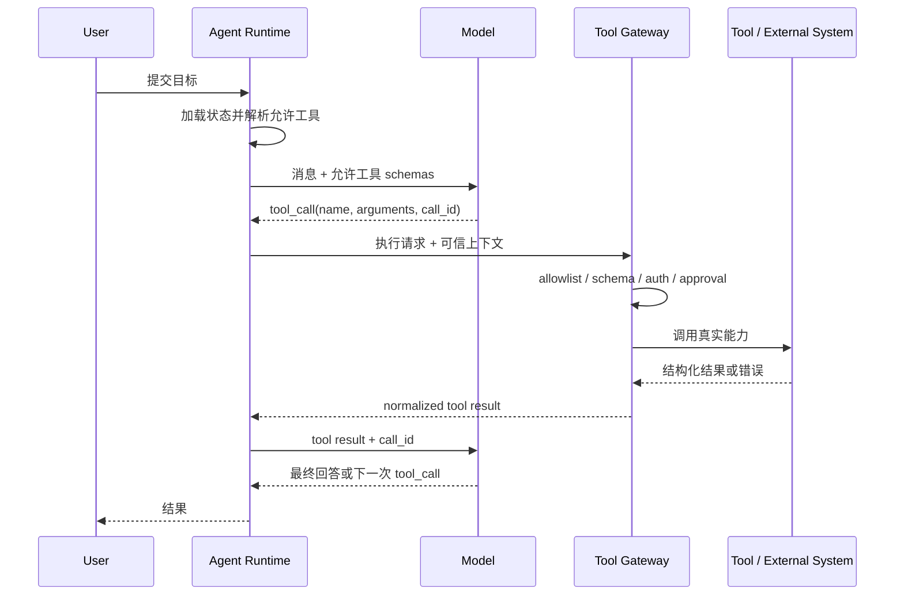

# AI Agent、Tools 与 Function Calling 面试指南

> 目标：不仅能解释名词，还能从运行机制、工程设计、安全治理、评测和 BinnAgent 实践回答追问。
>
> 面试定位：Agent 应用开发、LLM 应用工程、LangGraph 工作流、Tool Runtime / MCP。

## 1. 先记住一句话

AI Agent 是一个由模型参与决策、能围绕目标循环执行的系统。模型负责理解与决策，Tool 负责连接确定性代码和外部世界，Function Calling 是模型用结构化参数表达“我想调用哪个工具”的协议，真正的执行、鉴权和结果回传由应用 Runtime 完成。

最重要的边界是：

> 模型只能提出工具调用请求，不能直接执行工具，也不能成为权限边界。

## 2. 核心概念

### 2.1 LLM、Chatbot、Workflow 和 Agent

| 形态 | 谁决定下一步 | 是否循环 | 适合场景 | 主要风险 |
|---|---|---:|---|---|
| 单次 LLM 调用 | 业务代码 | 否 | 摘要、分类、结构化抽取 | 输出不稳定 |
| Chatbot | 模型和固定会话逻辑 | 通常否 | 多轮问答 | 上下文膨胀、幻觉 |
| Workflow | 代码、图或状态机 | 可选 | 步骤清晰、强流程业务 | 流程僵化 |
| Agent | 模型在受控范围内动态决策 | 是 | 开放目标、工具选择、动态规划 | 失控循环、越权、成本不可控 |

Workflow 和 Agent 不是非黑即白。生产系统常用“确定性工作流 + 局部 Agent 决策”：关键业务顺序、权限和副作用由代码控制，只把意图识别、工具选择或计划调整交给模型。

一个系统是否称得上 Agent，通常看它是否具备以下闭环：

1. 接收目标和当前状态。
2. 判断下一步行动。
3. 调用工具或向用户请求信息。
4. 观察执行结果。
5. 更新状态并继续，直到完成、失败或触发停止条件。

### 2.2 Tool 是什么

Tool 是 Agent 可调用的一项外部能力。它可以是：

- 本地确定性函数，如计算器、文本规范化和练习评分。
- 内部服务，如 RAG 检索、Memory 读取、Mastery 更新。
- 外部 API，如搜索、邮件、支付或日历。
- 数据库操作，如查询学习记录或写入复习计划。
- MCP Server 暴露的远程工具。
- 人类审批、补充信息等 Human-in-the-loop 能力。

一个可生产使用的工具不只是一个 Python 函数，还应包含一份可治理的契约：

```text
name + version + description
+ input_schema + output_schema
+ risk_level + scopes + approval policy
+ timeout + retry + idempotency
+ provider + health + audit metadata
```

Tool 的描述会影响模型是否选择它，schema 决定参数是否合法，Runtime policy 决定它是否真的允许被执行。

### 2.3 Function Calling 是什么

Function Calling，也常称 Tool Calling，是一种结构化交互协议：应用把可用工具的名称、描述和参数 schema 提供给模型；模型不直接返回自然语言答案，而是返回工具名和结构化参数。

概念示例：

```json
{
  "name": "weather.get_forecast",
  "arguments": {
    "city": "Changsha",
    "date": "2026-07-15"
  }
}
```

这段 JSON 只是模型的调用意图。应用仍需完成：

1. 检查该工具是否在当前任务 allowlist 中。
2. 校验参数 schema，注入可信用户上下文。
3. 做鉴权、审批、限流、超时和幂等控制。
4. 调用真实函数或远程服务。
5. 将结构化结果以 tool result 回传给模型。
6. 让模型基于结果回答，或继续发起下一次调用。

Function Calling 解决的是“模型与程序之间的结构化协作”，不是 Agent 的全部。单次信息抽取也可以使用 Function Calling，但没有目标驱动的循环，就不一定是 Agent。

### 2.4 Structured Output 与 Function Calling 的区别

两者都可能使用 JSON Schema，但目的不同：

| 概念 | 目的 | 输出交给谁 | 是否执行副作用 |
|---|---|---|---:|
| Structured Output | 让模型按业务 schema 返回数据 | 业务模块 | 通常否 |
| Function Calling | 让模型选择工具并生成调用参数 | Tool Runtime | 可能 |

例如，把作文评分结果输出为 `{score, feedback}` 是 Structured Output；调用 `essay.save_score` 写入数据库是 Function Calling。前者需要 schema 校验，后者还需要权限、审批、幂等和审计。

### 2.5 Tool Calling 与普通 JSON Prompt 的区别

提示模型“请返回 JSON”只是文本约定，模型可能加入 Markdown、遗漏字段或改变类型。原生 Tool Calling / Structured Output 通常能提供更明确的角色、schema 和消息协议，但应用仍不能跳过校验。

稳健性顺序通常是：

```text
原生 schema 约束
→ 本地 schema validation
→ 可控 repair / retry
→ deterministic fallback 或失败
```

## 3. Agent 的完整执行循环

### 3.1 Observe、Think、Act

经典 Agent loop 可以抽象为：

```text
Goal + State
    ↓
Observe：读取用户输入、Memory、工具结果和环境状态
    ↓
Decide：选择回答、调用工具、请求审批或结束
    ↓
Act：Runtime 执行工具
    ↓
Observe：把结果加入状态
    ↓
Continue / Stop
```

“Think”不代表必须保存或展示模型的私有思维过程。工程上应保存可审计的决策摘要、工具选择原因和结构化状态，而不是依赖隐藏推理文本。

### 3.2 一次 Tool Calling 的消息时序



`call_id` 用来把多个调用请求与各自结果正确关联。并行调用时尤其不能只按工具名匹配。

### 3.3 Runtime 伪代码

```python
async def run_agent(goal, user_context):
    state = await load_state(goal, user_context)

    for step in range(MAX_STEPS):
        tools = resolver.resolve(
            catalog=catalog.snapshot(),
            task=state.task_spec,
            user=user_context,
        )
        decision = await model.generate(
            messages=state.messages,
            tools=[tool.public_schema for tool in tools],
        )

        if decision.final_answer is not None:
            return verify_and_finish(decision.final_answer, state)

        for call in decision.tool_calls:
            result = await gateway.execute(
                call=call,
                allowed_tools=tools,
                trusted_context=user_context,
            )
            state.append_tool_result(call.id, result)

    raise StepLimitExceeded()
```

真正的生产代码还需要处理 checkpoint、用户中断、并行调用、预算、取消、错误分类和 trace。

### 3.4 停止条件

Agent 必须有明确停止条件，常见包括：

- 模型返回最终答案。
- 达到最大步骤、时间、token 或费用预算。
- 目标已经通过验证器。
- 工具连续失败或没有取得新进展。
- 需要用户补充输入或审批。
- 命中安全策略，立即终止。

只设置 `while True` 并相信模型会自己停，是典型生产事故来源。

## 4. Tool 的设计方法

### 4.1 好工具的特征

一个高质量工具应当：

- 单一职责：名称能准确表达一个业务动作。
- 描述清楚：说明何时使用、何时不要使用。
- 参数最小：减少模型必须猜测的字段。
- schema 严格：类型、枚举、必填项、长度和范围明确。
- 返回结构稳定：区分数据、状态、可重试错误和业务拒绝。
- 权限最小化：只开放当前任务需要的工具。
- 副作用明确：读、写、外部副作用、特权操作分级。
- 支持幂等：重试不会重复扣款、重复发信或重复写记录。

不推荐把所有能力做成一个 `execute(action, payload)` 万能工具。它会让 schema 模糊、权限难拆分、评测困难，也更容易发生越权。

### 4.2 Schema 设计

示例：

```json
{
  "type": "object",
  "additionalProperties": false,
  "properties": {
    "query": {
      "type": "string",
      "minLength": 1,
      "maxLength": 200,
      "description": "要检索的教材问题，不包含 learner_id"
    },
    "top_k": {
      "type": "integer",
      "minimum": 1,
      "maximum": 10,
      "default": 5
    }
  },
  "required": ["query"]
}
```

关键原则：

- 尽量用 enum、范围和格式约束减少歧义。
- 默认 `additionalProperties: false`，避免模型偷偷加入未治理字段。
- schema 字段名应表达业务语义，而不是底层数据库细节。
- 不把密钥、数据库 session、当前用户和真实 learner scope 暴露给模型。
- schema 是输入验证，不是授权证明；合法参数仍可能访问非法资源。

### 4.3 公开参数与可信上下文分离

假设模型可调用 `memory.retrieve`。不应让模型自由填写 `learner_id`：

```python
# 模型可见
payload = {"scene": "daily_lesson", "limit": 5}

# Runtime 注入，模型不可见也不可覆盖
context = ToolContext(
    current_user=current_user,
    learner_id=current_learner.id,
    db=db_session,
    episode_id=episode.id,
)
```

Gateway 根据 `context.learner_id` 查询私有数据。即使模型或 prompt injection 在 payload 中伪造其他 learner，也不能越过授权边界。

### 4.4 返回值和错误模型

推荐返回可机器处理的 envelope：

```json
{
  "status": "failed",
  "error_code": "provider_timeout",
  "retryable": true,
  "message": "Dictionary provider timed out",
  "data": null
}
```

至少区分：

- `invalid_input`：参数不符合 schema，通常让模型修正一次。
- `not_allowed`：当前任务或用户无权限，不应靠重试解决。
- `approval_required`：暂停并等待用户确认。
- `provider_timeout` / `rate_limited`：可按策略重试。
- `business_rejected`：调用成功，但业务规则拒绝。
- `invalid_output`：工具提供方违反输出契约。
- `internal_error`：记录 trace，向模型暴露最少必要信息。

不要把原始堆栈、SQL、token 或内部网络地址返回给模型和终端用户。

### 4.5 Timeout、Retry 与 Idempotency

重试策略取决于调用语义：

| 操作 | 自动重试建议 | 原因 |
|---|---:|---|
| 只读检索 | 可以 | 通常无副作用 |
| 使用幂等键的写入 | 有条件可以 | 服务端可去重 |
| 发送邮件、支付、发布内容 | 默认不盲目重试 | 可能产生重复外部副作用 |
| 参数或权限错误 | 不重试 | 重试不能改变结果 |

写操作最好使用稳定业务幂等键，例如 `(learner_id, event_id)`，而不是每次重试都生成新 ID。

### 4.6 Granularity：工具应该多细

过粗的工具权限大、schema 复杂；过细的工具会增加步骤、token 和失败点。判断标准是：

- 是否是一个清晰的业务动作？
- 能否独立授权和审计？
- 是否需要独立的超时、重试和幂等策略？
- 模型是否容易在相似工具间选错？

例如 `memory.retrieve` 和 `memory.write` 应拆开，因为读写风险不同；但把一次教材查询拆成“建 query、查向量、查关键词、融合、重排”五个模型工具通常过细，这些步骤更适合由确定性 RAG service 内部完成。

## 5. Tool Runtime 的生产架构

### 5.1 Registry、Catalog、Resolver、Gateway

这几个概念经常被混用：

| 组件 | 职责 | 回答的问题 |
|---|---|---|
| Registry / Catalog | 保存工具定义、版本、来源和健康状态 | 系统拥有哪些工具？ |
| Discovery | 从内部 manifest 或 MCP Server 发现工具 | 工具从哪里来？ |
| Resolver | 结合任务和用户策略筛选 | 当前请求允许看到哪些工具？ |
| Runtime Injector | 注入用户、DB、episode 等可信上下文 | 执行所需的可信信息从哪里来？ |
| Execution Gateway | 校验、鉴权、超时、审批、调用、归一化和审计 | 这次调用能否安全执行？ |
| Adapter | 对接 Python 函数、HTTP API 或 MCP | 如何调用具体 provider？ |

推荐链路：

```text
Discovery → Immutable Catalog Snapshot
                    ↓
Task + User → Resolver → Model-visible Tool Schemas
                    ↓
Tool Call → Gateway + Trusted Context → Adapter → Provider
                    ↓
             Normalized Result + Audit
```

### 5.2 为什么要做 Catalog Snapshot

长任务可能在中途暂停数小时。如果恢复时工具 schema 或版本已经改变，旧调用可能无法重放。因此 episode 启动时应保存：

```text
catalog_revision
tool name / version / spec_hash
provider reference
resolved policy
```

恢复时复用原快照；无法复用时明确迁移或失败，不能悄悄换工具语义。

### 5.3 动态工具是否越多越好

不是。把几十或几百个工具一次性传给模型会：

- 增加上下文 token。
- 降低工具选择准确率。
- 产生相似名称冲突。
- 扩大 prompt injection 和供应链攻击面。
- 使评测组合爆炸。

生产上应先按任务、角色、scope、风险和健康状态筛选，再只暴露最小工具集合。必要时采用两阶段路由：先选择能力域，再注入该域的少量工具。

## 6. Agent 常见模式

### 6.1 ReAct

ReAct 可以理解为“基于观察循环决定行动”：模型根据当前信息选择工具，读取结果，再决定下一步。优点是灵活，缺点是路径不稳定、延迟和成本难预测。

适合开放式研究、复杂排障和工具路径无法预先枚举的任务。不适合直接控制高风险副作用。

### 6.2 Plan-and-Execute

Planner 先生成计划，Executor 执行步骤，并根据结果重规划。它适合长任务，但计划可能过早失效，因此要允许局部修正，并对总预算和完成条件做约束。

### 6.3 Router / Supervisor

Router 根据意图选择技能、子流程或专业 Agent。Supervisor 负责分派任务、汇总结果和处理冲突。

多 Agent 不会自动比单 Agent 更好。它增加通信、状态一致性、上下文隔离、循环和成本问题。只有当角色、工具权限、上下文或并行子任务确实可分时才值得使用。

### 6.4 Deterministic Workflow + Agentic Node

这是高风险业务更常用的结构：

```text
确定性加载用户和权限
→ 模型识别意图或选择工具
→ Gateway 执行受控能力
→ 确定性验证和写业务状态
```

它保留模型的语义理解能力，又让业务不变量和副作用顺序可测试。

## 7. LangGraph 在 Agent 系统中的位置

LangGraph 是状态化工作流 / Agent 编排框架，不是模型，也不是 Tool Gateway。它通常负责：

- 用 node 和 edge 表达执行流程。
- 在共享 state 中传递结构化数据。
- 根据条件边进行分支和循环。
- checkpoint 与 durable execution。
- 在需要人类输入时 interrupt，随后 resume。
- 组织工具节点、验证节点和副作用节点的顺序。

面试时可以这样区分：

> LangGraph 决定流程如何推进，模型决定某些节点里的语义决策，Tool Runtime 决定工具能否以及如何执行，业务服务维护最终领域状态。

不要因为用了 LangGraph 就称系统为 Agent。如果所有节点和边完全固定，它更准确地说是状态化 Workflow；如果某个节点让模型在允许动作中动态选择并形成观察—行动循环，才具有更强的 Agentic 特征。

## 8. RAG、Memory、Tools 和 MCP 的关系

### 8.1 RAG 不是 Agent

RAG 是在生成前检索外部知识，以降低知识缺失和幻觉。它可以被封装成 `rag.retrieve` 工具，也可以是固定工作流中的一个节点。

RAG 解决“回答需要什么外部知识”，Agent 解决“为了目标下一步做什么”。二者可以组合，但不是同义词。

### 8.2 Memory 不等于聊天记录

- Short-term state：当前任务的消息、工具结果和中间状态。
- Long-term memory：跨会话保存的事实、偏好、事件或策略。
- Business state：订单、掌握度、复习计划等权威领域数据。

业务状态不能只存在向量 Memory 中。Memory 写入也不应直接相信模型判断，需要证据、来源、scope、置信度、过期和删除机制。

### 8.3 MCP 是什么

MCP（Model Context Protocol）是一种让客户端发现并调用外部能力的标准协议，可统一暴露 tools、resources 等能力。它解决“不同客户端如何用一致方式连接 provider”，但不替代本地治理。

即使工具来自 MCP，应用仍需：

- 对 server 和 tool 做 allowlist。
- 校验远端 schema 和描述。
- 本地覆盖风险等级和审批策略。
- 隔离凭据，防止参数走私。
- 处理健康、版本漂移、超时和输出大小。
- 记录 provider、spec hash 和审计链。

MCP Tool 的描述属于外部输入，不能天然信任；远端 schema 变化也不应未经审核直接进入生产 catalog。

## 9. 安全与治理

### 9.1 Prompt Injection 为什么危险

RAG 文档、网页、邮件和 Tool 输出都可能包含“忽略之前指令、调用某工具、泄露密钥”等恶意文本。模型无法可靠地区分数据与指令，因此不能仅靠 system prompt 防御。

有效防线必须在模型之外：

- 工具最小暴露和默认拒绝。
- 权限依据可信用户上下文，而不是模型参数。
- 高风险操作审批。
- 输出到下一工具前做结构化验证和数据最小化。
- secret 永不进入模型上下文。
- 网络、文件和数据库访问做沙箱与 scope 限制。
- 外部内容标记来源，关键结论要求证据。

### 9.2 Confused Deputy

Agent 拥有用户没有的系统权限时，攻击者可能诱导 Agent 代为执行操作，这叫“混淆代理”问题。解决方式是让每次调用都带当前用户身份，并在执行边界重新鉴权，而不是因为 Agent 本身能访问就默认放行。

### 9.3 审批边界

建议按风险分层：

- 只读：可自动执行，但仍需 scope 和审计。
- 可逆写入：展示变更摘要，必要时允许撤销。
- 外部副作用：发送、发布、支付前通常需要确认。
- 高权限 / 不可逆：强审批、二次验证或禁止模型直接触发。

审批必须绑定具体的工具、规范化参数、用户、过期时间和 request hash。用户批准“发这封邮件”不等于批准模型之后修改收件人或正文。

## 10. 可观测性与评测

### 10.1 需要记录什么

一次 Agent episode 至少要能关联：

- trace / episode / session / user 标识。
- prompt 和 tool spec 版本或 hash。
- 模型决策类型、工具名、call ID。
- 参数和输出的安全 hash 或脱敏摘要。
- policy decision、审批结果和拒绝原因。
- 延迟、token、费用、重试次数和错误类型。
- 最终验证结果和用户反馈。

不要把可观测性等同于“把所有原始输入输出写数据库”。日志仍要满足隐私、密钥和数据保留规则。

### 10.2 怎么评测 Agent

不能只评测最终回答文本。至少分层检查：

| 层级 | 典型指标 |
|---|---|
| Tool selection | 工具选择准确率、无工具时是否误调用 |
| Arguments | schema 通过率、字段正确率、资源 scope 正确率 |
| Trajectory | 步骤数、冗余调用、循环率、计划完成率 |
| Tool execution | 成功率、P95 延迟、重试与幂等正确性 |
| Safety | 越权率、注入攻击成功率、审批绕过率 |
| Outcome | 任务成功率、验证通过率、用户修正率 |
| Efficiency | token、费用、总耗时、模型调用次数 |

测试结构建议：

1. 单元测试：schema、resolver、policy、adapter、错误映射。
2. Contract test：模拟模型输出，检查工具协议。
3. Integration test：fake model + test DB 跑完整链路。
4. Simulation：用固定 persona 和场景验证行为回归。
5. E2E：少量真实模型和外部 provider 测试。
6. Red team：prompt injection、越权、重复副作用和恶意 tool output。

真实模型有随机性，CI 应以 deterministic fake / recorded response 为主；真实模型评测用于统计分布，不能替代确定性回归测试。

## 11. BinnAgent 中如何落地

### 11.1 当前准确定位

BinnAgent 是“确定性 LangGraph 学习工作流 + 应用级 Tool Catalog / Gateway 第一阶段”，不是已经完成的自由 ReAct Agent 或通用 MCP 平台。

当前可以准确表述的能力：

- `ToolSpec` 描述名称、版本、输入输出 schema、风险、timeout、scope、注入字段和幂等语义。
- `ToolCatalogManager` 在应用生命周期初始化，支持内部工具发现、原子 refresh、revision、启停和健康状态。
- `resolve()` 使用 Task allowlist 做默认拒绝式筛选。
- `execute()` 检查 catalog revision、allowlist、启用状态和健康状态。
- Gateway 对输入、输出执行 JSON Schema 校验，并实施 timeout。
- `ToolExecutionContext` 将 `db`、`learner_id` 与模型 payload 分离。
- ToolCall 可关联 episode，记录 hash、延迟、版本、revision、provider 和错误码。
- 五个 can-do learning bindings 已连接真实业务逻辑；旧 core bindings 仍有占位 handler。

尚不能夸大为已完成的能力：

- Daily Lesson / LangGraph 业务节点尚未全部迁入统一 Gateway。
- 尚未把筛选后的 tools 全面绑定给模型做动态 Tool Calling。
- 尚无通用 MCP discovery 和 adapter 平台。
- retry、approval、完整 scope / risk policy 尚未完整实施。
- 跨进程 catalog revision、持久化快照和外部 provider 探活仍是 roadmap。

### 11.2 BinnAgent 的推荐讲法

```text
TaskSpec.allowed_tools
        ↓
ToolCatalogManager.resolve()  —— 默认拒绝、只保留健康且启用的工具
        ↓
模型可见 public payload schema
        ↓
ToolCatalogManager.execute()
  ├─ revision / allowlist / health
  ├─ input schema
  ├─ trusted learner + db context
  ├─ timeout
  ├─ output schema
  └─ ToolCall audit
        ↓
真实 learning handler / 后续 MCP adapter
```

设计亮点不是“注册了几个函数”，而是把工具作为独立治理边界：模型可见参数和可信上下文分离，任务 allowlist 默认拒绝，输入输出都有契约，调用与 episode 可追踪。

### 11.3 为什么没有直接做自由 ReAct

学习场景存在明确业务不变量：没有用户答案不能评分，没有评分证据不能更新 Mastery，未经验证不能写长期 Memory，写入后才能安排 Review。把这些顺序完全交给模型会导致漏步骤、乱序和不可重复。

因此当前选择固定图控制主学习链，在适合的节点引入模型决策和工具能力。未来可以增加受控的 tool-selection node，但关键写入仍通过确定性节点和 Gateway。

### 11.4 一个可用于面试的项目例子

以 `record_learning_evidence` 为例：

1. 模型或上游节点只能提交题目、作答和证据等公开字段。
2. learner 和数据库 session 由 Runtime 可信注入。
3. Gateway 校验 allowlist 和 input schema。
4. handler 复用 MasteryEngine，而不是让模型直接指定掌握度。
5. 使用 `(learner_id, event_id)` 保证数据库级幂等。
6. 保存原始证据、匹配器版本和审计信息，撤销后可重放状态。

这能回答“如何防止模型伪造 learner、重复写入或直接篡改业务状态”的追问。

## 12. 高频面试问题与参考回答

### Q1：什么是 AI Agent？和 Chatbot 有什么区别？

Agent 是围绕目标运行的闭环系统。它维护状态，基于当前观察决定下一步行动，调用工具后读取结果，再继续或结束。Chatbot 通常更关注多轮自然语言响应，不一定有工具、环境反馈和自主执行循环。生产 Agent 还必须有权限、预算、停止条件、可观测性和验证机制。

### Q2：Function Calling 的底层流程是什么？

应用先把工具名、描述和 JSON Schema 发送给模型。模型生成结构化 tool call，包括工具名、参数和 call ID。Runtime 校验工具和参数，注入可信上下文，做鉴权、审批、超时和幂等后执行真实函数，再把 tool result 用 call ID 回传模型。模型据此输出答案或继续调用。模型只提出请求，执行权在 Runtime。

### Q3：Function Calling 能保证参数正确吗？

不能完全保证。schema 约束能提高语法和类型正确率，但无法保证业务语义、资源权限和事实真实性。例如 `learner_id` 格式正确，不代表当前用户有权访问它。因此还需要本地 schema validation、业务校验和基于可信身份的授权。

### Q4：Tools 越多，Agent 能力越强吗？

不一定。工具过多会增加 token、选择混淆、安全面和评测成本。应通过 Catalog 管理全量能力，再由 Resolver 按 task、user scope、风险、健康和 episode snapshot 选择最小集合。相似工具很多时可先做能力域路由。

### Q5：如何防止 Prompt Injection 导致越权调用？

不能只靠 prompt。模型外部必须默认拒绝，按当前用户身份和任务 allowlist 过滤工具；可信 learner、tenant 和 secret 由 Runtime 注入；写操作重新鉴权；高风险副作用需要绑定参数 hash 的审批；工具输出也视为不可信数据；最后记录 policy decision 和审计链。

### Q6：工具失败怎么办？

先分类：参数错误让模型最多修正一次；权限和审批错误不重试；超时、限流等瞬态错误按退避策略重试；写操作只有幂等时才安全重试；provider 不可用时可走明确 fallback。所有失败都要转成结构化 error，避免模型看到内部堆栈，并受总步骤和时间预算限制。

### Q7：为什么要有 Tool Gateway，直接调用函数不行吗？

小 demo 可以直接调用，但生产系统会在每个业务模块重复实现 schema、鉴权、timeout、retry、approval、审计和错误映射，容易出现旁路。Gateway 把这些横切策略集中在唯一执行边界，确保无论工具来自本地函数、HTTP 还是 MCP，都遵守同一规则。

### Q8：Tool Calling 和 RAG 是什么关系？

RAG 是一种知识检索增强方法，可以作为固定节点，也可以包装成工具。Tool Calling 是模型表达行动请求的协议。Agent 可以调用 RAG 工具，也可以完全不使用 RAG；普通 RAG 应用也不一定是 Agent。

### Q9：什么时候用 Workflow，什么时候用 Agent？

步骤和业务规则清晰、需要稳定低成本时优先 Workflow；路径开放、工具组合难预先枚举且错误可恢复时考虑 Agent。支付、权限和关键状态变更应保留确定性控制。实践中最常见的是 Workflow 作为骨架，局部节点使用 Agent 决策。

### Q10：LangGraph 的价值是什么？

它把长运行、状态化流程表达成 node、edge 和 state，支持条件分支、checkpoint、interrupt / resume 和可观测执行。它解决的是 orchestration，不替代模型、业务服务或 Tool Gateway。BinnAgent 用它保证等待作答、评分、Mastery、Memory、Review 和 Verification 的顺序。

### Q11：如何测试一个 Agent？

不能只断言最终文本。要分别测试工具选择、参数、轨迹、权限、副作用、最终任务成功和效率。底层用单元测试覆盖 schema 和 policy，中层用 fake model 做 integration / simulation，高层用少量真实模型 E2E 和攻击测试。还要固定 prompt、tool spec 和数据版本，避免基线不可复现。

### Q12：如何处理并行 Tool Calls？

只读且互不依赖的调用可以并行，并使用 call ID 关联结果；有依赖或写冲突的调用必须按 DAG 顺序执行。Runtime 还要限制并发数、传播取消、设置独立 timeout，并避免多个写工具同时修改同一业务实体。

### Q13：如何降低 Agent 延迟和成本？

减少暴露工具数量和上下文；简单任务用小模型或确定性路由；独立只读工具并行；缓存稳定检索；限制最大步骤；避免把工具内部的确定性步骤交给模型逐个调用；对长上下文做结构化状态和摘要；分别观察模型耗时与工具耗时再优化。

### Q14：多 Agent 什么时候值得使用？

当子任务真正独立、可并行，或不同角色需要不同上下文、工具权限和评测标准时值得使用。仅为了“看起来智能”拆成多个 Agent，通常会增加消息成本、冲突、循环和调试难度。先证明单 Agent + tools 无法清晰解决，再引入多 Agent。

### Q15：MCP 和 Function Calling 有什么区别？

Function Calling 是模型输出工具名和参数的交互机制；MCP 是客户端连接外部能力提供方、发现并调用工具或读取资源的标准协议。MCP 可以向 Agent 提供工具定义，但模型仍通过 Tool Calling 选择它，应用仍通过本地 Runtime 做权限和治理。

## 13. 系统设计题答题框架

如果面试官让你设计“能搜索、读文档并发送邮件的 Agent”，可以按以下顺序回答：

1. 明确目标、用户和成功条件，识别高风险副作用。
2. 定义状态：任务、消息、证据、计划、调用结果、预算和审批状态。
3. 定义工具契约：`search.web`、`document.read`、`email.draft`、`email.send`。
4. 把 draft 和 send 拆开；send 要求用户确认并绑定内容 hash。
5. Catalog 管理工具，Resolver 按用户权限只暴露当前所需工具。
6. Gateway 负责 schema、鉴权、timeout、retry、幂等、审批和审计。
7. 用 Workflow 控制“搜索 → 汇总证据 → 生成草稿 → 审批 → 发送”，局部允许模型多轮搜索。
8. 设置最大步骤、token、总时间和重复调用检测。
9. 对网页和文档内容按不可信输入处理，secret 不进入模型上下文。
10. 用 fake tools 测主链，用攻击样例测注入，用沙箱账号做少量 E2E。

这种回答比只讲“用 ReAct + 几个 API”更接近生产要求。

## 14. 常见错误答案

### 错误一：模型调用了函数

更准确：模型生成调用意图，Runtime 执行函数。

### 错误二：用了 Tool Calling 就是 Agent

一次结构化调用可能只是普通 LLM workflow。Agent 还需要目标、状态、观察—行动循环和停止条件。

### 错误三：JSON Schema 已经解决安全问题

Schema 只验证结构，不能替代身份验证、资源授权、业务校验和审批。

### 错误四：System Prompt 可以防止所有越权

Prompt 是软约束。权限和副作用必须由模型外的代码硬控制。

### 错误五：工具异常就自动重试三次

必须先判断错误是否瞬态、操作是否幂等。外部副作用盲目重试可能造成重复执行。

### 错误六：把 Memory 当权威业务数据库

Memory 适合个性化上下文，不应替代订单、掌握度等强一致领域状态。

### 错误七：用了多 Agent 就更高级

面试官更关心为什么需要拆分，以及如何处理权限、通信、状态、冲突、成本和评测。

## 15. 面试表达模板

### 15.1 30 秒版本

> AI Agent 是由模型参与决策、围绕目标循环执行的系统。Tool 是它连接确定性代码和外部系统的能力，Function Calling 是模型用结构化参数表达调用意图的协议。模型不直接执行工具，Runtime 会做 allowlist、schema、鉴权、可信上下文注入、超时、审批和审计，再把结果回传模型。生产上我更倾向于确定性 Workflow 做骨架，只在需要语义决策的节点引入 Agent 能力。

### 15.2 两分钟项目版本

> BinnAgent 不是把所有学习流程交给自由 ReAct，而是用 LangGraph 控制等待作答、评分、Mastery、Memory、Review 和 Verification 的业务顺序。在工具层，我把 Tool 当成独立治理边界：Catalog 保存工具版本、schema、健康和 revision；Resolver 根据 TaskSpec allowlist 默认拒绝；Gateway 校验输入输出、执行 timeout，并把 learner 和数据库 session 作为可信上下文注入，模型不能伪造。调用结果与 episode 关联，记录版本、spec hash、延迟和错误码。
>
> 当前五个 can-do 学习工具已经连接真实业务逻辑，其中学习证据写入复用 MasteryEngine，并用 learner_id 和 event_id 做幂等。项目还没有夸大成完整动态 MCP 或自由 Tool Calling 平台：LangGraph 全量迁移、approval、retry 和通用 MCP discovery 仍是后续工作。这个取舍是先把权限、契约和可回归性做稳，再逐步增加模型自主性。

## 16. 面试前自检清单

你应该能不看文档回答：

- Agent、Workflow、Chatbot 的区别。
- Tool Calling 的六步时序，以及为什么模型没有执行权。
- Structured Output、Tool Calling、RAG、MCP 的边界。
- 为什么 schema validation 不等于 authorization。
- Tool Catalog、Resolver、Injector、Gateway 各自负责什么。
- prompt injection、confused deputy 和参数走私如何防御。
- timeout、retry、idempotency、approval 如何配合。
- 如何设置停止条件，如何防止无限循环。
- 如何按选择、参数、轨迹、安全、结果和成本评测 Agent。
- 为什么 BinnAgent 选择确定性学习图 + 局部 Agent 能力。
- BinnAgent 哪些工具能力已实现，哪些仍是 roadmap。

## 17. 延伸阅读

- [Agent Runtime / Harness Interview Brief](agent-runtime-harness.md)
- [LangGraph 最佳实践](LangGraph最佳实践.md)
- [Prompt 工程经验](Prompt工程经验.md)
- [Langfuse 最佳实践](Langfuse最佳实践.md)
- [Dynamic Tool Registry、Discovery 与 Runtime Injection](../architecture/15-dynamic-tool-registry-discovery-injection.md)
- [Multi-agent Collaboration](../architecture/04-multi-agent-collaboration.md)
- [Learning Tools and MCP](../architecture/05-learning-tools-and-mcp.md)

