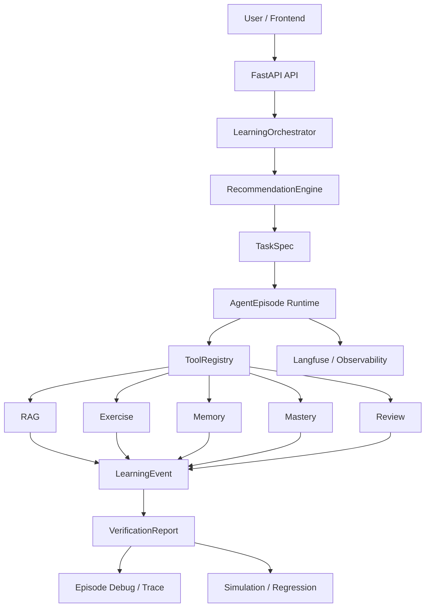

# Agent Runtime / Harness 架构说明

## 一、项目定位

BinnAgent 不是普通英语学习 Chatbot，而是一个面向学习场景的 Agent Runtime / Harness 工程实践。它把教材学习、练习、记忆、推荐、工具调用和验证串成可追踪、可解释、可回归的学习闭环。

核心技术主线：

- TaskSpec-based Orchestration
- AgentEpisode Runtime
- Event-driven Learning Pipeline
- Evidence-grounded Recommendation
- Long-term Memory
- Knowledge Tracing / Mastery Engine
- RAG-grounded Exercise Generation
- Tool Registry
- VerificationReport
- Simulation-based Regression Testing
- Langfuse Observability

## 二、架构图

## 三、核心闭环

一次教材知识点练习的链路：

1. RecommendationEngine 生成带目标、工具和验收策略的 TaskSpec。
2. AgentEpisode 创建运行上下文，记录 source、entrypoint、status 和 task_spec。
3. RAG 或教材题库提供教材证据和练习题。
4. Exercise 评分保存 ExerciseAttempt，并写入 exercise_answered / exercise_graded 事件。
5. MasteryEngine 根据正确率、提示数、重试数和分数更新掌握度。
6. MemoryWriter 写入学习证据，后续 Recall 可用于推荐与反馈。
7. ReviewSchedule 安排复习，形成下一次训练入口。
8. VerificationService 按 TaskSpec 的 required_checks 验证关键步骤是否完成。
9. Episode trace 可在前端 Debug 页面查看，也可被 simulation 回归测试读取。

## 四、关键数据结构

| 结构 | 作用 |
|---|---|
| TaskSpec | 标准化学习任务，描述 task_type、source、objective、target、allowed_tools、success_criteria 和 verification_policy |
| AgentEpisode | 一次 Agent 学习任务运行实例，保存上下文、状态、工具调用、验证报告和失败信息 |
| LearningEvent | 事件化学习流水线，记录 exercise_answered、exercise_graded、mastery_updated、memory_written 等步骤 |
| EvidenceRef | 统一证据引用，连接 RAG chunk、ExerciseAttempt、MemoryEvent、KnowledgePoint、LearningEvent 等对象 |
| MasteryUpdateResult | 掌握度更新结果，包含 previous/new score、confidence、weakness_tags、forgetting_risk 和 next_review_at |
| RecommendationPlan | 每日学习计划，按规则综合低掌握度、到期复习、教材进度和偏好，输出 TaskSpec 列表 |
| ToolCallRecord | 工具调用审计记录，包含 tool_name、status、latency、input_hash、output_hash 和 error |
| VerificationReport | 可验证完成报告，列出每个 check 的 passed/failed、actual/expected 和 evidence_refs |

## 五、面试讲法

3 分钟版本：

> BinnAgent 表面上是英语学习 Agent，但我的重点不是做一个聊天入口，而是做一个可追踪的 Agent Runtime。每次教材练习、推荐任务或探索入口都会先转成 TaskSpec，里面有目标、允许工具、成功标准和验证策略。运行时创建 AgentEpisode，后续评分、掌握度更新、记忆写入、复习安排都会记录成 LearningEvent 和 ToolCallRecord。
>
> 这和普通 RAG 的区别是：RAG 只解决“从哪里拿材料”，但这里还要证明“系统为什么推荐、用了什么证据、是否真的完成关键步骤”。所以我引入 EvidenceRef 连接教材 chunk、练习 attempt、memory event 和 knowledge point；推荐和验证都可以带证据。
>
> 这也不是简单 Chat。Chat 可以作为入口，但学习系统真正有价值的是长期记忆和知识追踪：MemoryWriter 记录学习证据，MasteryEngine 更新掌握度，RecommendationEngine 用这些状态生成下一步行动。最后 VerificationReport 和 simulation regression 会检查完整链路，保证 Agent 行为可解释、可验证、可回归。

## 六、当前边界和后续计划

已实现：

- AgentEpisode / LearningEvent / ToolCallRecord 数据模型和 trace API。
- TaskSpec、EvidenceRef、MasteryEngine、RecommendationEngine、LearningOrchestrator、ToolRegistry、VerificationReport。
- Knowledge Exercise 提交流程接入 episode trace。
- Daily Lesson start / answer 轻量 orchestration。
- Explore skill start API 和前端入口接入 TaskSpec。
- Episode Debug 前端页面。
- Simulation scenario 覆盖 episode runtime 知识点练习链路。

第一阶段 runtime 接入：

- Knowledge exercise 是完整接入样板。
- Daily Lesson 支持 answer_required 和轻量 resume 信息，但还不是完整 LangGraph checkpoint。
- Explore vocabulary / writing phrase 等入口已能创建 TaskSpec 和 episode，部分 handler 返回 not_implemented，保留扩展位。

后续计划：

- 加强 checkpoint / resume，和 LangGraph interrupt 机制深度融合。
- 引入统一 current-learner 依赖，补齐多用户权限隔离。
- 扩展 ToolRegistry wrapper，让 RAG / Memory / Mastery / Review 全部通过统一 executor 调用。
- 增加在线 eval、golden dataset、Langfuse dashboard 和更多 simulation persona。
- 把前端 Episode Debug 接入证据解析详情和可回放视图。

## 七、验收标准

这套文档应让技术面试官快速理解：

- 系统复杂度：学习任务不是孤立 API，而是 runtime trace。
- 工程抽象能力：TaskSpec、Episode、Evidence、Tool、Verification 等抽象边界清晰。
- Agent Harness 能力：每次运行有事件、工具调用、证据和验证报告。
- 可靠性设计：simulation regression 和 deterministic checks 能持续防止学习闭环回退。
