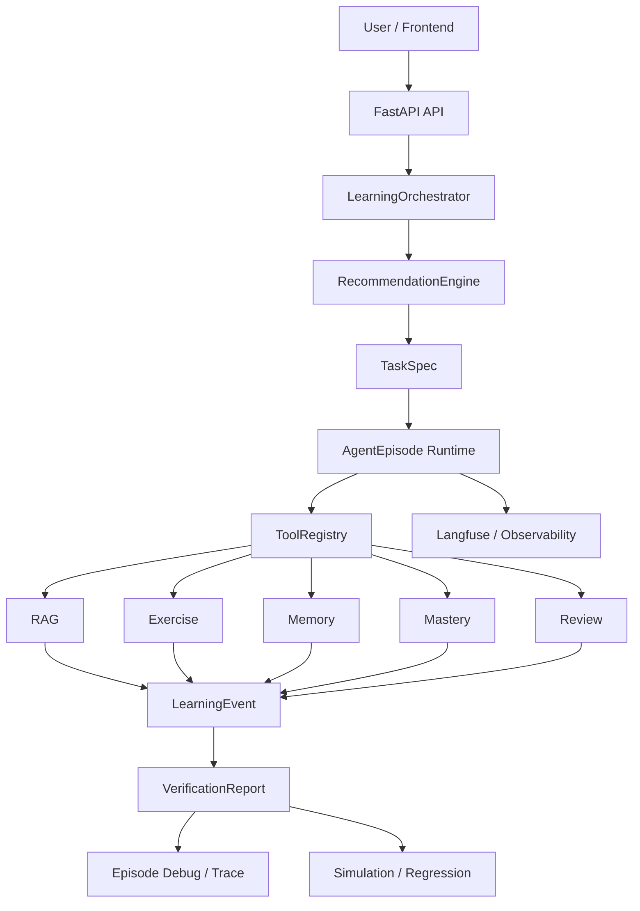

# Agent Runtime / Harness 架构说明

## 一、项目定位

BinnAgent 不是普通英语学习 Chatbot，而是一个面向学习场景的 Agent Runtime / Harness 工程实践。它把教材学习、练习、记忆、推荐、工具调用和验证串成可追踪、可解释、可回归的学习闭环。

核心技术主线：

- TaskSpec-based Orchestration
- AgentEpisode Runtime
- Event-driven Learning Pipeline
- Evidence-grounded Recommendation
- Long-term Memory
- Knowledge Tracing / Mastery Engine
- RAG-grounded Exercise Generation
- Tool Registry
- VerificationReport
- Simulation-based Regression Testing
- Langfuse Observability

## 二、架构图


```mermaid
flowchart TD
    user["User / Frontend"] --> api["FastAPI API"]
    api --> orchestrator["LearningOrchestrator"]
    orchestrator --> rec["RecommendationEngine"]
    rec --> task["TaskSpec"]
    task --> episode["AgentEpisode Runtime"]
    episode --> tools["ToolRegistry"]
    tools --> rag["RAG"]
    tools --> exercise["Exercise"]
    tools --> memory["Memory"]
    tools --> mastery["Mastery"]
    tools --> review["Review"]
    rag --> events["LearningEvent"]
    exercise --> events
    memory --> events
    mastery --> events
    review --> events
    events --> verification["VerificationReport"]
    verification --> debug["Episode Debug / Trace"]
    verification --> simulation["Simulation / Regression"]
    episode --> observability["Langfuse / Observability"]
```

## 三、核心闭环

一次教材知识点练习的链路：

1. RecommendationEngine 生成带目标、工具和验收策略的 TaskSpec。
2. AgentEpisode 创建运行上下文，记录 source、entrypoint、status 和 task_spec。
3. RAG 或教材题库提供教材证据和练习题。
4. Exercise 评分保存 ExerciseAttempt，并写入 exercise_answered / exercise_graded 事件。
5. MasteryEngine 根据正确率、提示数、重试数和分数更新掌握度。
6. MemoryWriter 写入学习证据，后续 Recall 可用于推荐与反馈。
7. ReviewSchedule 安排复习，形成下一次训练入口。
8. VerificationService 按 TaskSpec 的 required_checks 验证关键步骤是否完成。
9. Episode trace 可在前端 Debug 页面查看，也可被 simulation 回归测试读取。

## 四、Daily Lesson checkpoint / interrupt / resume

Daily Lesson 不再把所有节点一次跑完。`daily_lesson_graph` 当前链路是：

```text
load_profile -> detect_intent -> select_learning_goal -> route_skill_agent
-> run_learning_task -> wait_for_answer -> grade_attempt -> update_mastery
-> generate_feedback -> update_memory -> schedule_review
-> recommend_learning_action -> verify_episode -> summarize_session
```

- `answer_required=true` 且还没有 `learner_answer` 时，graph 返回题目材料并中断，不进入反馈节点。
- 有 `learner_answer` 时，从 `grade_attempt` 进入评分、掌握度、Memory、Review、推荐和验证闭环。

为什么需要 interrupt：学习任务必须等待真实用户作答，不能在没有答案时生成反馈、写记忆或安排复习。当前实现同时保留两层能力：LangGraph graph 支持可选 checkpointer 编译；项目内 `learning_graph_checkpoints` 表继续作为业务 checkpoint，服务前端题面恢复。

checkpoint 保存：

- learner / episode / thread / checkpoint_key。
- `resume_from`，当前从 `grade_attempt` 恢复。
- `state_snapshot`，包含 `input_materials`、`current_task_id`、`answer_required` 等 graph state。
- `prompt_payload` 和 `required_input_schema`，用于前端刷新后恢复题面。

恢复流程：

1. `/daily-lessons/start` 创建 `AgentEpisode`，graph 运行到 `run_learning_task`。
2. 如果需要作答，写入 `LearningGraphCheckpoint`，episode 状态变为 `waiting_user`，并记录 `task_prepared` / `graph_interrupted`。
3. `/daily-lessons/{episode_id}/answer` 校验 active checkpoint，注入 `learner_answer`，以 dry-run resume graph 产出 graph-level 闭环状态，并记录 `graph_resumed` / `learner_answer_received`。
4. 复用现有知识练习评分、掌握度、Memory、Review 和 Verification 能力，新增 `exercise_attempt_created` / `next_action_recommended` runtime events。
5. VerificationReport 生成后记录 `verification_report_generated`，并根据 `passed` / `warning` / `failed` 决定 episode 最终状态。
6. checkpoint 标记为 `completed`，Trace 中可看到 `episode_completed` 和 verification 检查结果。

当前边界：第一阶段只支持单题单 active `waiting_user` checkpoint；同一 episode 通过 partial unique index 保证只有一个 active checkpoint。LangGraph `InMemorySaver` 已可用于测试/本地实验，生产 PostgresSaver 和官方 `interrupt()/Command(resume=...)` 深度集成仍是后续任务。

## 五、关键数据结构

| 结构 | 作用 |
|---|---|
| TaskSpec | 标准化学习任务，描述 task_type、source、objective、target、allowed_tools、success_criteria 和 verification_policy |
| AgentEpisode | 一次 Agent 学习任务运行实例，保存上下文、状态、工具调用、验证报告和失败信息 |
| LearningEvent | 事件化学习流水线，记录 exercise_answered、exercise_graded、mastery_updated、memory_written 等步骤 |
| EvidenceRef | 统一证据引用，连接 RAG chunk、ExerciseAttempt、MemoryEvent、KnowledgePoint、LearningEvent 等对象 |
| MasteryUpdateResult | 掌握度更新结果，包含 previous/new score、confidence、weakness_tags、forgetting_risk 和 next_review_at |
| RecommendationPlan | 每日学习计划，按规则综合低掌握度、到期复习、教材进度和偏好，输出 TaskSpec 列表 |
| ToolCallRecord | 工具调用审计记录，包含 tool_name、status、latency、input_hash、output_hash 和 error |
| VerificationReport | 可验证完成报告，列出每个 check 的 passed/failed、severity、actual/expected 和 evidence_refs；它是 deterministic / schema / business_rule / evidence checks，不是 LLM judge |
| LearningGraphCheckpoint | Daily Lesson 暂停状态，保存 graph state snapshot、题面 payload、resume_from 和 consumed_at |

## 六、面试讲法

3 分钟版本：

> BinnAgent 表面上是英语学习 Agent，但我的重点不是做一个聊天入口，而是做一个可追踪的 Agent Runtime。每次教材练习、推荐任务或探索入口都会先转成 TaskSpec，里面有目标、允许工具、成功标准和验证策略。运行时创建 AgentEpisode，后续评分、掌握度更新、记忆写入、复习安排都会记录成 LearningEvent 和 ToolCallRecord。
>
> 这和普通 RAG 的区别是：RAG 只解决“从哪里拿材料”，但这里还要证明“系统为什么推荐、用了什么证据、是否真的完成关键步骤”。所以我引入 EvidenceRef 连接教材 chunk、练习 attempt、memory event 和 knowledge point；推荐和验证都可以带证据。
>
> 这也不是简单 Chat。Chat 可以作为入口，但学习系统真正有价值的是长期记忆和知识追踪：MemoryWriter 记录学习证据，MasteryEngine 更新掌握度，RecommendationEngine 用这些状态生成下一步行动。最后 VerificationReport 和 simulation regression 会检查完整链路，保证 Agent 行为可解释、可验证、可回归。

## 七、当前边界和后续计划

已实现：

- AgentEpisode / LearningEvent / ToolCallRecord 数据模型和 trace API。
- TaskSpec、EvidenceRef、MasteryEngine、RecommendationEngine、LearningOrchestrator、ToolRegistry、VerificationReport。
- Knowledge Exercise 提交流程接入 episode trace。
- Daily Lesson start / answer 支持 checkpoint / interrupt / resume，等待用户作答时 episode 进入 `waiting_user`，答案提交后闭合 grade/mastery/memory/review/recommend/verify。
- ExploreCapability start API 和前端入口接入 TaskSpec。
- Learner App / Dev Console 双入口：学习端只暴露学习功能，调试端承载 Memory、Episode、Tool、Evidence、RAG、Prompt、Verification 和 Simulation 面板。
- Episode Debug / Graph Runs、Tool Registry、Tool Call Records、RAG Debug、Prompt Debug、VerificationReport、Simulation Report 等 Dev Console 页面。
- Simulation scenario 覆盖 episode runtime 知识点练习链路。
- 教材解析链路新增 ParserRun、ParserQualityReport、ParserReviewItem 和 TextbookQualityScore：每次 PDF ingest 都有运行记录、质量指标、队列化审核、发布门禁和 provenance，可防止低质量解析结果静默进入学习闭环。
- Dev Console 新增 Textbook Parsing Report：可查看教材 source 质量摘要、ParserRun 历史、quality metrics、blocking reasons、pending review items 和 parser evidence；evidence 查询只返回必要 raw line/excerpt，不展示整本 PDF 原文。

本地运行入口：

```bash
cd binnagent-frontend
npm run dev          # Learner App: http://localhost:5173
npm run dev:console  # Dev Console: http://localhost:5174
```

Dev Console 访问后端内部 API 需要显式开启：

```bash
DEBUG_CONSOLE_ENABLED=true
DEBUG_CONSOLE_TOKEN=dev
DEBUG_CONSOLE_ALLOWED_ORIGINS=http://localhost:5174
```

Debug API 默认关闭。普通用户端不暴露 Memory / Runtime / Trace / Prompt / Tool / Evidence 页面，也不能直接访问 Memory Debug 页面。

Dev Console 使用流程：

1. 启动后端：`DEBUG_CONSOLE_ENABLED=true DEBUG_CONSOLE_TOKEN=dev uvicorn src.main:app --reload --port 8000`
2. 启动 Dev Console：`cd binnagent-frontend && npm run dev:console`
3. 打开 http://localhost:5174 并输入 token：`dev`
4. 在 Learners 页面搜索或选择 learner，顶部 ContextBar 会同步 learner_id。
5. 在 Recent Episodes 页面查看该 learner 最近的 AgentEpisode。
6. 点击“打开 Trace”进入 Graph Run Debug，查看 Episode、checkpoint、events、tool calls、prompt execution summary、VerificationReport 和 evidence refs。
7. 打开 Textbook Parsing Report，按 source、ParserRun、review issue 或 target object 查看解析质量和 evidence 摘要。

Graph Run Debug 不展示 raw prompt / raw output；原始 LLM trace 交给 Langfuse。

第一阶段 runtime 接入：

- Knowledge exercise 是完整接入样板。
- Daily Lesson 支持单题单 checkpoint 的持久化暂停和恢复，并支持可选 LangGraph checkpointer 编译；业务 checkpoint 仍负责前端恢复。
- Textbook ingest 已接入 deterministic 质量门禁和 ParserReviewItem 队列，API、Dev Console 和 review flow 会根据 pending blocker / warning 决定 `published/review_required/partial_indexed/blocked/failed`。
- Explore vocabulary / writing phrase 等入口已能创建 TaskSpec 和 episode，部分 handler 返回 not_implemented，保留扩展位。

后续计划：

- 扩展多步骤 checkpoint / resume，和 LangGraph 官方 interrupt/checkpointer 机制深度融合。
- 引入统一 current-learner 依赖，补齐多用户权限隔离。
- 扩展 ToolRegistry wrapper，让 RAG / Memory / Mastery / Review 全部通过统一 executor 调用。
- 增加在线 eval、golden dataset、Langfuse dashboard 和更多 simulation persona。
- 扩展 golden dataset parser eval、parser registry、CI parser regression 和更完整的节点级回放。

## 八、验收标准

这套文档应让技术面试官快速理解：

- 系统复杂度：学习任务不是孤立 API，而是 runtime trace。
- 工程抽象能力：TaskSpec、Episode、Evidence、Tool、Verification 等抽象边界清晰。
- Agent Harness 能力：每次运行有事件、工具调用、证据和验证报告。
- 可靠性设计：simulation regression 和 deterministic checks 能持续防止学习闭环回退。
