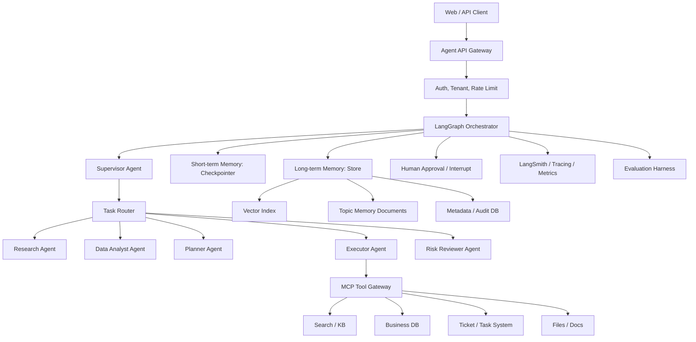

# 基于 LangGraph 的强化 Memory + 多智能体协作 Agent 系统技术方案

> 文档日期：2026-06-11  
> 目标：输出一份可落地、可复盘、可写入简历的总体技术方案。本文只做架构设计与技术路线，不包含代码实现。

## 1. 项目定位

构建一个面向复杂任务执行的 Agent 后端系统：以 LangGraph 作为状态化编排核心，强化长期记忆、短期上下文、工具调用、多智能体协作、可观测性、评估与安全治理能力，使系统可以支持多轮任务、跨会话学习、专家分工、任务恢复、人工审批和可审计执行。

一句话项目描述：

> 设计并落地一套基于 LangGraph 的生产级多智能体 Agent 后端架构，支持短期 checkpoint 记忆、长期结构化记忆、MCP 工具生态接入、Supervisor/Router/Swarm 混合协作、可回放状态机、Agent 评测闭环与安全治理。

## 2. 联网调研摘要

### 2.1 LangGraph 最新核心能力

LangGraph 官方定位是用于构建、管理和部署长运行、状态化 Agent 的低层编排框架，重点能力包括 durable execution、streaming、human-in-the-loop、persistence、memory 与 fault tolerance。官方文档明确将 LangGraph 放在“orchestration runtime”层，而 LangSmith 负责 tracing、evaluation、prompts 和 deployment。  
来源：[LangGraph overview](https://docs.langchain.com/oss/python/langgraph/overview)

对本项目的架构启发：

- 用 LangGraph 的 `StateGraph` 作为 Agent 工作流状态机，而不是把所有逻辑塞进一个 ReAct loop。
- 用 checkpointer 保存线程内短期状态，支持失败恢复、会话续跑、人工中断和 time travel。
- 用 store 保存跨线程长期记忆，面向用户、组织、任务、工具、偏好和经验做 namespace 隔离。

### 2.2 Memory 设计趋势

LangGraph memory 文档把记忆分为短期记忆和长期记忆：

- 短期记忆：thread-scoped，由图状态和 checkpointer 管理。
- 长期记忆：cross-session，由 store 管理，可按 namespace 存储 JSON 文档并支持检索。

官方还将长期记忆分为 semantic、episodic、procedural 三类，并强调 memory 写入可以走 hot path 或 background 两种路径。  
来源：[Memory overview](https://docs.langchain.com/oss/python/concepts/memory)

近两年的研究也在强调 memory 不是“无限追加向量库”。2026 年的 Memory survey 将 Agent memory 抽象为 write-manage-read 循环，重点问题包括持续合并、矛盾处理、可信反思、遗忘策略、延迟预算和隐私治理。  
来源：[Memory for Autonomous LLM Agents: Mechanisms, Evaluation, and Emerging Frontiers](https://arxiv.org/abs/2603.07670)

2026 年的 Infini Memory 提出 topic-structured documents，把长期记忆组织为可维护的主题文档，而不是孤立片段；新观察先进 buffer，再周期性合并到主题文档，推理时允许 Agent 迭代读取证据。  
来源：[Infini Memory](https://arxiv.org/abs/2606.10677)

对本项目的架构启发：

- 长期记忆采用“结构化 JSON + topic document + 向量/关键词混合索引”的混合设计。
- 增加 memory curator 节点，负责写入、合并、去重、矛盾检测和遗忘。
- 记忆更新不只依赖主 Agent 自觉调用工具，关键事实走 hot path，低优先级经验走 background consolidation。

### 2.3 多智能体协作趋势

LangChain 官方多智能体文档强调：多智能体的核心不是“Agent 数量多”，而是 context engineering，即决定每个 Agent 能看到什么、不能看到什么。主流模式包括：

- Subagents：主 Agent 把子 Agent 当工具调用，集中控制强，适合上下文隔离。
- Handoffs：Agent 之间移交控制权，适合多轮中持续由某个专家接管。
- Skills：单 Agent 按需加载专业上下文。
- Router：先分类再分派给一个或多个专家，适合并行多领域任务。
- Custom workflow：用 LangGraph 混合确定性流程和 Agentic 节点。

来源：[LangChain multi-agent](https://docs.langchain.com/oss/python/langchain/multi-agent)

LangGraph Supervisor 和 Swarm 生态也提供了两个可参考方向：

- Supervisor：中心协调者负责分派与汇总，适合企业流程、审计和权限控制。
- Swarm：Agent 可动态 handoff，系统记住最后活跃 Agent，适合连续对话与专家接管。

来源：[langgraph-supervisor-py](https://github.com/langchain-ai/langgraph-supervisor-py)、[langgraph-swarm-py](https://github.com/langchain-ai/langgraph-swarm-py)

对本项目的架构启发：

- 采用“Supervisor + Router + Specialist Agents + Handoff”的混合架构。
- 对强管控任务走 Supervisor；对明确领域分类任务走 Router；对连续交互场景允许 Swarm-style active agent。
- 每个子 Agent 使用独立 prompt、工具集、记忆 namespace 和输出 schema，降低上下文污染。

### 2.4 MCP 与工具生态

MCP 是开放协议，用于把 AI 应用连接到外部数据源、工具和工作流。官方将它类比为 AI 应用的标准化连接口，可连接本地文件、数据库、搜索、业务 API 和专业 prompt。  
来源：[Model Context Protocol intro](https://modelcontextprotocol.io/docs/getting-started/intro)

LangChain 已支持通过 `langchain-mcp-adapters` 接入一个或多个 MCP server，并提供 tools、resources、prompts、structured content、multimodal content、interceptors、stateful sessions 等能力。  
来源：[LangChain MCP docs](https://docs.langchain.com/oss/python/langchain/mcp)

对本项目的架构启发：

- 将外部工具统一封装成 MCP server，Agent 后端通过 MCP client 接入，减少一次性集成成本。
- 通过 tool interceptor 注入用户上下文、权限、trace id、租户 id 和 memory store 查询结果。
- 对 MCP 工具做 allowlist、权限分级、审计日志、参数校验和 prompt injection 防护。

## 3. 核心技术关键词

可写入方案与简历的关键词：

- LangGraph `StateGraph`、checkpoint、store、subgraph、interrupt、time travel、durable execution
- Short-term memory、long-term memory、semantic/episodic/procedural memory
- Memory write-manage-read loop、memory consolidation、reflection、learned forgetting、contradiction detection
- Topic-structured memory、profile memory、collection memory、few-shot episodic memory
- Multi-agent Supervisor、Router、Subagent-as-tool、Handoff、Swarm-style active agent
- Context engineering、state isolation、tool isolation、schema-constrained output
- MCP server/client、tool/resource/prompt、interceptor、stateful session
- Human-in-the-loop、approval gate、policy guardrail、audit trail
- LangSmith tracing、offline eval、LLM-as-judge、golden task set、regression eval
- RAG hybrid retrieval、vector search、BM25、reranker、metadata filtering
- Tenant isolation、PII redaction、prompt injection defense、tool permission boundary

## 4. 目标业务场景

建议将项目包装为“企业知识与任务执行 Agent 平台”，既能体现后端架构，也能体现 Agent 工程复杂度。

示例场景：

用户提出一个复杂需求，例如“帮我分析某产品近期用户反馈，结合历史改进记录，生成优先级排序，并创建研发任务草案”。系统需要：

1. 理解目标和约束。
2. 检索企业知识库、历史任务、用户偏好、组织规则。
3. 将任务拆给研究 Agent、数据分析 Agent、方案 Agent、风险审查 Agent、执行 Agent。
4. 在关键动作前请求人工审批。
5. 把执行结果、用户反馈、失败经验写入长期记忆。
6. 未来相似任务能复用历史经验并避免重复错误。

## 5. 总体架构



## 6. 分层设计

### 6.1 API 接入层

职责：

- 提供 REST 或 WebSocket API。
- 管理用户、组织、租户、thread id、run id。
- 支持同步响应、流式事件、后台任务三种调用模式。
- 对输入做基础安全过滤、附件解析、幂等键处理。

建议接口：

- `POST /threads`：创建会话线程。
- `POST /threads/{thread_id}/runs`：触发一次 Agent run。
- `GET /threads/{thread_id}/events`：SSE/WebSocket 订阅事件。
- `POST /runs/{run_id}/approve`：人工审批继续执行。
- `GET /runs/{run_id}/trace`：查看执行轨迹。
- `GET /memory/search`：调试或管理长期记忆。

### 6.2 LangGraph 编排层

核心图节点：

- `intent_classifier`：识别任务类型、风险等级和是否需要多 Agent。
- `memory_loader`：读取短期状态和长期相关记忆。
- `supervisor`：拆解任务、分配 Agent、控制流程。
- `router`：选择一个或多个 specialist agents。
- `specialist_agent_nodes`：执行领域任务。
- `tool_executor`：调用 MCP 工具或内部工具。
- `risk_reviewer`：检查越权、隐私、危险操作、幻觉风险。
- `human_approval_gate`：关键动作前 interrupt。
- `memory_writer`：写入事实、经验、偏好、失败案例。
- `final_synthesizer`：整合结果并输出结构化响应。

关键设计：

- 每个节点输入输出都使用强类型 schema。
- 子 Agent 可以是 subgraph，复杂任务允许嵌套图。
- 对长任务开启 checkpoint，失败后从最近成功 super-step 恢复。
- 人工审批通过 LangGraph interrupt 暂停，审批后从 checkpoint 续跑。

### 6.3 Memory 层

Memory 分四层：

| 层级 | 范围 | 内容 | 存储方式 | 典型用途 |
|---|---|---|---|---|
| Working Context | 单次节点调用 | 当前 prompt 所需最小上下文 | prompt/context | 控制 token 成本 |
| Short-term Memory | 单 thread | 消息、任务状态、中间结果、active agent | checkpointer | 多轮续聊、失败恢复 |
| Long-term Semantic Memory | 跨 thread | 用户偏好、业务事实、实体画像 | store + JSON + index | 个性化和事实复用 |
| Long-term Episodic/Procedural Memory | 跨任务 | 成功/失败经验、最佳实践、工具使用策略 | topic docs + examples | 任务迁移和自我改进 |

长期记忆 namespace 设计：

```text
("tenant", tenant_id, "user", user_id, "profile")
("tenant", tenant_id, "org", org_id, "business_facts")
("tenant", tenant_id, "agent", agent_name, "procedures")
("tenant", tenant_id, "task", task_type, "episodes")
("tenant", tenant_id, "tool", tool_name, "usage_lessons")
```

Memory 写入策略：

- Hot path：用户明确偏好、关键事实、审批结论、任务目标变更立即写入。
- Background：完整对话总结、失败归因、工具调用经验、主题文档合并异步处理。
- Curator：定期做去重、过期、冲突检测、置信度更新和证据链接维护。

Memory 读取策略：

- 先按租户、用户、任务类型过滤。
- 再做 hybrid retrieval：metadata filter + BM25 + embedding + reranker。
- 对高风险事实要求 evidence trace，最终回答引用来源或内部证据 id。
- 对低置信度记忆降权，不直接进入最终上下文。

### 6.4 多智能体层

推荐 Agent 角色：

| Agent | 职责 | 工具 | 记忆 |
|---|---|---|---|
| Supervisor Agent | 任务拆解、调度、汇总、终止判断 | Agent handoff tools | 任务策略、协作经验 |
| Research Agent | 检索外部/内部资料并归纳证据 | 搜索、知识库、网页、文件 | 研究偏好、可信源 |
| Data Analyst Agent | SQL/指标分析、数据解释 | 数据库、Notebook、BI | 指标口径、历史分析 |
| Planner Agent | 制定执行计划和里程碑 | 项目管理、日历 | 计划模板、风险清单 |
| Executor Agent | 执行业务动作 | ticket、邮件、CRM、代码平台 | 工具使用经验 |
| Risk Reviewer Agent | 审核权限、隐私、事实风险 | policy、审计、DLP | 违规案例、规则 |
| Memory Curator Agent | 维护长期记忆质量 | store、向量库、评估集 | 记忆治理规则 |

协作模式：

- 普通单领域任务：Router 直接分派给单个 specialist。
- 多领域分析任务：Router 并行调用多个 specialist，Supervisor 汇总。
- 长链路执行任务：Supervisor 串行推进，关键节点插入 Risk Reviewer 和 human approval。
- 连续专家对话：Swarm-style active agent 记录最后接管者，后续 thread 优先交给该 Agent。

## 7. 数据与存储设计

建议后端存储组合：

- PostgreSQL：用户、租户、thread、run、checkpoint metadata、审计日志。
- LangGraph checkpointer：开发阶段可用 SQLite/Postgres saver，生产阶段接 PostgreSQL。
- Object Storage：附件、生成报告、中间产物。
- Vector DB：pgvector、Qdrant、Milvus 或 Elasticsearch vector。
- Redis：分布式锁、短 TTL 状态、事件缓冲、限流。

核心表：

- `agent_threads`：thread 元信息。
- `agent_runs`：每次执行状态、耗时、成本、模型版本。
- `agent_events`：流式事件与节点事件。
- `agent_tool_calls`：工具调用参数摘要、结果摘要、权限、耗时。
- `agent_memory_items`：长期记忆元数据。
- `agent_memory_evidence`：记忆与原始证据关系。
- `agent_approvals`：人工审批记录。
- `agent_eval_results`：离线/在线评测结果。

## 8. 工具与 MCP 设计

建议通过 MCP Tool Gateway 把工具分为四级：

- L0 Read-only：搜索、知识库读取、文件读取。
- L1 Low-risk Write：创建草稿、生成临时报告。
- L2 Business Write：创建工单、更新 CRM、发通知，需要审批或策略校验。
- L3 Sensitive Action：付款、删除、权限变更、生产操作，默认禁止或强审批。

MCP interceptor 负责：

- 注入 `tenant_id`、`user_id`、`run_id`、`trace_id`。
- 校验工具 allowlist 和用户权限。
- 对工具参数做 schema validation 和敏感字段脱敏。
- 将工具结果结构化落审计日志。
- 对工具返回内容做 prompt injection 检测。

## 9. 安全与治理

必须纳入方案的风险点：

- Prompt injection：来自网页、文档、工具返回的恶意指令不得覆盖系统策略。
- Tool poisoning：MCP 工具描述、参数 schema、server 来源必须可信。
- Cross-tenant memory leakage：长期记忆 namespace 必须强制租户隔离。
- Over-memory：不应把所有用户输入都永久记住，需可删除、可解释、可导出。
- Hallucinated memory：模型生成的“记忆”必须标记置信度和证据来源。
- Dangerous action：高风险工具调用必须走审批和幂等保护。

治理机制：

- Policy engine：基于用户角色、工具等级、数据敏感度决定是否允许执行。
- Human-in-the-loop：对 L2/L3 工具、低置信事实、外部发送类动作插入审批。
- Audit trail：保存 run、node、tool、memory write 的完整轨迹。
- Memory privacy：支持用户级 forget、租户级 retention、PII redaction。
- Evaluation gate：新 prompt、新工具、新 Agent 上线前跑回归评测。

## 10. 可观测性与评估

可观测性指标：

- 成功率、平均轮数、平均 token、工具调用成功率、人工审批率。
- checkpoint 恢复次数、节点失败率、超时率。
- memory hit rate、memory precision、memory freshness、conflict rate。
- 多 Agent handoff 次数、重复调用率、无效调用率。
- 单任务成本、P95 latency、模型错误分布。

评测集设计：

- Golden task set：20-50 个标准业务任务。
- Memory regression set：验证跨会话偏好、事实更新、遗忘和冲突处理。
- Tool-use eval：验证工具选择、参数构造、失败重试。
- Multi-agent eval：验证拆解质量、并行效率、汇总一致性。
- Safety eval：prompt injection、越权调用、跨租户检索、敏感信息泄漏。

评测方法：

- 规则评测：结构化字段、工具调用序列、权限判断。
- LLM-as-judge：计划质量、回答完整性、证据一致性。
- Trace replay：基于 LangGraph checkpoint 重放历史失败路径。
- A/B prompt eval：比较 supervisor prompt、memory retrieval、agent routing 策略。

## 11. 推荐技术栈

后端：

- Python 3.11+
- FastAPI
- LangGraph
- LangChain / langchain-mcp-adapters
- Pydantic v2
- PostgreSQL + pgvector
- Redis
- Celery / Dramatiq / Temporal 任选其一做后台任务

Agent 与模型：

- 主推 OpenAI / Anthropic / Gemini 可切换模型抽象。
- 高成本模型负责 Supervisor、Reviewer、Final Synthesizer。
- 低成本模型负责分类、摘要、memory candidate extraction。
- Embedding 模型用于 memory 和知识检索。

可观测与部署：

- LangSmith tracing/evaluation
- OpenTelemetry
- Docker Compose 开发环境
- Kubernetes 或 ECS 生产部署
- CI 中加入 prompt/eval regression

## 12. 里程碑规划

### M1：基础 Agent Runtime

- FastAPI 接入层。
- LangGraph 单 Agent 工作流。
- checkpointer 支持 thread 内短期记忆。
- SSE 输出节点事件。

验收标准：

- 多轮会话可恢复。
- 节点失败后可从 checkpoint 继续。
- trace 中可看到每个节点输入输出摘要。

### M2：长期 Memory 系统

- store namespace 设计。
- semantic/profile memory 写入与读取。
- memory curator 异步合并。
- memory 搜索调试接口。

验收标准：

- 跨 thread 记住用户偏好。
- 支持事实更新和旧事实降权。
- 支持 memory 删除和审计。

### M3：多智能体协作

- Supervisor + Router + 3 个 specialist agents。
- 子 Agent 独立工具集和 prompt。
- 并行子任务与汇总。
- handoff/active agent 机制。

验收标准：

- 多领域任务能拆解并行执行。
- 子 Agent 内部消息不污染全局上下文。
- 汇总输出包含证据和执行路径。

### M4：MCP 工具体系

- 接入至少 3 个 MCP server：知识库、数据库、任务系统。
- MCP interceptor 注入用户和权限上下文。
- 工具分级审批。

验收标准：

- 读工具自动执行。
- 写工具按风险等级审批。
- 工具调用全链路可审计。

### M5：评估与安全闭环

- 建立 golden task set。
- 建立 memory、tool-use、multi-agent、safety eval。
- LangSmith trace + eval dashboard。
- prompt injection 和跨租户泄漏测试。

验收标准：

- 每次 prompt/agent/tool 变更可跑回归。
- 有清晰指标证明系统质量提升。
- 高风险动作无审批不执行。

## 13. 项目亮点包装

面试时可以突出以下技术点：

1. 状态化 Agent 编排：基于 LangGraph 将复杂 Agent 拆成可恢复、可回放、可审计的状态机，而非简单 ReAct 循环。
2. 强化 Memory：同时实现 thread-scoped checkpoint、cross-session store、topic memory consolidation 和 memory curator。
3. 多智能体协作：结合 Supervisor、Router、Subagent-as-tool、Handoff，实现强管控与灵活协作的混合架构。
4. 工具体系标准化：使用 MCP 统一外部工具、资源和 prompt 接入，并通过 interceptor 做权限、审计和上下文注入。
5. 生产级安全治理：加入 tool permission boundary、human approval、prompt injection 防护、跨租户 memory 隔离。
6. 评估闭环：建设 golden task、memory eval、tool-use eval、safety eval，并通过 trace replay 定位 Agent 失败路径。

## 14. 简历项目描述

可直接用于简历：

> 设计并实现基于 LangGraph 的生产级多智能体 Agent 后端平台，支持状态化工作流编排、短期 checkpoint 记忆、跨会话长期记忆、MCP 工具生态接入和 Human-in-the-loop 审批。系统采用 Supervisor + Router + Specialist Agents 的混合协作架构，将复杂任务拆解为研究、数据分析、规划、执行和风险审查等子 Agent，并通过长期 Memory Curator 实现用户偏好、任务经验和工具使用策略的持续沉淀。引入 LangSmith tracing/evaluation、memory regression、tool-use eval 和 safety eval，构建可观测、可回放、可评估的 Agent 工程闭环，同时通过租户级 memory namespace、工具权限分级、prompt injection 防护和审计日志保障生产安全。

简历 bullet 版本：

- 基于 LangGraph 设计状态化 Agent runtime，利用 checkpoint 实现多轮会话恢复、失败续跑、人工中断和 time-travel 调试。
- 构建分层 Memory 架构，覆盖 working context、thread-scoped short-term memory、cross-session semantic/episodic/procedural memory，并设计 memory curator 负责合并、去重、冲突检测与遗忘策略。
- 设计 Supervisor + Router + Handoff 的多智能体协作机制，将复杂任务分派给 Research、Data Analyst、Planner、Executor、Risk Reviewer 等专家 Agent，并通过上下文隔离降低 token 成本和工具误用。
- 通过 MCP Gateway 标准化接入数据库、知识库、工单系统等外部工具，利用 interceptor 注入租户上下文、权限校验、审计追踪和结构化工具结果。
- 建立 LangSmith trace 与 Agent eval 体系，覆盖 memory recall、tool-use accuracy、multi-agent coordination、prompt injection 和越权调用等关键指标。

## 15. 后续实现建议

优先实现顺序：

1. 先做单 Agent + checkpoint，把可恢复状态机跑通。
2. 再加长期 memory store，避免一开始陷入复杂多 Agent。
3. 然后接 Supervisor + Router，把多智能体分工变成可观测流程。
4. 最后扩展 MCP、审批、安全和评估闭环。

最小可展示 Demo：

- 用户第一次说“我喜欢短答案，偏 Python 技术栈”。
- 系统将偏好写入长期记忆。
- 用户开启新 thread，请系统设计一个后端 Agent 项目。
- 系统自动召回偏好，用短答案、Python 栈输出。
- 用户要求“创建任务到项目系统”，系统触发 L2 工具审批。
- 审批后调用 MCP task tool，并在 trace 中展示完整路径。

这个 Demo 能同时展示 memory、多智能体、工具调用、审批、可观测五个亮点。

## 16. 参考资料

- [LangGraph overview](https://docs.langchain.com/oss/python/langgraph/overview)
- [LangGraph persistence](https://docs.langchain.com/oss/python/langgraph/persistence)
- [LangGraph memory overview](https://docs.langchain.com/oss/python/concepts/memory)
- [LangChain multi-agent](https://docs.langchain.com/oss/python/langchain/multi-agent)
- [LangChain MCP](https://docs.langchain.com/oss/python/langchain/mcp)
- [Model Context Protocol](https://modelcontextprotocol.io/docs/getting-started/intro)
- [langgraph-supervisor-py](https://github.com/langchain-ai/langgraph-supervisor-py)
- [langgraph-swarm-py](https://github.com/langchain-ai/langgraph-swarm-py)
- [Memory for Autonomous LLM Agents: Mechanisms, Evaluation, and Emerging Frontiers](https://arxiv.org/abs/2603.07670)
- [Infini Memory: Maintainable Topic Documents for Long-Term LLM Agent Memory](https://arxiv.org/abs/2606.10677)
- [How Memory Management Impacts LLM Agents](https://arxiv.org/abs/2505.16067)
- [Multi-Agent Collaboration Mechanisms: A Survey of LLMs](https://arxiv.org/abs/2501.06322)
