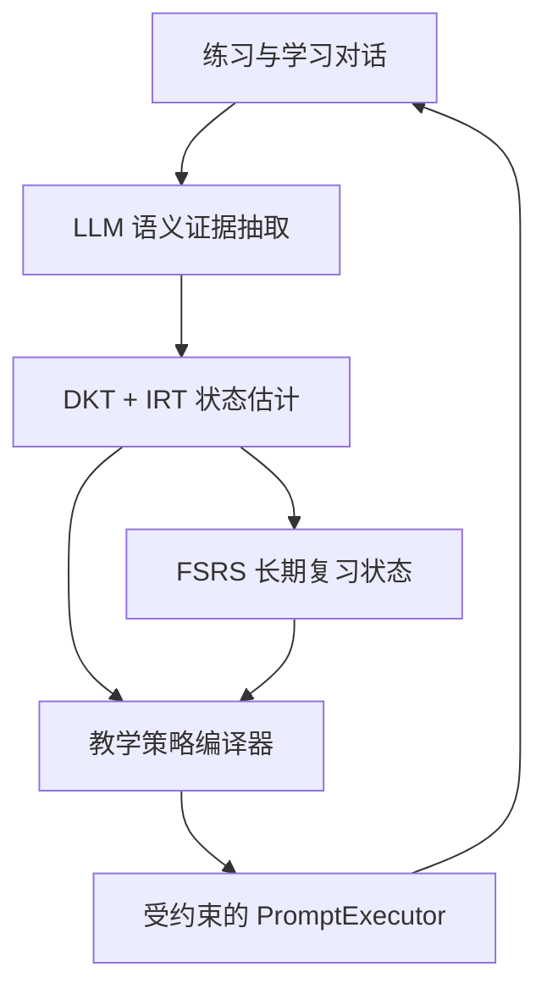

确认采用这套理论组合。结论是：**在 BinnAgent 中具有较高落地可行性，但不能把 DKT、IRT、FSRS 当成三个并列的“掌握度计算器”叠加。**更合理的定位是：

* LLM：把开放对话转成结构化学习证据。
* Dialogue-based KT：规定哪些对话可以视为评测。
* DKT：追踪随交互变化的知识状态。
* IRT：解释“学生能力—题目难度—成功概率”。
* FSRS：负责长期遗忘与复习时间。
* Policy Compiler：把学习状态编译为动态 Prompt 约束。

整体落地可行性约为 **8/10**；其中 FSRS、语义证据和 Prompt 约束可立即落地，真正的数据驱动 DKT 需要先积累跨学习者序列数据。

## 一、这套组合为什么成立

它实际上对应两个时间尺度：

| 层次     | 要回答的问题                    | 采用方法             |
| ------ | ------------------------- | ---------------- |
| 当前能力追踪 | 学生现在做这类题大概率能否独立完成？        | DKT + IRT        |
| 长期记忆追踪 | 这个知识点什么时候可能忘，应何时复习？       | DSR/FSRS         |
| 开放表达评测 | 这段回答涉及什么知识点、错在哪里、是否真正掌握？  | LLM 语义分析         |
| 教学决策   | 下一题多难、给多少提示、Prompt 能生成什么？ | 动态 Prompt Policy |

DKT 原本就是根据历史交互预测下一次作答表现的序列模型，但它的隐状态缺乏天然解释性。[DKT 原始论文](https://papers.nips.cc/paper/5654-deep-knowledge-tracing)
Deep-IRT 证明了可以把深度 KT 与学生能力、题目难度结合，使输出具有心理测量含义。[Deep-IRT](https://arxiv.org/abs/1904.11738)

对话场景也已有直接研究依据：2024 年的 Dialogue KT 工作用 LLM 从师生对话中识别知识点和正确性，再进行 KT；2026 年 5 月的新工作进一步把 LLM、对话 KT、IRT 能力与题目难度统一起来，与你提出的路线非常接近。不过后者目前仍是较新的研究方案，不能当作成熟工业标准。[Dialogue KT](https://arxiv.org/abs/2409.16490)、[Interpretable Difficulty-Aware Conversational KT](https://arxiv.org/abs/2605.01097)

## 二、在 BinnAgent 中的正确架构



关键是不能直接把几个分数相加：

* DKT 输出：某知识点在给定难度下，下一次独立成功的概率。
* IRT 输出：学习者能力 `θ`、题目难度 `b`，首版使用简单的 Rasch/1PL：
  [
  P(\text{correct})=\sigma(\theta-b)
  ]
* FSRS 输出：知识点的 Difficulty、Stability、Retrievability，以及下次复习时间。
* LLM 输出：知识点、作答质量、错误类型、证据模式和置信度。
* Prompt Policy 输出：允许生成的任务难度、提示等级、练习形式和知识点数量。

**不要生成一个“DKT 0.6 + IRT 0.2 + FSRS 0.2”的总分。**三者解决的问题不同。

## 三、当前项目已有的落地基础

BinnAgent 已经具备大部分工程骨架：

* `ExerciseAttempt` 已记录正确性、响应时间、目标对象和 metadata。
* `LearnerKnowledgeState` 已有 `mastery_score`、`confidence`、曝光次数和 `next_review_at`。
* `MasteryEngine` 已经处于统一更新入口。
* LangGraph 已有 `grade_attempt → update_mastery → schedule_review → recommend → verify`。
* `PromptExecutor` 已支持 schema 校验、repair、fallback、审计和离线 eval。
* Expression Lab 已能产生 `ExpressionLabAttempt → ExerciseAttempt → LearningEvent → Memory → Recommendation`。

参考当前的 [MasteryEngine](https://github.com/paras0l/BinnAgent/blob/main/src/mastery/engine.py)、[知识数据模型](https://github.com/paras0l/BinnAgent/blob/main/src/models/knowledge.py)、[Expression Lab 架构](https://github.com/paras0l/BinnAgent/blob/main/docs/architecture/14-expression-lab.md)。

因此不需要重构主链，只需要替换内部实现。

当前真正的问题有三个：

1. `MasteryEngine` 仍是答对 `+0.18`、答错 `-0.12` 的固定规则。
2. 复习时间仍主要是错误后 1 天、普通正确 4 天、掌握后 7 天。
3. 词汇练习更新时会把 recognition、recall、spelling、context_use、production 设成同一个分数，这会抹掉不同证据形式的差异。

第三点尤其需要先修，否则即使接入 DKT，输入数据也是失真的。

## 四、每个组件的实际可行性

| 组件           | 可行性 | 主要判断                                                                                      |
| ------------ | --: | ----------------------------------------------------------------------------------------- |
| LLM 语义分析     |  很高 | 已有 PromptExecutor 和结构化输出治理                                                                |
| 对话式隐式追踪      |   高 | Expression Lab、Chat、Generative Classroom 都能产生对话证据                                         |
| IRT 解释层      |  中高 | 题目已有 difficulty，但还不是统计校准后的 IRT 难度                                                         |
| FSRS         |  很高 | 可直接替换固定 1/4/7 天调度；Python 有现成 [Py-FSRS](https://github.com/open-spaced-repetition/py-fsrs) |
| DKT 在线追踪     |  中等 | 工程入口成熟，但项目当前真实序列数据不足                                                                      |
| 动态 Prompt 约束 |  很高 | 项目现有 Prompt Registry、schema 和 trace 正适合做策略编译                                              |

FSRS 基于 DSR 的 Difficulty、Stability、Retrievability 建模，适合词汇、短语和聚焦语法结构等稳定复习对象。[FSRS](https://github.com/open-spaced-repetition/free-spaced-repetition-scheduler) 的前身方法也已有大规模语言学习日志和 KDD 论文支撑。[KDD 2022 论文](https://dl.acm.org/doi/10.1145/3534678.3539081)

但它不适合直接给“一篇阅读”或“一次口语对话”排复习；应把其中暴露出的词汇、短语、语法结构或错误模式作为 FSRS item。

## 五、对话证据应该怎么进入模型

不是所有对话都更新掌握度。只有满足以下条件的 turn 才成为 `AssessmentEvidence`：

* 系统明确提出了需要学习者作答的任务；
* 可以定位到一个主 KnowledgePoint；
* 有可判断的目标或评分标准；
* 学习者确实进行了回忆、辨认或产出；
* LLM 语义判断通过 schema，并有足够置信度。

浏览解释、复制表达、说“我懂了”、查看答案都不能直接提高掌握度。

建议统一事件结构：

```json
{
  "knowledge_point_id": "kp_xxx",
  "item_id": "item_xxx",
  "evidence_mode": "production",
  "outcome_score": 0.72,
  "independent": false,
  "hint_count": 1,
  "retry_count": 0,
  "response_time_ms": 18000,
  "error_tags": ["article_omission"],
  "semantic_confidence": 0.86,
  "item_difficulty_prior": 0.55,
  "evidence_ref": "attempt_xxx"
}
```

仍然保持之前确定的原则：**一个 attempt 只绑定一个主知识点**；听说读写不是四套独立知识地图，而是 `evidence_mode` 或任务上下文。

## 六、隐式 FSRS 如何映射

用户不需要手动选择 Again/Hard/Good/Easy，可以由确定性规则映射：

* Again：错误，或者必须显示答案后才能完成。
* Hard：正确但用了提示、重试或明显超时。
* Good：独立正确，速度正常。
* Easy：快速独立正确，并在新场景中成功迁移或产出。

LLM 的语义分数只作为修正项，不能单独决定 FSRS rating。低置信度语义判断只存入 Evidence，不更新长期状态。

首版仍维持“一个知识点一个主掌握状态”，FSRS 也按 KnowledgePoint 调度；下一次练什么形式，由 recognition/recall/production 证据分布决定，不必立即拆出三套 FSRS 卡片。

## 七、动态 Prompt 约束应怎样落地

不要让 DKT 直接生成 Prompt。增加一个确定性的 `TeachingPolicyCompiler`：

```text
mastery < 0.35
→ 只练一个知识点
→ 降低题目难度
→ 允许示例和分步提示
→ 禁止一次引入多个新结构

mastery 0.35–0.75
→ 独立回忆优先
→ 提示延迟出现
→ 安排近迁移练习

mastery > 0.75 且 FSRS 即将到期
→ 低提示
→ 新场景产出
→ 使用更高 IRT 难度验证迁移
```

编译结果应成为 `PromptExecutor` 的结构化输入，例如：

```json
{
  "target_knowledge_points": ["kp_article_usage"],
  "difficulty_band": [0.45, 0.60],
  "support_level": "delayed_hint",
  "evidence_mode": "production",
  "max_new_concepts": 1,
  "required_checks": ["target_alignment", "difficulty_match"]
}
```

这样 DKT 控制教学策略，但模型仍只能在 schema 和白名单内生成内容。

## 八、推荐实施顺序

### 阶段一：先建立可信证据层

* 修复所有维度同步加分的问题。
* 统一 AssessmentEvidence。
* 给 ExerciseQuestion 增加 `difficulty_prior`、`difficulty_calibrated`、`model_version`。
* 对话语义分析先以 shadow mode 运行，不影响用户状态。

### 阶段二：先落 IRT + FSRS

* 用 Rasch/1PL 做题目难度与学习者能力解释。
* 用 Py-FSRS 替换固定复习周期。
* 没有个人日志时用默认参数；数据积累后再个性化优化。
* Dev Console 展示“为什么判断薄弱、为什么今天复习”。

### 阶段三：DKT 离线训练和影子预测

* 用现有规则模型作为 baseline。
* DKT 只预测，不参与实际推荐。
* 按时间和学习者划分数据，避免同一用户轨迹泄漏。
* 对比 AUC、Log Loss、Brier Score、ECE，以及预测波动和单调性。

DKT 已知存在“答对后预测反而下降”和状态剧烈波动问题，因此不能只看 AUC，还要加入一致性约束或至少做相关回归测试。[DKT 一致性问题研究](https://arxiv.org/abs/1806.02180)

### 阶段四：接入 Prompt Policy

只有当 DKT 的校准度和稳定性超过当前规则基线后，才逐步控制题目难度、提示量和练习形式；先在英语表达实验室开启，再扩展到 Vocabulary 和 Generative Classroom。

## 最终判断

这套理论可以成为 BinnAgent 稳定的学习者模型主线，但应正式定义为：

> **LLM 负责理解证据，Dialogue-based KT 负责从交互中形成评测事件，DKT 负责动态知识状态，IRT 负责能力与难度解释，FSRS 负责长期复习，Policy Compiler 负责把状态转化成可审计的 Prompt 约束。**

首版不要一开始训练完整 DKT。最稳妥的落地路线是：

**统一证据 → IRT/FSRS 真实上线 → DKT shadow mode → 动态 Prompt 小流量接管。**

这样既保留研究前沿性，也不会重新陷入之前担心的“学习者模型过度复杂、每个模块都维护一套分数”的问题。
明白了。你现在要验收的是：

> **Codex 是否把代码按设计正确实现，而不是等待 7～14 天验证学习效果。**

代码验收可以在几十分钟内完成，核心办法是：**固定输入、冻结时间、模拟交互、检查状态前后变化和完整 trace。**

## 一、要求 Codex 提供“一键验收脚本”

让 Codex 必须新增类似命令：

```bash
.venv/bin/python scripts/validate_adaptive_learning.py --all
```

运行后输出：

```text
PASS evidence_independent_correct
PASS evidence_hint_correct
PASS low_confidence_no_update
PASS browsing_does_not_update
PASS irt_monotonicity
PASS fsrs_time_travel
PASS dkt_shadow_prediction
PASS prompt_policy_low_mastery
PASS prompt_policy_high_mastery
PASS duplicate_attempt_idempotency
PASS model_failure_blocks_write
PASS evidence_trace_complete

12 passed, 0 failed
```

这样你不需要阅读全部代码，只需要检查：

1. 验收脚本是否覆盖关键场景；
2. 自动化测试是否真的断言数据库变化；
3. CI 是否全部通过；
4. Dev Console 是否能回放一次完整决策。

---

## 二、必须验收的 10 个场景

使用同一个知识点，例如：

```text
KnowledgePoint: grammar.article_usage
题目：I bought ___ umbrella yesterday.
正确答案：an
```

### 场景验收矩阵

| 场景             | 必须产生的结果                                          |
| -------------- | ------------------------------------------------ |
| 独立快速答对         | mastery 上升；FSRS=Good/Easy；下次题难度上升或进入迁移           |
| 提示后答对          | mastery 小幅上升；FSRS=Hard；不能等同独立答对                  |
| 首次答错，重试答对      | 保留两次证据；不能只保存最终正确                                 |
| 完全答错           | mastery 下降；FSRS=Again；复习早于正确场景                   |
| 回答含糊、LLM 低置信度  | 保存原始 Evidence，但 mastery、FSRS 不变                  |
| 只浏览解释          | 不产生 AssessmentEvidence，不更新任何掌握状态                 |
| 重复提交同一 attempt | 数据库只更新一次                                         |
| LLM schema 失败  | 不更新 mastery；PromptExecution 标记 rejected/fallback |
| 用户纠正系统评分       | 原证据失效，状态可重算，留下审计记录                               |
| DKT 服务不可用      | 自动回退当前规则/IRT，学习流程不崩溃                             |

这里最关键的是检查**状态前后值和数据库记录数**，不能只断言 API 返回 `200`。

---

## 三、通过“时间旅行”立即验收 FSRS

不需要真的等待 7 天。要求所有调度代码使用可注入时钟：

```python
clock.now()
```

测试中固定时间：

```text
T0 = 2026-07-14 10:00:00 UTC
```

然后直接把时间推进：

```text
T0
T0 + 1 day
T0 + 7 days
T0 + 30 days
```

必须验证：

* 时间越久，Retrievability 越低；
* 错误后的复习时间早于正确；
* Hard 的间隔短于 Good；
* 复习成功后 Stability 增长；
* 提前和逾期复习都能计算；
* 重新运行同一事件不会重复改变状态。

测试不要过度绑定某个 FSRS 版本的具体日期，更适合断言：

```python
assert again_due < hard_due < good_due
assert retrievability_after_7d < retrievability_after_1d
assert stability_after_success > stability_before
```

---

## 四、立即验收 IRT

IRT 可以完全使用数学不变量测试。

### 必须通过

```python
# 学生能力相同，题越难，正确概率越低
assert p(theta=0.5, difficulty=0.8) < p(theta=0.5, difficulty=0.2)

# 题目难度相同，能力越高，正确概率越高
assert p(theta=0.8, difficulty=0.5) > p(theta=0.2, difficulty=0.5)
```

再检查解释结果必须包含：

```json
{
  "predicted_success": 0.63,
  "ability": 0.42,
  "item_difficulty": 0.61,
  "evidence_count": 5,
  "evidence_refs": ["attempt-001", "attempt-002"],
  "model_version": "irt-1pl-v1"
}
```

没有 `evidence_refs` 的解释应验收失败。

---

## 五、DKT 如何快速验收

DKT 分成两种验收。

### 1. 工程接入验收

使用固定的 Fake DKT，在测试中返回确定结果：

```python
{
    "knowledge_point_id": "grammar.article_usage",
    "predicted_success": 0.36,
    "confidence": 0.72
}
```

验证：

* DKT 输出能进入 LearnerKnowledgeState；
* shadow mode 下只记录预测，不影响真实推荐；
* 开启 feature flag 后才影响 TeachingPolicy；
* DKT 超时或模型不存在时自动降级；
* 每次预测记录模型版本、输入事件范围和 trace。

### 2. 模型实现验收

要求 Codex 提供一个小型合成序列数据集：

```text
连续正确 → 成功概率上升
连续错误 → 成功概率下降
练习相关知识点 → 目标知识点变化
```

CI 中只做快速验证：

* 训练 loss 明显下降；
* 连续正确后预测提高；
* 连续错误后预测降低；
* 保存再加载模型，预测结果一致；
* 固定随机种子后结果可复现；
* 训练集和测试集按时间隔离。

这只能证明“DKT 代码实现正确”，不能证明它已经优于真实业务 baseline。真实效果继续保持 shadow mode 评估。

---

## 六、动态 Prompt 的快速验收

准备三份固定学习者状态。

### 低掌握

```json
{
  "mastery": 0.25,
  "retrievability": 0.41,
  "production": 0.12
}
```

预期策略：

```json
{
  "difficulty_band": [0.15, 0.35],
  "support_level": "guided",
  "max_new_concepts": 1,
  "evidence_mode": "recall"
}
```

### 中等掌握

```json
{
  "mastery": 0.58,
  "retrievability": 0.76,
  "production": 0.43
}
```

预期：

* 延迟提示；
* 独立回忆；
* 近迁移练习；
* 仍然只练一个主知识点。

### 高掌握但到期

```json
{
  "mastery": 0.87,
  "retrievability": 0.69,
  "production": 0.81
}
```

预期：

* 不重新讲基础规则；
* 使用新场景验证；
* 降低提示；
* 提高题目难度；
* 完成后延长复习间隔。

必须检查最终 PromptExecutionRecord 确实带上这些约束，而不是只在内存中计算后没有使用。

---

## 七、完整端到端验收

要求 Codex 写一个集成测试，真实运行：

```text
创建题目
→ 提交答案
→ 形成 AssessmentEvidence
→ 更新 IRT/DKT 状态
→ 更新 FSRS
→ 编译 TeachingPolicy
→ 生成下一题 Prompt 约束
→ 生成 VerificationReport
```

测试结束后，数据库应能查到：

| 数据                     | 数量要求 |
| ---------------------- | ---: |
| ExerciseAttempt        |    1 |
| AssessmentEvidence     |    1 |
| KnowledgeStateUpdate   |    1 |
| FSRS ReviewState       |    1 |
| TeachingPolicyDecision |    1 |
| PromptExecutionRecord  |    1 |
| DecisionTrace          |    1 |
| VerificationReport     |    1 |

并验证它们通过同一个：

```text
learner_id
attempt_id
knowledge_point_id
evidence_ref
```

串联起来。

---

## 八、你实际运行的验收命令

要求 Codex 最终保证这些命令通过：

```bash
.venv/bin/python -m pytest \
  tests/assessment \
  tests/mastery \
  tests/review \
  tests/policy \
  tests/integration/test_adaptive_learning_loop.py \
  -q

.venv/bin/python scripts/validate_adaptive_learning.py --all

.venv/bin/ruff check src tests scripts

alembic upgrade head
```

如果改了前端或 Dev Console，再执行：

```bash
cd binnagent-frontend

npm run test
npm run lint
npm run build
npm run build:console
```

最后运行项目现有的总回归：

```bash
.venv/bin/python -m pytest tests/ -q
./scripts/run_learner_simulation.sh --test
```

不得为了让 simulation 通过而直接修改 baseline 掩盖行为变化。

---

## 九、要求 Codex 交付的材料

你可以要求它在任务完成时必须提供：

1. 修改文件清单；
2. 数据库迁移说明；
3. 新增字段和表；
4. 算法接口及 fallback；
5. feature flag；
6. 自动化测试场景；
7. 一键验收命令；
8. 一次完整验收输出；
9. Dev Console 回放入口或 CLI JSON 报告；
10. 尚未验证的部分。

如果它只说“实现了 DKT、IRT、FSRS”，但没有：

* 固定测试数据；
* fake clock；
* 前后状态断言；
* shadow mode；
* evidence trace；
* fallback；
* 一键验收脚本；

就不能算完成。

## 最终验收标准

你这次可以在短时间内确认的是：

> **相同输入能否稳定产生预期证据、状态、复习时间和 Prompt 策略；错误和低置信情况是否会被阻止；所有决策是否可追踪、可重放、可回退。**

这属于“工程实现验收”。7～14 天的延迟学习效果属于后续“算法效果验收”，不应该阻塞 Codex 当前任务交付。
