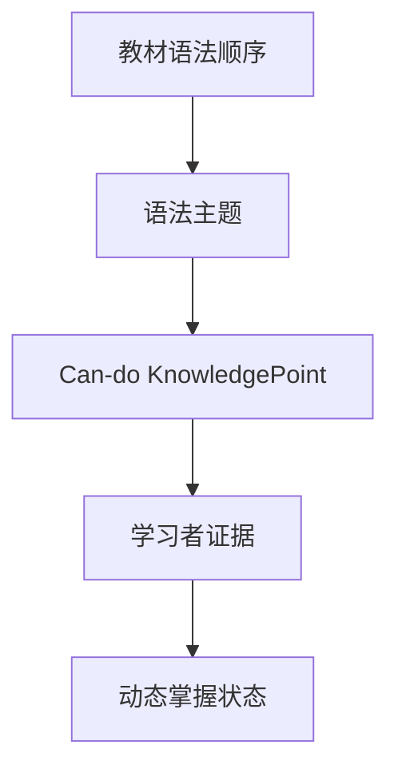

最符合 BinnAgent 的不是某一篇论文，而是一套组合：

> **用 English Grammar Profile 定义语法知识点，用 Dialogue KT 从对话中识别证据，用 DKT/LKT 追踪状态，用 Deep-IRT/QIKT 解释题目难度，用 FSRS 安排复习。**

其中最关键的新发现是：**你项目里的语法知识点，应该从“语法章节名”升级为可评测的 can-do statement。**

## 一、最符合本项目的论文

| 优先级 | 论文                                                                                                               | 对 BinnAgent 的价值         | 是否直接研究英语语法  |
| --- | ---------------------------------------------------------------------------------------------------------------- | ----------------------- | ----------- |
| S   | [Exploiting the English Grammar Profile for L2 grammatical analysis with LLMs](https://arxiv.org/abs/2603.17171) | 语法知识点定义、LLM 检测成功/失败尝试   | 是           |
| S   | [Exploring Knowledge Tracing in Tutor-Student Dialogues using LLMs](https://arxiv.org/abs/2409.16490)            | 从对话识别 KC、判断回答、追踪掌握轨迹    | 否，原论文是数学    |
| A   | [Interpretable Difficulty-Aware KT in Tutor-Student Dialogues](https://arxiv.org/abs/2605.01097)                 | LLM 对话 KT + IRT 能力/难度解释 | 否，但架构高度一致   |
| A   | [Deep-IRT](https://arxiv.org/abs/1904.11738)                                                                     | 把黑盒掌握度解释成学生能力和题目难度      | 否           |
| A   | [QIKT](https://arxiv.org/abs/2302.06885)                                                                         | 同一个知识点下，不同题目的诊断价值和难度不同  | 否           |
| B   | [Language Model Can Do Knowledge Tracing](https://arxiv.org/abs/2406.02893)                                      | 利用题目与知识点文本语义，缓解新知识点冷启动  | 否           |
| B   | [A Trainable Spaced Repetition Model for Language Learning](https://aclanthology.org/P16-1174/)                  | 语言学习记忆预测和复习调度           | 是，但主要不是语法划分 |

### 最值得直接采用的论文

2026 年的 EGP+LLM 论文与 BinnAgent 的契合度最高。它使用 English Grammar Profile，把英语语法拆成超过 1,000 个可解释的 grammatical constructs，每个知识点都有：

* SuperCategory；
* SubCategory；
* CEFR 等级；
* can-do statement；
* FORM / USE / FORM+USE；
* 真实学习者例句；
* 修正后的例句；
* 是否包含特定词汇；
* 学习者是否成功使用。

论文使用了 1,211 个带例句的 EGP construct，但其人工标注实验只选了 12 个，因此它证明了方法可行，尚未证明 1,211 个点都能同等可靠地自动识别。[论文数据和粒度说明](https://arxiv.org/abs/2603.17171)

---

## 二、他们是怎么划分语法知识点的

### 1. 不按照传统“章节名”划分

传统教材会写：

```text
现在完成时
定语从句
冠词
情态动词
```

这对于课程目录足够，但不能直接用于知识追踪。因为“掌握现在完成时”不是一个可以通过一次作答判断的能力。

EGP 的划分方式是：

```text
语法大类
→ 子类
→ 交际功能或形式
→ 一个可观察、可评测的 can-do statement
```

例如现在完成时不能只保留一个知识点，应拆成：

| 知识点                                 | 类型       |
| ----------------------------------- | -------- |
| 能用 `have/has + 过去分词` 构成肯定句          | FORM     |
| 能构成现在完成时的疑问句和否定句                    | FORM     |
| 能用 `ever/never` 表达经历                | USE      |
| 能区分 `have been to` 和 `have gone to` | FORM/USE |
| 能用 `since/for` 表达持续到现在              | USE      |
| 能用 `already/yet` 表达完成状态             | USE      |
| 能根据语境区分一般过去时与现在完成时                  | FORM/USE |

每一个点都能单独出题、单独观察、单独追踪。

### 2. EGP 的知识点结构

论文示例包括：

* “能使用不规则形容词比较级”；
* “能构成否定疑问句”；
* “能使用省略关系代词的限制性定语从句”；
* “能用有限从句和时间连词构成时间状语从句”；
* “能用 `used to` 表达过去重复发生但现在不再持续的行为”；
* “能用 `another` 表达不同的另一个”。

这些点同时覆盖：

* 形态：词形变化；
* 句法：句子结构；
* 语义：表达什么含义；
* 语用：在什么场景下使用。

这比单纯依靠 POS、依存句法或者“是否写错”更适合表达实验室。

---

## 三、BinnAgent 当前语法数据的问题

项目现有的两个数据源承担的是不同职责。

### 教材顺序数据

[changsha_english_grammar_sequence.metadata.json](https://github.com/paras0l/BinnAgent/blob/main/docs/research/changsha_english_grammar_sequence.metadata.json) 记录的是：

```text
哪个年级
→ 哪本教材
→ 哪个单元
→ 首次教授或复习什么语法
```

它适合作为：

* 课程顺序；
* 先修关系来源；
* 教材范围约束；
* 推荐学习路径。

但不适合直接作为 Mastery 的 KnowledgePoint。例如“现在完成时”“时态综合复习”都太大。

### 前端 GrammarTopic

[grammarTopics.ts](https://github.com/paras0l/BinnAgent/blob/main/binnagent-frontend/src/data/grammarTopics.ts) 已经出现了比较好的粒度：

* `used to do`；
* `be used to doing`；
* `stop to do / stop doing`；
* `if 条件句中的主将从现`；
* `第一次用 a/an，第二次用 the`。

这些比教材目录细，但仍缺少：

* CEFR；
* FORM/USE；
* can-do statement；
* 前置知识点；
* 成功/失败证据定义；
* recognition/recall/production；
* 与教材单元的映射；
* 可自动检测的模式；
* 例句和反例。

因此，不需要推翻现有 JSON，而是建立两层：



教材 JSON 决定“什么时候教”；can-do KnowledgePoint 决定“具体追踪什么”。

---

## 四、成功和失败证据如何定义

EGP+LLM 论文的设计非常适合 Expression Lab。它比较学习者原句与修正句，把语法行为分成四类：

| 原句         | 修正句       | 判断              | 是否更新    |
| ---------- | --------- | --------------- | ------- |
| 都出现目标结构    | 都出现       | 成功尝试            | 正向证据    |
| 原句没有，修正句出现 | 修正后才正确    | 失败尝试            | 负向证据    |
| 都没有        | 未尝试       | No attempt      | 不更新     |
| 原句有，修正后移除  | 实际想表达其他意思 | unrelated error | 不更新该知识点 |

例如目标知识点是：

> 能用 `used to` 表达过去重复发生、现在不再发生的状态。

```text
Music used to be my job.
→ Successful

Music was use to be my job.
→ Unsuccessful

Music is used to evoke emotion.
→ No attempt
```

这比“句子整体正确/错误”更适合语法追踪。

---

## 五、如何做到可视化

论文中最值得借鉴的是 Dialogue KT 的两种表现形式：

1. 对话表格：每轮对话旁显示 KC、正确性和预测掌握度；
2. 学习曲线：横轴为知识点出现次数，纵轴为预测掌握度，并显示误差范围。[Dialogue KT 学习曲线方法](https://arxiv.org/html/2409.16490v1)

但 BinnAgent 不能只复制论文图表。建议分成用户端与 Dev Console。

## 六、用户端：语法地图

不要把上千个点画成巨大的关系网络。更适合使用“分类矩阵 + 逐层展开”。

### 第一层：语法能力矩阵

| 类别     |   A1 |   A2 |   B1 |   B2 |
| ------ | ---: | ---: | ---: | ---: |
| 时态与体   | 8/10 | 6/12 | 3/15 | 1/10 |
| 名词与限定词 |  7/9 |  4/8 |  2/7 |    — |
| 从句     |  2/3 | 4/10 | 3/12 | 1/14 |
| 情态与语气  |  3/5 |  2/7 |  1/9 |  0/8 |
| 非谓语    |    — |  2/5 | 3/11 | 1/10 |

颜色表达状态：

* 深绿色：稳定掌握；
* 浅绿色：正在形成；
* 橙色：需要复习；
* 红色：反复失败；
* 灰色：尚无证据。

这里显示的是“当前证据状态”，不是简单课程完成度。

### 第二层：子类列表

点击“从句 · B1”后：

```text
✓ 能使用 that 引导限制性定语从句
◐ 能区分 which 和 that
! 能省略作宾语的关系代词
○ 能用 where 引导定语从句
```

### 第三层：知识点详情

知识点卡片展示：

```text
能用 used to 表达过去习惯

掌握趋势：正在形成
预计独立成功率：68%
证据置信度：中等
下次复习：明天

辨认       ████████ 82%
回忆       ██████   61%
产出       ████     43%
```

下方再放两张图：

* 掌握度时间曲线；
* FSRS 遗忘曲线。

并展示最近证据：

```text
7月14日  独立正确使用                    +正向证据
7月12日  写成 was use to                 -失败证据
7月10日  看懂选择题但未独立产出           弱正向证据
```

---

## 七、对话页面：实时标注

Expression Lab 或 Chat 中不应打断用户，而是在一轮学习结束后展示：

```text
你的表达：
I was used to play basketball.

检测到目标：
used to 表达过去习惯

结果：
尝试失败

关键区别：
used to do       过去常常做
be used to doing 习惯于做

系统状态：
“used to do” 回忆证据下降
“be used to doing” 暂不更新，因为本轮并未真正测试它
```

这对应 Dialogue KT 的：

```text
对话轮次 → KC 标签 → 回答判断 → 掌握状态变化
```

---

## 八、Dev Console：研究级可视化

Dev Console 才展示模型内部信息：

### 1. DKT 轨迹图

* 横轴：AssessmentEvidence 时间；
* 纵轴：预测独立成功率；
* 点的形状：recognition / recall / production；
* 颜色：正确、提示后正确、错误、低置信；
* 虚线：模型版本切换。

### 2. IRT 能力—难度图

```text
学习者能力 θ ─────●────────
题目难度   b ─────────●────

当前题略高于学习者稳定能力
预测独立成功率：42%
```

### 3. Evidence Trace

点击一个掌握度变化，可以展开：

```text
状态：0.57 → 0.64
原因：独立完成 B1 production 任务
题目难度：0.52
LLM 语义置信度：0.91
Attempt：xxx
Prompt：grammar-assessment-v2
Estimator：dkt-sem-v1
```

### 4. FSRS 状态

* Difficulty；
* Stability；
* Retrievability；
* 上次复习；
* 预计遗忘曲线；
* 下次复习时间；
* 隐式 rating 的生成原因。

---

## 九、最适合本项目的最终划分原则

BinnAgent 应采用这条判断标准：

> **如果一个语法点不能通过一次聚焦练习判断学习者是否成功使用，它就仍然太大。**

但也不能无限拆小。一个合格的 Grammar KnowledgePoint 应同时满足：

1. 能写成一句 can-do statement；
2. 一次练习可以聚焦测试；
3. 成功和失败有明确证据；
4. 能绑定教材来源；
5. 能用于新的表达场景；
6. 与相近知识点可以区分。

首个试点不要导入全部 1,211 个 EGP 点。建议先选择七年级上册教材中的约 25～40 个高置信 can-do 点，完成：

```text
教材映射
→ LLM 识别
→ 成功/失败证据
→ 掌握轨迹
→ 语法地图可视化
```

跑通后再逐册扩展。这样既吸收了论文的科学粒度，也不会让项目重新变得过度复杂。

---

## 十、落地状态（2026-07-14）

原 30 点试点已完成并进一步扩展为论文口径的完整 EGP 目录：

- 当前官方导出共 1,222 行；
- 1,215 行 Example 非空；
- 排除 4 行不含 A1–C2 learner metadata 的 Example，以及 7 行无 Example 的记录；
- 最终导入 1,211 个 can-do 和 3,600 个 learner examples；
- 覆盖 19 个 SuperCategory 和 A1–C2 全等级；
- EGP ID 使用确定性 KnowledgePoint UUID，可重复幂等导入；
- 原七年级 30 点仅归档，不删除已有掌握与证据数据；
- Grammar Workspace 已支持完整矩阵、EGP ID/can-do/guideword 搜索、CEFR/类别筛选、分批渲染和例句详情。

实现与运维说明见 [19-grammar-can-do-core.md](../architecture/19-grammar-can-do-core.md)，聚合清单见 `data/grammar/egp_1211_manifest.json`。

English Grammar Profile 原始内容受 Cambridge 使用条款约束，授权导出保存在 gitignored 的 `data/private/egp/`，仓库不分发 learner examples 原始快照。部署环境必须单独获得合法导出后执行 `scripts/import_egp_catalog.py`。
