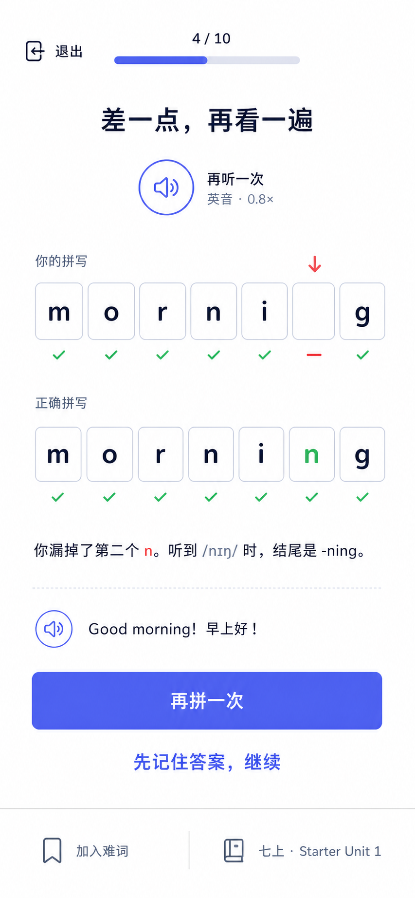
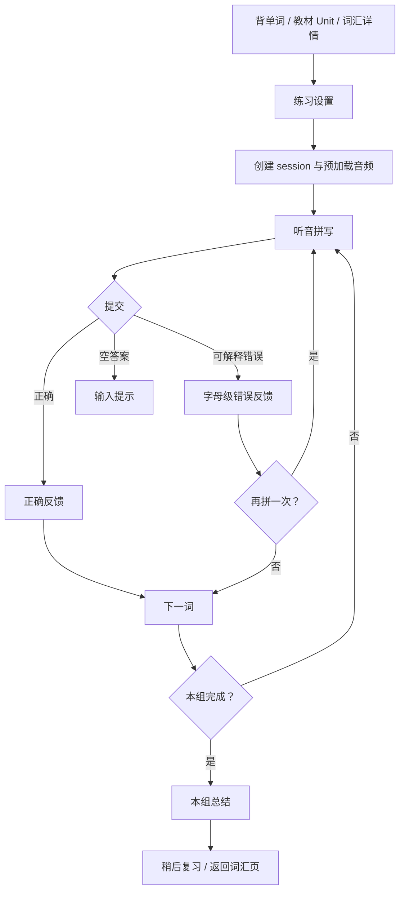

# 拼写训练模块 UI/UX 设计规范

> 日期：2026-06-19  
> 状态：Ready for implementation  
> 关联架构：[教材词汇与背单词模块](../../architecture/11-vocabulary-learning.md)

## 1. 设计目标

拼写训练帮助用户把“看见单词认识”推进到“听到或想到含义时能独立写出”。它是词汇学习中的独立能力维度，不是翻词卡后的附加输入框。

核心体验：

```text
选择练习来源 -> 听音/看语境 -> 主动拼写 -> 字母级反馈
            -> 立即重试或继续 -> 更新拼写证据 -> 安排复习
```

设计必须做到：

- 每次只聚焦一个单词和一个清晰动作。
- 先主动回忆，提交前不泄露完整答案。
- 错误反馈指出具体字母问题，不用笼统的“回答错误”。
- 发音、提示、重试和退出都不会打断学习记录。
- 支持教材单元、对话提取等来源筛选，并显示来源标签。
- 桌面端优先键盘效率，移动端优先拇指操作与系统键盘稳定性。
- 不使用生命值、金币、连胜惩罚或羞辱式红色反馈。

## 2. 视觉方向

视觉延续 BinnAgent 现有学习中心：靛蓝主色、Nunito 风格圆润字体、真实白色背景和 Lucide 线性图标。拼写训练进入“安静专注模式”，隐藏全局导航和统计仪表盘，只保留退出、进度、来源和当前任务。

设计关键词：

- 安静、清晰、友好。
- 活泼但不幼稚。
- 大留白、低层级噪声。
- 一个主操作、一个视觉焦点。
- 错误是可修正的信息，不是惩罚。

### 2.1 桌面主练习态


### 2.2 手机错误反馈态



视觉稿用于确定信息层级、容器模型、颜色、密度和交互位置。界面文字、输入框、进度、按钮与图标必须由 React/HTML 原生实现，不能把截图作为实际 UI。

## 3. 用户入口

### 3.1 背单词页

在现有“背单词”工作区增加两个并列主行动：

```text
[开始复习]  [拼写练习]
```

“拼写练习”显示今日数量，例如 `拼写练习 · 8`。若没有可练词，仍可进入设置页选择某个教材单元，不显示禁用死按钮。

### 3.2 单元页

用户开启教材单元并完成词汇注入后显示：

```text
本单元 34 词 · 新词 20 · 待拼写 12
[学习本单元词汇] [练习拼写]
```

来源自动锁定为当前教材与 Unit，用户可在开始前调整数量和难度。

### 3.3 词汇详情与复习结果

- 词汇详情提供 `听写这个词`。
- 普通词汇复习结束页提供 `练习刚才出错的拼写`。
- 对话中沉淀的单词可通过来源筛选进入拼写训练。

## 4. 完整用户流程



用户退出时自动保存进度。再次进入显示“继续上次练习”，不要求从头开始。

## 5. 页面与状态

### 5.1 练习设置页

目的：用最少选择开始一组可完成的任务。

内容顺序：

1. 标题 `拼写练习`。
2. 来源选择：`今日到期`、`七上 · Unit 1`、`对话生词`、`全部词汇`。
3. 练习方式：默认 `听音拼写`，可选 `看中文拼写`、`语境拼写`。
4. 数量：`5`、`10`、`15`，默认根据可用词和时间预算推荐。
5. 发音偏好：`英音`、`美音`、`跟随词典`。
6. 主按钮 `开始练习`。

不展示准确率、排行榜或复杂算法设置。若某来源只有 3 个词，数量自动变成 `全部 3 个`。

### 5.2 音频预加载态

创建 session 后预加载当前词和下一词音频：

- 300 ms 内不显示 loading。
- 超过 300 ms，音频按钮内显示旋转进度，文字为 `正在准备发音…`。
- 超过 3 s，提供 `使用系统发音`。
- 在线音频与系统 TTS 都不可用时，自动切换到 `看中文拼写`，并说明 `暂时无法播放发音，已切换为释义提示`。

不得让音频失败阻塞整组训练。

### 5.3 主练习态

桌面布局：

```text
退出练习       进度条 4 / 10                    七上 · Unit 1
----------------------------------------------------------------
                 听发音，拼出这个单词

                     [播放发音] [英音] [0.8×]
                       按空格键播放

                  [m][o][r][n][i][ ][ ]

              给我一个提示 | 不认识，先看答案
              Good ___! 早上好！
              来自 人教版英语七年级上册 · Starter Unit 1
----------------------------------------------------------------
Enter 提交                                      [检查拼写]
```

关键规则：

- 页面进入后输入控件自动聚焦，但不会自动弹出桌面虚拟键盘。
- 首次发音由用户点击或按空格触发，遵守浏览器自动播放策略。
- 音频按钮播放时有 600 ms 柔和扩散环；`prefers-reduced-motion` 下仅改变图标颜色。
- `英音/美音` 和语速是普通按钮，不使用容易与来源混淆的标签样式。
- 字母槽只是视觉表现，DOM 使用一个真实文本输入框，避免逐格输入导致焦点、粘贴、退格和读屏问题。
- 不提前显示音标；第一次错误后或用户请求提示时才显示。
- 例句中目标词使用等宽空位，不通过空位长度泄露答案长度。
- 桌面右侧 session rail 只在宽度不小于 1200 px 时出现；它显示完成/当前/未开始和稍后复习数，不显示答案或正确率。

### 5.4 提示阶梯

`给我一个提示` 每次只增加一层信息：

| 层级 | 呈现 | 对掌握证据的影响 |
|---|---|---|
| 0 | 仅发音/当前 prompt | 完整权重 |
| 1 | 显示词性与语境 | 轻微降权 |
| 2 | 显示首字母和字母数 | 中度降权 |
| 3 | 显示音节/音标分段 | 中度降权 |
| 答案 | 显示完整拼写 | 本次不计正确，只记录 exposure |

每次提示按钮文案保持 `再给一点提示`，旁边显示 `1/3`。点击 `不认识，先看答案` 进入答案揭示态，不伪装成答对。

### 5.5 空答案与格式处理

- 空答案提交：输入区轻微横移 4 px 并提示 `先试着拼一下`，焦点返回输入框。
- 自动 trim 首尾空格。
- 英文字母不区分大小写判分，但保留用户输入用于反馈。
- 连字符、撇号和空格按词条规范判分；短语在视觉上分组。
- 中文输入法 composition 期间不响应 Enter 提交。
- 粘贴允许，但事件标记 `input_method = paste`，避免把复制答案当作独立回忆证据。

### 5.6 正确反馈态

保持同一页面，不弹 modal：

- 标题变为 `拼对了`。
- 字母槽边框与文字转为 success 色，动画 180 ms。
- 显示单词、音标、教材释义和完整例句。
- 主按钮 `下一个`，桌面可按 Enter。
- 若使用过提示，补充 `在提示后拼对，明天再巩固一次`。
- 停留 700 ms 后可自动将焦点移动到“下一个”，但不自动跳题。

### 5.7 错误反馈态

原则：只解释最关键的一处差异，先给用户重试机会。

反馈分为：

| 类型 | 示例 | UI 反馈 |
|---|---|---|
| omission | `mornig → morning` | `你漏掉了第二个 n` |
| insertion | `morining → morning` | `这里多了一个 i` |
| substitution | `morneng → morning` | `这里应该是 i，不是 e` |
| transposition | `mornnig → morning` | `i 和 n 的顺序换了` |
| spacing/hyphen | `ice cream → ice-cream` | `这个词在教材中使用连字符` |

呈现规则：

- 用户答案与正确答案按最小编辑路径对齐。
- 正确部分保持中性色或绿色，只把相关错误字母标为 coral/error。
- 不使用整块红色背景、叉号大图标或“失败”。
- 显示一句可执行解释，例如 `听到 /nɪŋ/ 时，结尾是 -ning。`
- 主按钮 `再拼一次`；次按钮 `先记住答案，继续`。
- 重试时清空错误位置并重新播放一次发音，正确答案重新隐藏。
- 第二次仍错时保留答案、加入稍后复习，并让用户继续，避免卡死。

### 5.8 答案揭示态

用户主动选择“不认识”后：

- 显示完整拼写、音标、释义和例句。
- 提供 `跟着拼一遍`：答案显示 2 秒后淡出，只保留音频。
- 提供 `加入难词`，默认不自动勾选。
- 主按钮 `我记住了，继续`，事件结果为 `revealed` 而不是 `correct`。

### 5.9 Session 完成页

避免只给一个百分比。总结页回答三件事：完成了什么、哪里薄弱、何时再练。

```text
本组完成
10 个词 · 独立拼对 6 · 提示后拼对 2 · 待巩固 2

最值得再看
morning   漏写字母   [再听]
favorite  音节混淆   [再听]

下次复习：明天 19:30
[练习这 2 个难词] [返回背单词]
```

“独立拼对”与“提示后拼对”分开，防止高分制造虚假掌握感。鼓励文案固定为具体事实，不生成夸张评价。

### 5.10 暂停、退出和恢复

- 点击退出：若没有作答，直接退出；已有进度时显示底部确认层。
- 确认文案：`已完成 4 / 10，进度会自动保存。`
- 操作：`保存并退出`、`继续练习`。
- 浏览器刷新、意外关闭或离线时，每次 attempt 后保存 cursor；恢复后回到下一未完成词。
- 不把退出标记为失败，不减少 streak。

## 6. 响应式设计

### 6.1 桌面（>= 1200 px）

- 内容主列最大宽度 820 px，右侧 rail 236 px。
- 顶栏 72 px，底部 action bar 112 px。
- 字母槽 88-104 px，高度不小于 88 px；长词自动缩小至 56 px，超过 12 字母切换为连续输入底线样式。
- 主操作按钮宽 320-400 px。

### 6.2 平板（768-1199 px）

- 隐藏右侧 rail，在顶栏进度旁显示 `稍后复习 2`。
- 主列最大宽度 720 px。
- 底部 action bar 保持横向。

### 6.3 手机（< 768 px）

- 单列、无侧栏，安全区 padding 使用 `env(safe-area-inset-*)`。
- 顶栏退出按钮只显示 `退出`，来源移到底部。
- 使用系统键盘时，主按钮随 visual viewport 上移，不被键盘遮挡。
- 字母槽最小 44 px；超过 8 个字符时允许缩小间距，不横向滚动。
- 反馈态允许页面纵向滚动，主按钮不永久遮挡解释内容。
- 主按钮满宽，次按钮为文本样式；触控目标不小于 44 × 44 px。

## 7. 组件清单

```text
SpellingSetupPage
SpellingSessionPage
  ImmersiveSessionHeader
  SessionProgress
  PronunciationControl
  SpellingPrompt
  SpellingInput
  HintActions
  ContextClue
  SourceAttribution
  SessionRail
  SessionActionBar
  SpellingFeedback
    CorrectFeedback
    LetterDiffFeedback
    RevealFeedback
  ExitConfirmationSheet
SpellingSummaryPage
  SummaryBreakdown
  DifficultWordList
  NextReviewNotice
```

`SpellingInput` 内部只有一个真实 input；`LetterDiffFeedback` 使用纯展示字符格，二者不能混用焦点逻辑。

## 8. 设计系统

### 8.1 颜色

| Token | 值 | 用途 |
|---|---|---|
| `--spelling-bg` | `#FFFFFF` | 主背景，保持纯白 |
| `--spelling-shell` | `#F8FAFC` | 页面边缘和次级区域 |
| `--spelling-text` | `#0F172A` | 标题与主要文字 |
| `--spelling-muted` | `#64748B` | 提示、来源、辅助文字 |
| `--spelling-border` | `#E2E8F0` | 分隔线和输入边框 |
| `--spelling-primary` | `#6366F1` | 主按钮、焦点和当前进度 |
| `--spelling-primary-deep` | `#5865F2` | 主按钮和音频按钮的轻微层次 |
| `--spelling-success` | `#22C55E` | 正确字母与完成状态 |
| `--spelling-error` | `#EF6262` | 仅用于具体错误字符 |
| `--spelling-warning` | `#F59E0B` | 音频降级或提示状态 |

主背景保持纯色。主按钮和音频按钮允许从 `--spelling-primary-deep` 到 `--spelling-primary` 的低对比线性渐变，色差不得超过当前定义；其他区域不使用装饰渐变。错误色不得铺满反馈面板。

### 8.2 字体

| 样式 | 桌面 | 手机 |
|---|---|---|
| 页面任务标题 | 40/48, 800 | 30/38, 800 |
| 拼写字母 | 52/60, 800 | 36/44, 800 |
| 反馈标题 | 32/40, 800 | 28/36, 800 |
| 正文 | 16/26, 600 | 16/24, 600 |
| 控件 | 15/20, 700 | 16/22, 700 |
| 辅助文字 | 13/20, 600 | 13/20, 600 |

字体使用现有 `Nunito, system-ui, sans-serif`。音标可回退 `Arial, sans-serif` 以保证 IPA 字形完整。

### 8.3 几何与层级

- 小控件圆角 10 px；主按钮 12 px；圆形音频按钮保持正圆。
- 主任务不放在卡片中；边缘由留白和细分隔线组织。
- 字母槽边框 1.5 px，focus 2 px primary，禁止重阴影。
- 仅底部确认层和网络提示使用 elevation。
- 图标使用 Lucide，默认 20 px / 1.75 stroke，音频主图标 36 px。

### 8.4 Motion

- hover/focus：120-160 ms。
- 提交后字符对齐：180 ms ease-out。
- 正确状态颜色过渡：180 ms。
- 错误字母轻微上移再回位，总时长 220 ms，不使用连续抖动。
- 音频播放环：600 ms，一次播放最多两圈。
- `prefers-reduced-motion` 下取消位移与扩散，只保留颜色变化。

## 9. 键盘、输入法与可访问性

### 9.1 键盘

| 键位 | 行为 |
|---|---|
| `Space` | 输入为空且焦点不在按钮时播放/暂停发音 |
| `Enter` | 提交；反馈态进入下一词或执行重试 |
| `Ctrl/Cmd + .` | 给出下一层提示 |
| `Esc` | 打开退出确认层 |
| `Alt + A` | 切换英/美音 |

快捷键必须显示在 `aria-describedby` 和帮助提示中，不能只依赖视觉记忆。

### 9.2 读屏

- 页面任务标题是唯一 `h1`。
- 进度使用 `role="progressbar"`，包含 `aria-valuenow/min/max`。
- 音频按钮提供 `播放 morning 的英式发音`；答案未揭示前使用 `播放当前单词的英式发音`，避免读屏泄露答案。
- 字母槽设为 `aria-hidden`，真实 input 使用 `aria-label="输入你听到的单词"`。
- 提交反馈使用 `aria-live="polite"`；网络失败使用 assertive 仅一次。
- 颜色之外同时使用文字、位置和图标表达正确/错误。

### 9.3 对比与缩放

- 正文和控件至少 WCAG AA 4.5:1。
- 焦点环至少 3:1，且不被 sticky action bar 遮挡。
- 200% 浏览器缩放下可完成核心流程，无横向滚动。
- 页面支持系统深色模式时使用现有 token 映射，但首期可以只交付浅色模式；不可自动把截图中的白色改为米白色。

## 10. 文案规范

### 10.1 推荐文案

| 场景 | 文案 |
|---|---|
| 主任务 | `听发音，拼出这个单词` |
| 空答案 | `先试着拼一下` |
| 正确 | `拼对了` |
| 近似错误 | `差一点，再看一遍` |
| 提示 | `给我一个提示` / `再给一点提示` |
| 揭示 | `不认识，先看答案` |
| 重试 | `再拼一次` |
| 跳过 | `先记住答案，继续` |
| 音频降级 | `真人发音暂时不可用，已切换为系统发音` |
| 完成 | `本组完成` |

### 10.2 禁用文案

- `回答错误`、`失败`、`太差了`。
- `你怎么又错了`。
- 没有证据支持的 `你已经完全掌握`。
- 把提示后答对与独立答对都称为 `正确率 100%`。

## 11. 数据与接口映射

UI 使用架构文档预留的 session/attempt API：

```text
POST /api/learners/{id}/vocabulary/sessions
GET  /api/learners/{id}/vocabulary/sessions/{session_id}/next
POST /api/learners/{id}/vocabulary/sessions/{session_id}/spelling-attempts
GET  /api/vocabulary/{item_id}/pronunciations?accent=uk
```

前端 session 状态：

```ts
type SpellingPhase =
  | 'loading'
  | 'prompting'
  | 'submitting'
  | 'correct'
  | 'incorrect'
  | 'revealed'
  | 'paused'
  | 'completed'
  | 'recoverable_error'
```

任务响应至少包含：

```text
task_id
vocabulary_item_id
prompt_mode
pronunciations[]
context_with_blank
source_labels[]
allowed_punctuation
capabilities: hints/replay/tts_fallback
```

提交响应至少包含：

```text
result: correct/incorrect/revealed
normalized_answer
letter_diff[]
error_type
feedback_text
phonetic_focus
can_retry
next_action
```

客户端不可自行把答案写入初始任务 payload 后再隐藏；答案与 diff 在提交后由服务端返回，降低开发工具意外泄露和判分不一致。

## 12. 错误与离线状态

| 情况 | 处理 |
|---|---|
| 发音 API 404 | 使用 SpeechSynthesis，并标注系统发音 |
| 发音超时 | 保留输入，允许切换释义模式 |
| attempt 提交超时 | 本地保留答案，显示 `提交未完成，重试` |
| 重复提交 | 禁用按钮并使用 idempotency key，不生成两次反馈 |
| 网络断开 | 保存本地队列；可继续已预载任务，恢复后同步 |
| session 过期 | 提示 `练习已更新`，保存已完成结果并创建续练 session |
| 词条无音频 | 默认释义/语境拼写，不显示坏掉的播放按钮 |

错误提示靠近发生位置，不统一堆到全局 toast。只有 session 无法恢复时才退出到设置页。

## 13. 埋点与体验指标

建议事件：

```text
spelling_setup_viewed
spelling_session_started
pronunciation_played
spelling_hint_requested
spelling_attempt_submitted
spelling_answer_revealed
spelling_retry_started
spelling_session_paused
spelling_session_resumed
spelling_session_completed
```

关键指标：

- 从入口到开始练习的转化率。
- 首次独立拼对率与跨日保持率。
- 每词平均播放、提示和重试次数。
- omission/substitution/transposition 等错误分布。
- 音频 fallback 率和首播延迟。
- session 中途退出位置与恢复率。
- 键盘、触屏、粘贴等输入方式分布。

不以“页面停留越久越好”为目标；更短且准确的主动提取通常是正向信号。

## 14. 验收标准

### 14.1 核心流程

- 用户能从背单词页和教材 Unit 页进入拼写练习。
- 可完成设置、听音、输入、提交、反馈、重试、下一词和总结闭环。
- 错误反馈能准确呈现遗漏、插入、替换、换位和连接符问题。
- 用户退出、刷新和离线恢复后不丢失已提交 attempt。
- 音频失败时能继续完成练习。

### 14.2 视觉与响应式

- 1440 × 1024 与视觉稿保持相同信息层级和开放式容器模型。
- 390 × 844 下主按钮、字母差异与来源不横向溢出。
- 右侧 rail 仅在宽桌面显示，不压缩主任务。
- 任何状态都只有一个视觉主按钮。
- 错误态不会把整页或整块区域染红。

### 14.3 无障碍

- 全流程仅用键盘可完成。
- VoiceOver/NVDA 不会在提交前读出答案。
- 焦点顺序与视觉顺序一致，反馈后焦点移动可预测。
- 200% 缩放和 reduced motion 下功能完整。
- 颜色对比达到 WCAG AA。

## 15. 实施拆分

### Phase 1：可用闭环

- 设置页、主练习态、正确/错误/揭示态、总结页。
- 单一真实 input + 字母槽展示。
- 在线发音与系统 TTS fallback。
- session 恢复和基础键盘操作。

### Phase 2：高质量反馈

- 字母 diff 可视化与错误类型文案。
- 分层提示、音标聚焦和短语/连字符支持。
- 来源筛选与教材 Unit 快捷入口。

### Phase 3：个性化

- 根据拼写错误模式选择题目和提示。
- 音素到字素专项练习。
- 跨日拼写保持率与 SRS 联动。

## 16. 关键设计决策

1. **拼写是独立训练模式。** 入口与普通识义复习相连，但学习证据分开。
2. **一个真实输入框驱动字母槽。** 兼顾输入法、粘贴、退格、读屏和移动端稳定性。
3. **先重试，后继续。** 错误反馈给出一个具体修正点，不把用户困在单词上。
4. **提示分层且降权。** 帮助用户完成任务，同时不虚增掌握度。
5. **答案不随初始题目下发。** 避免泄露并统一服务端判分。
6. **沉浸模式隐藏全局导航。** 退出和来源仍可见，学习进度自动保存。
7. **免费发音不可成为单点故障。** 系统 TTS、释义模式和本地缓存保证流程连续。
