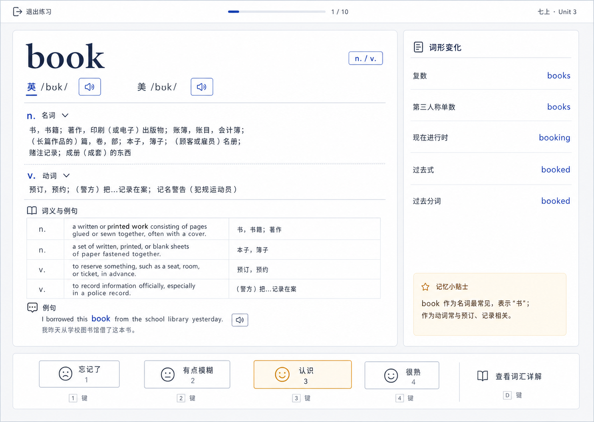

# Rich Vocabulary Dictionary Design

## Goal

The vocabulary workflow should use Free Dictionary API as the source for pronunciation and audio assets, and use the local model enrichment prompt as the source for Chinese senses grouped by part of speech, word forms, tags, examples, and collocations. Existing bilingual `definition` / `definition_zh` rows remain available for deeper reading.

## Data model

- `phonetic_uk`, `phonetic_us`: accent-specific IPA.
- `dictionary_senses`: Chinese meanings grouped by part of speech.
- `word_forms`: local-model extracted values such as plural, third-person singular, present participle, past tense, and past participle.
- `dictionary_tags`: core vocabulary labels such as CET4 or 高考.
- `meanings`: retained bilingual English definition and Chinese translation rows.
- `examples`: retained dictionary examples.

## Interaction design

The review screen uses an editorial dictionary layout rather than a centered flashcard:

1. A quiet progress header keeps exit, progress, and textbook source visible.
2. The main dictionary page shows the headword, UK/US pronunciation controls, senses, bilingual definitions, and an example.
3. A right rail keeps word forms visible without interrupting reading.
4. Memory ratings remain fixed at the bottom and support keys 1–4.
5. The dedicated vocabulary detail page reads persisted API data directly; it no longer depends on copied prompts or pasted HTML.

## Visual reference

The implementation uses a true-white editorial surface, pale cool-gray surround, ink navy text, indigo controls, restrained amber memory emphasis, serif headwords, and sans-serif Chinese content.
